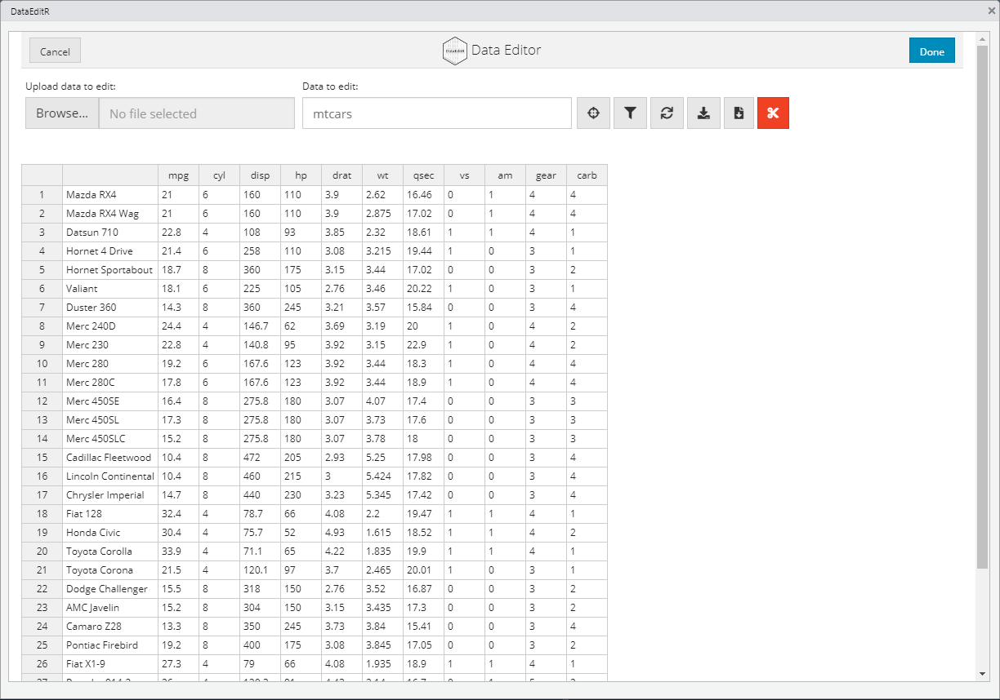
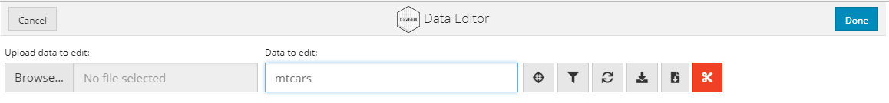
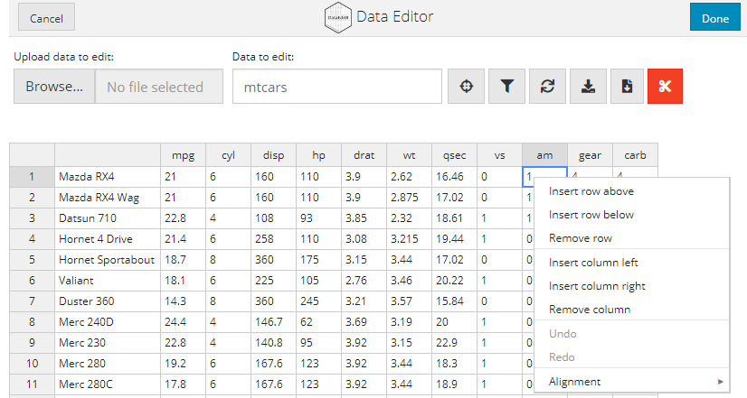
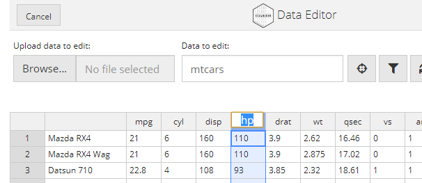
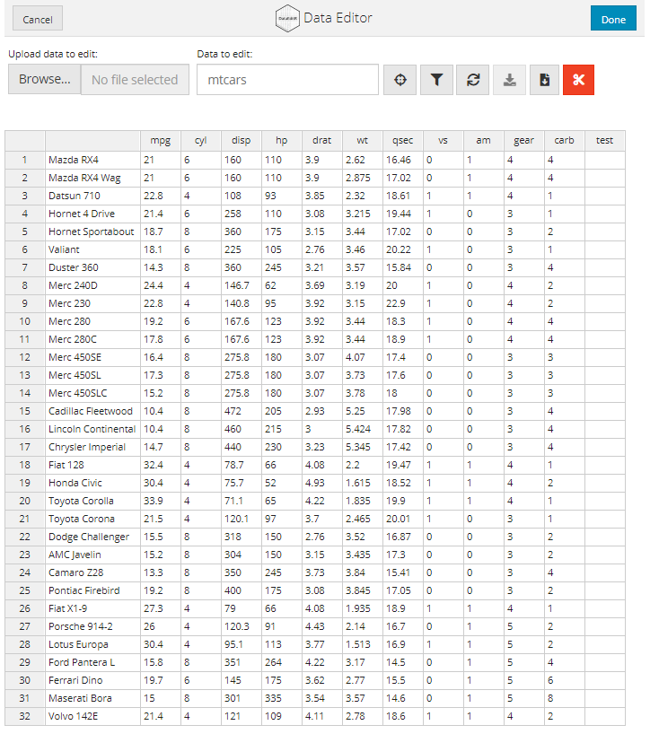

## 

```{r setup, include=FALSE}
knitr::opts_chunk$set(echo = TRUE)
```

## 데이터 생성과 처리 with DataEditR - 1

R에서 데이터를 생성할 때는 주로 엑셀이나 DB에 저장된 데이터를 읽어들여서 사용하는 방법을 일반적으로 사용한다. 하지만 R에서 데이터를 직접 생성하거나 일부 데이터를 삽입, 변경, 삭제하는 경우에는 코드를 생성하여 실행하고 결과를 확인해야 하기 때문에 GUI(Graphic User Interface)에 익숙한 사용자에게는 불편하게 느껴지는 것이 사실이다. 데이터를 다루는 사람들은 엑셀과 같은 스프레드 쉬트를 사용할 수 있는 사람들이 대부분이고 스프레드 쉬트에 익숙해져 있기 때문에 이런 환경을 R에서도 사용할 수 있었으면 하는 사용자가 많이 있을 것이다. 이런 사용자의 요구를 지원해 주는 R 패키지가 몇 개 존재하는데 이 중 DataEditR을 소개한다.

(출처 : <https://cran.r-project.org/web/packages/DataEditR/vignettes/DataEditR.html>)

DataEditR은 R에서 데이터의 삽입, 삭제, 필터링, 편집 등의 작업을 대화식 GUI 방식으로 구현한 Shiny 기반의 패키지이다. DataEditR 패키지는 `data_edit()`를 사용하여 데이터를 처리 할 수 있다.

### 패키지 설치

DataEditR 패키지를 사용하기 위해서는 먼저 DataEditR 패키지를 설치해야 한다.

DataEditR 패키지를 CRAN에서 설치하기 위해서는 다음과 같이 실행한다.

```{r cran, eval=FALSE}
install.packages("DataEditR")
library(DataEditR)
```

만약 CRAN이 아닌 Github에서 설치하기 위해서는 다음과 같이 설치할 수 있다.

```{r github, eval=FALSE}
devtools::install_github("DillonHammill/DataEditR")
```

```{r library}
library(DataEditR)
```

### 데이터 보기

DataEditR 패키지를 사용하여 GUI 방식으로 데이터를 보기 위해서는 `data_edit()`를 사용한다.

```{r visualization1, eval=FALSE}
data_edit(mtcars)
```

`data_edit()`를 사용하면 다음과 같은 Data Editor 화면이 나타나고 `mtcars`의 데이터가 보인다.

Data Editor는 기본적으로 R-Studio의 Dialog Box로 실행된다. 하지만 R-Studio의 View Panel이나 웹 브라우져에서 실행할 수도 있다.

```{r visualization2, eval=FALSE}
data_edit(mtcars, viewer = "browser")  ##  웹 브라우저에서 Data Editor 실행

data_edit(mtcars, viewer = "viewer")  ##  View panel에서 Data Editor 실행
```

Data Editor는 데이터를 테이블 형태로 표현하는데 맨 왼쪽 열에는 행 인덱스가 표시되고 오른쪽으로 각각의 열 이름과 함께 데이터가 표시된다.



Data Editor의 맨 위에는 Data Editor를 닫을 수 있는 버튼이 양쪽에 배치되는데 'Done' 버튼은 Data Editor를 마치고 나갈때 사용하는 버튼이고 'Cancel' 버튼은 마찬가지로 나갈때 사용하는 버튼이지만 수정된 내용이 저장되지 않고 빠져나가게 된다.


### 데이터 Import

`data_edit()`는 다음의 몇가지 방법으로 저장된 테이블 데이터를 읽어들일 수 있다.

첫번째는 `data_edit()`는 하나의 테이블 형태로 저장된 데이터를 지정할 수 있는데 matirx, data.frame, data.table로 R에 이미 로딩된 데이터를 매개변수로 전달하면 해당 데이터를 사용할 수 있다.

두번째는 `data_edit()`를 매개변수 없이 호출한 후 Data Editor 창의 'Data to edit:' 입력창에 원하는 데이터 객체 이름을 입력해서 데이터를 편집할 수 있다.



세번째는 `data_edit()`에 데이터 Import에 사용할 함수와 함수 매개변수를 전달함으로써 파일에 저장된 데이터를 불러들일 수 있다. 다음의 예는 csv로 저장된 파일의 데이터를 data editor로 불러들이는 코드이다.

```{r eval=FALSE}
mtcars <- data_edit("mtcars.csv",                     ## 데이터가 저장된 CSV 파일명
                    read_fun = "read.csv",            ## 데이터를 불러읽어들일때 사용될 함수명
                    read_args = list(header = TRUE))  ## 데이터 읽는 함수에 필요한 매개변수
```

위와 같이 불러읽을 데이터가 저장된 파일의 포맷에 따라 사용될 함수를 `read_fun` 매개변수로 전달하고 함수에서 사용해야할 매개변수들을 `read_args`를 통해 전달하면 데이터를 읽어 저장하고 Data Editor를 열어 해당 데이터를 보여준다.

### 데이터 처리

`data_edit()`는 데이터를 편집하기 위한 대화형 편집 방법을 제공한다.

#### 1. 열이나 행을 추가하거나 삭제

Data Editor를 통해 열이나 행을 추가하거나 삭제하기 위해서는 추가하거나 삭제하기를 원하는 위치를 클릭하고 마우스 오른쪽 버튼을 누르면 팝업 메뉴가 나타나는데, 이 메뉴에서 적절한 작업을 선택하여 추가나 삭제 할 수 있다.



#### 2. 열의 이름 변경

열의 이름을 변경하기 위해서는 변경하기 원하는 열을 클릭하면 열 이름을 변경할 수 있다.



#### 3. 자동 채우기

엑셀을 사용하는 사용자들은 특정 패턴의 데이터를 채우는 기능을 자주 사용한다. 이를 자동 채우기라고 하는데 선택된 셀의 우측 하단에 작은 네모점을 끌어 당기면 당겨진 범위만큼 자동으로 데이터가 채워진다. Data Editor에도 동일한 기능이 있는데 엑셀과 동일하게 선택된 범위의 우측 하단에 네모 점을 당겨주면 당겨준 범위만큼 자동 채워지기가 작동한다.


#### 4. 열이나 행을 붙이기

`DataEditR`에서는 `cbind()`와 `rbind()`와 같이 구조가 같은 두 개의 데이터를 행 방향이나 열 방향으로 붙이는 작업을 대화형 창에서 할 수 있다. 붙일 수 있는 데이터는 matrix나 data.frame의 형태로 저장된 데이터가 가능한데, `data_edit()`로 데이터를 호출할 때 `col_bind`이나 `row_bind` 매개변수로 붙이고 싶은 데이터를 지정함으로써 실행할 수 있다. 만약 `col_bind`과 `row_bind`를 모두 사용하여 한꺼번에 열과 행을 붙일 때는 열보다 행이 먼저 붙는다.

아래의 코드는 `col_bind`를 이용하여 mtcars 데이터 프레임에 matirx를 붙이는 코드이다.

```{r col_bind, eval=FALSE}
# 붙일 열을 위한 matrix 생성
new_col <- matrix(rep(NA, nrow(mtcars)),
                  ncol = 1,
                  dimnames = list(NULL, "test"))

# 열을 붙이는 코드
data_edit(mtcars,
          col_bind = new_col)
```



#### 5. 읽기 전용

DataEditR의 Data Editor 창을 열 때 특정 열에 대한 수정이 불가능한 읽기 전용으로 사용할 수 있다. 이 때는 `col_readonly` 매개변수를 사용하여 열을 지정한다. 다음은 mpg 열을 읽기 전용 설정하여 Data Editor를 사용하는 코드이다.

```{r readonly, eval=FALSE}
data_edit(mtcars,
          col_readonly = "mpg")
```
