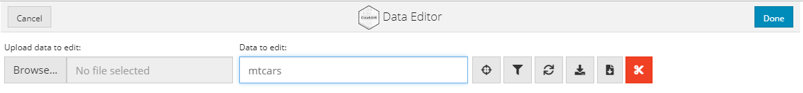

## ---

```{r setup, include=FALSE}
knitr::opts_chunk$set(echo = TRUE)
```

## 데이터 생성과 처리 with DataEditR

R에서 데이터를 생성할 때는 주로 엑셀이나 DB에 저장된 데이터를 읽어들여서 사용하는 방법을 일반적으로 사용한다. 하지만 R에서 데이터를 직접 생성하거나 일부 데이터를 삽입, 변경, 삭제하는 경우에는 코드를 생성하여 실행하고 결과를 확인해야 하기 때문에 GUI(Graphic User Interface)에 익숙한 사용자에게는 불편하게 느껴지는 것이 사실이다. 데이터를 다루는 사람들은 엑셀과 같은 스프레드 쉬트를 사용할 수 있는 사람들이 대부분이고 스프레드 쉬트에 익숙해져 있기 때문에 이런 환경을 R에서도 사용할 수 있었으면 하는 사용자가 많이 있을 것이다. 이런 사용자의 요구를 지원해 주는 R 패키지가 몇 개 존재하는데 이 중 DataEditR을 소개한다.

DataEditR은 R에서 데이터의 삽입, 삭제, 필터링, 편집 등의 작업을 대화식 GUI 방식으로 구현한 Shiny 기반의 패키지이다. DataEditR 패키지는 `data_edit()`를 사용하여 데이터를 처리 할 수 있다.

### 패키지 설치

DataEditR 패키지를 사용하기 위해서는 먼저 DataEditR 패키지를 설치해야 한다.

DataEditR 패키지를 CRAN에서 설치하기 위해서는 다음과 같이 실행한다.

```{r cran, eval=FALSE}
install.packages("DataEditR")
library(DataEditR)
```

만약 CRAN이 아닌 Github에서 설치하기 위해서는 다음과 같이 설치할 수 있다.

```{r github, eval=FALSE}
devtools::install_github("DillonHammill/DataEditR")
```

```{r library}
library(DataEditR)
```

### 데이터 보기

DataEditR 패키지를 사용하여 GUI 방식으로 데이터를 보기 위해서는 `data_edit()`를 사용한다.

```{r visualization1, eval=FALSE}
data_edit(mtcars)
```

`data_edit()`를 사용하면 다음과 같은 Data Editor 화면이 나타나고 `mtcars`의 데이터가 보인다.

Data Editor는 기본적으로 R-Studio의 Dialog Box로 실행된다. 하지만 R-Studio의 View Panel이나 웹 브라우져에서 실행할 수도 있다.

```{r visualization2, eval=FALSE}
data_edit(mtcars, viewer = "browser")  ##  웹 브라우저에서 Data Editor 실행

data_edit(mtcars, viewer = "viewer")  ##  View panel에서 Data Editor 실행

```

Data Editor는 데이터를 테이블 형태로 표현하는데 맨 왼쪽 열에는 행 인덱스가 표시되고 오른쪽으로 각각의 열 이름과 함께 데이터가 표시된다.


Data Editor의 맨 위에는 Data Editor를 닫을 수 있는 버튼이 양쪽에 배치되는데 'Done' 버튼은 Data Editor를 마치고 나갈때 사용하는 버튼이고 'Cancel' 버튼은 마찬가지로 나갈때 사용하는 버튼이지만 수정된 내용이 저장되지 않고 빠져나가게 된다.


### 데이터 Import

`data_edit()`는 다음의 몇가지 방법으로 저장된 테이블 데이터를 읽어들일 수 있다.

첫번째는 `data_edit()`는 하나의 테이블 형태로 저장된 데이터를 지정할 수 있는데 matirx, data.frame, data.table로 R에 이미 로딩된 데이터를 매개변수로 전달하면 해당 데이터를 사용할 수 있다.

두번째는 `data_edit()`를 매개변수 없이 호출한 후 Data Editor 창의 'Data to edit:' 입력창에 원하는 데이터 객체 이름을 입력해서 데이터를 편집할 수 있다.



세번째는 `data_edit()`에 데이터 Import에 사용할 함수와 함수 매개변수를 전달함으로써 파일에 저장된 데이터를 불러들일 수 있다. 다음의 예는 csv로 저장된 파일의 데이터를 data editor로 불러들이는 코드이다.

```{r eval=FALSE}
mtcars <- data_edit("mtcars.csv",                     ## 데이터가 저장된 CSV 파일명
                    read_fun = "read.csv",            ## 데이터를 불러읽어들일때 사용될 함수명
                    read_args = list(header = TRUE))  ## 데이터 읽는 함수에 필요한 매개변수
```

위와 같이 불러읽을 데이터가 저장된 파일의 포맷에 따라 사용될 함수를 `read_fun` 매개변수로 전달하고 함수에서 사용해야할 매개변수들을 `read_args`를 통해 전달하면 데이터를 읽어 저장하고 Data Editor를 열어 해당 데이터를 보여준다.

<!--chapter:end:DataEditR.Rmd-->

---
output: html_document
---

```{r setup, include=FALSE}
knitr::opts_chunk$set(echo = TRUE)
```

factor는 R에서 범주형 데이터 구조를 표현하기 위해 사용하는 특별한 데이터 구조형이다. 범주형 데이터란 데이터가 미리 규정된 분류로만 정의되어야 하는 데이터이다. 예를 들어, 사람을 성별로 표현할 때 성별은 남자, 여자로만 정의되어야 한다.(예를 들기 위해 두가지 값으로 표현했다. 필자는 남녀 이외의 성에 대해 편견을 가지지는 않는다.^.^) 이와 같이 사전에 정의되어 있는 변수의 목록을 레벨(level)이라고 한다.

가끔 factor형 변수에 미리 정의되어 있는 level의 값을 변경해야할 때가 있다. 아래의 예와 같이 남, 여를 표현하고 있는 factor형 dt는 중간에 결측치가 존재하여 레벨이 3개('', 'M', 'F')가 존재하게 된다.

```{r df}
df<-data.frame(ID=c(1:10), Gender=factor(c("M","M","M","","F","F","M","","F","F" )), 
           AgeGroup=factor(c("[60+]", "[26-35]", "[NA]", "[36-45]", "[46-60]", "[26-35]", "[NA]", "[18-25]", "[26-35]", "[26-35]")))
```

```{r output, echo=FALSE}
df
```

위의 예에서 보듯이 ID 4와 8은 성별 값이 결측치이기 때문에 NULL이 들어가 있다.

만약 이 값을 U(Unknown)으로 바꾸려면 어떻게 해야할까? 다음과 같이 factor의 level 이름을 변경할 수 있다.

```{r level_rename}
levels(df$Gender)[levels(df$Gender)==""] <- "U"
```

```{r output1, echo=FALSE}
df
```

한 줄의 코드이지만 그 안에는 3개의 코드가 숨어있다. 코드 설명을 위해 다시 되돌린다.

```{r}
levels(df$Gender)[levels(df$Gender)=="U"] <- ""
```

첫 번째 코드는 factor 변수의 level 이름을 NULL("")과 비교한 논리값 벡터를 만든다.

```{r level_rename1}
levels(df$Gender)==""
```

두 번째 코드는 논리값 벡터를 사용해 factor에서 변경하고자 하는 level을 선택한다.

```{r}
levels(df$Gender)[c(TRUE, FALSE, FALSE)]
```

위의 코드는 결국 levels(df\$Gender)의 첫 번째 요소를 선택하는 것과 같다.

```{r}
levels(df$Gender)[1]
```

이제 선택된 levels(df\$Gender)의 첫 번째 요소의 값을 ''에서 'U'로 바꾸어 준다.

```{r}
levels(df$Gender)[c(TRUE, FALSE, FALSE)] <- 'U'
df
```

만약 'M'을 'm'으로 바꾸고 싶다면 다음과 같이 할 수도 있겠다.

```{r}
levels(df$Gender)[c(FALSE, FALSE, TRUE)] <- 'm'
levels(df$Gender)[levels(df$Gender)=="M"] <- 'm'
```

```{r echo = FALSE}
df
```

그럼 이번에는 연령대를 바꾸어 본다.

위의 예에서 AgeGroup은 [18-25], [26-35], [36-45], [46-60], [60+], [NA]의 6 가지 level로 구성된 factor이다. 이 level을 [18-35], [35+], [NA]의 3개 레벨로 바꾸는 코드는 다음과 같다 .

```{r eval = TRUE}
levels(df$AgeGroup)[levels(df$AgeGroup)=="[18-25]"] = "[18-35]"
levels(df$AgeGroup)[levels(df$AgeGroup)=="[26-35]"] = "[18-35]"
levels(df$AgeGroup)[levels(df$AgeGroup)=="[36-45]"] = "[35+]"
levels(df$AgeGroup)[levels(df$AgeGroup)=="[46-60]"] = "[35+]"
levels(df$AgeGroup)[levels(df$AgeGroup)=="[60+]"] = "[35+]"
```

```{r echo=FALSE}
df
```

또는 아래와 같이 한 줄의 코드로 실행할 수도 있지만 순서를 잘못 맞추면 원치않는 결과가 나올 수 있어서 주의해야 한다.

```{r eval = FALSE}
levels(df$AgeGroup)<-c("[18-35]","[18-35]","[35+]","[35+]","[35+]", "[NA]")
```

\<출처 :<https://www.r-bloggers.com/2021/05/10-tips-and-tricks-for-data-scientists-vol-7/?utm_source=feedburner&utm_medium=feed&utm_campaign=Feed%3A+RBloggers+%28R+bloggers%29>\>

<!--chapter:end:factor_rename.Rmd-->

---
title: "ggplot의 X, Y축 숫자 포맷 설정"
output: html_document
---

```{r setup, include=FALSE}
knitr::opts_chunk$set(echo = TRUE, warning = F, message = F)
```

`ggplot`으로 플롯을 작성할 때 가끔 만나는 문제가 X축이나 Y축의 숫자인 label이 원하는 포맷으로 나오지 않을 때가 있다는 점이다.

`ggplot`의 X, Y축 label 표현은 십만(10\^6)부터 정수형 표기가 아닌 지수형 표기로 바뀐다. 하지만 이런 지수형 표기는 읽기가 쉽지 않아 정수형 표기로 바꾸어야 할 필요가 있다.

```{r}
library(tidyverse)
library(ggplot2)
if(!require(gapminder)) {
  install.packages('gapminder')
  library(gapminder)
}

gapminder %>%
  ggplot(aes(x = lifeExp, y = pop, color = continent)) + 
  geom_point()
```

위의 플롯은 gapminder 데이터 세트를 대륙별로 그룹핑한 후 인구수에 대한 평균을 나타낸 플롯이다. 플롯에서도 보이지만 가로축인 Y축의 라벨 값이 지수형태로 표기되어 있다. 지수형태로 표현된 Y축의 라벨을 고치기 위해서는 `scales` 패키지를 사용하여 다음과 같이 두가지 방법을 사용할 수 있다.

**1. scales\_\* 함수에 미리 정의된 숫자 포맷 지정**

ggplot에서 X축과 Y축의 형태를 변경할 수 있는 함수로 scale\_\* 함수가 사용된다. 이 함수에서 사용하는 매개변수인 `labels`는 X, Y축에서 표현되는 라벨의 표현 형태를 설정하는데 사용한다. 따라서 `labels` 매개변수를 `scales` 패키지에서 제공하는 포맷 지정 함수 중 적절한 함수를 지정해주면 표현되는 숫자의 형태가 변경된다.

`scales` 패키지에 `labels`에 설정할 수 있는 유용한 함수는 다음과 같다.

-   number : 숫자 포맷으로 표현되나 천단위 구분에 빈칸을 사용하는 포맷

-   comma : 숫자 포맷으로 천단위 구분 기호로 콤마(,)를 사용하는 포맷

-   percent : 백분률 포맷으로 원값에 100을 곱한 값이 표시되며 접미어에 '%'가 붙음

-   dollar : 달러 통화 포맷으로 접두사에 '\$'가 붙음

-   scientific : 과학적 포맷으로 지수형태의 표기

```{r 01}
gapminder %>%
  ggplot(aes(x = lifeExp, y = pop, color = continent)) + 
  geom_point() + 
  scale_y_continuous(labels = scales::comma)
```

여기서 하나 중요한 것은 포맷을 지정하는 `scales` 패키지의 함수를 설정할 때 일반적인 함수를 호출할 때 처럼 ()를 붙이면 안된다는 것이다. 이유는? 잘 모르겠지만 ()붙이면 에러가 난다.

**2. scales\_\* 함수에 숫자 포맷을 직접 설정**

다음으로 사용할 수 있는 방법은 앞선 사전 정의 포맷을 사용하는 대신 사용자가 직접 축 라벨에 사용될 포맷을 설정하는 방법이다. 포맷 설정에 사용하는 `sacles` 패키지의 함수는 `number_format()`이다. `number_format()`의 매개변수들을 적절히 설정함으로써 사용자가 원하는 형태의 숫자 형태로 출력이 가능하다.

```{r}
gapminder %>%
  ggplot(aes(x = lifeExp, y = pop, color = continent)) + 
  geom_point() + 
  scale_y_continuous(labels = scales::number_format(big.mark = ','))
```

다음은 `number_format()`에서 사용하는 매개변수와 그 설명이다.

-   accuracy : 반올림 되어 표기될 숫자의 유효숫자 범위를 지정. 예를 들어 0.01로 설정하면 소수점 세째자리에서 반올림하여 소수점 두쨰자리까지 표시됨.

-   scale : 스케일 팩터를 지정. 표기될 숫자는 포맷팅 되기 전에 스케일 팩터가 곱해짐. 수치값이 매우 작거나 매우 클때 유용함.

-   prefix : 숫자의 앞 에 표시될 문자 지정

-   sufix : 숫자의 뒤에 표시될 문자 지정

-   big.mark : 매 3자리(천단위)마다 표시될 문자 지정

-   decimal.mark : 소수점으로 표시될 문자 지정

<!--chapter:end:ggplot_label_format.Rmd-->

---
title: "tidyverse의 파이프(%>%)"
output: html_document
---

```{r setup, include=FALSE}
knitr::opts_chunk$set(echo = TRUE)
```

## magrittr

`tidyverse` 생태계(echosystem)의 일부인 `magrittr` 패키지는 코드를 다음과 같은 방법을 통해 보다 읽기 쉽게 만들어주는 연산자(operator)를 제공하는 패키지이다.

-   왼쪽에서 오른쪽으로 데이터 작업이 이루어지는 구조화 시퀀스

-   중첩 함수 호출의 방지

-   로컬 변수와 함수 호출의 최소화

-   코드안의 어디서든 작업 시퀀스를 추가할 수 있는 쉬운 방법의 제공

## 파이프란?

파이프(%\>%)는 파이프의 왼쪽에 기술 객체(Object) 또는 함수의 실행 결과 객체를 오른쪽에 기술된 함수의 첫번째 매개변수로 전달하는 연산자이다.

```{r pressure, message=FALSE, warning=FALSE}
library(tidyverse)
## 파이프를 이용한 코드
diamonds %>%
  arrange(carat)

## 파이프를 사용하지 않고 위의 코드와 동일한 코드
arrange(diamonds, carat)
```

Note that the `echo = FALSE` parameter was added to the code chunk to prevent printing of the R code that generated the plot.

<!--chapter:end:pipes.Rmd-->

---
title: "p값 추출과 p값 표현법"
output: html_document
---

```{r setup, include=FALSE}
knitr::opts_chunk$set(echo = TRUE)
```

## p값이란?

p값(p value)은 가설 검정에서 사용하는 값으로 유의 확률이라고 불리는 값이다. p 값은 귀무가설이 참이라는 가정하에 귀무가설이 발생할 확률이기 때문에 0에서 1사이의 값을 가진다.  보통 0.05를 임계치로 많이 활용하는데 사실 0.05라는 임계치의 과학적 근거는 없다고 알려져 있는데 가끔 0.1을 사용하는 경우도 있다.
0.05라는 수치는 p 값을 처음 제안한, 통계학의 아버지라고 일컬어지는 '로날드 피셔'(Ronald A. Fisher)가 0.05를 처음 사용했기 때문에 지금까지 관행적으로 사용되고 있는 임계치이다. 만약 피셔가 0.1을 사용했다면 지금까지 우리는 0.1을 임계치로 사용하고 있을지도 모른다. 
최근 임계치인 0.05가 너무 크다고하여 0.005를 사용하자는 움직임이 있기는하다. 하지만 아직까는 0.05가 많이 사용되고 있다. 

p값이 0.05보다 작게 나오는 경우에는 귀무가설이 발생될 확률이 0.05보다 작기 때문에 귀무가설을 기각하고 대립가설을 채택한다. 

## p값의 표현

p값을 리포팅 할때는 각 논문지마다 가이드라인이 조금씩 다르다. 

미국 심리학회(American Psychological Association)에서 제안하고 있는 p값의 표기방법은 다음과 같다. (APA Style Checklist
(Updated for APA Style 7th Edition), https://cdn.ymaws.com/www.psichi.org/resource/resmgr/pdfs/APAStyleManuscriptChecklist.pdf)

1. APA에서는 p값이 0.001보다 작은 경우외에는 = 기호를 써서 p값을 정확하게 제시해야함.
2. 모든 F값과 p값은 effect size를 기술해야함
3. 소수점 앞의 0은 생략해야함
4. 0.001보다 작은 경우가 아니라면 반올림된 소수점 두째자리까지 표현되어야 함.

또 p값을 테이블이나 그래프에 표현할 때에는 각주(footnote)의 형태로 별표(*)의 개수로 표현하기도 한다. 

## p값의 산출

그럼 R에서 p값은 어떻게 산출할 수 있는가? p값을 산출하기 위해 간단한 선형회귀 모델을 먼저 만들어보자. 

```{r lm}
library(ggplot2)
model.lm <- lm(price ~ carat, diamonds)
```

### 1. summary() 사용
보통 `summary()`를 사용하여 모델의 세부 정보를 확인하면 모델에서 산출된 p값을 R에서 확인할 수있다. 

```{r lm0}
summary(model.lm)
```

`summary()`의 결과를 보면 회귀 방정식 전체의 유의성에 해당하는 F 검정값은 3.041e+05로 계산되었고 이에 대한 p-value는 2.2e-16보다 작게 계산되었다. 따라서 F 검정값의 p값이 0.05보다 작으니 전체적인 회귀 방정식은 통계적으로 유의미하다고 볼 수 있다. 
또한 회귀 방정식을 구성하는 상수와 계수에 대한 t 검정값은 각각 -172.8과 551.4로 계산되었고 각각의 p값(Pr(>|t|))이 모두 0.05보다 작으니 상수와 계수도 통계적으로 유의미하다고 볼 수 있다. 

### 2. broom::tidy() 사용

broom 패키지에서는 모델의 전체적인 계수와 정보를 제공해주는 `glance()`와 `tidy()`를 제공한다. 

```{r lm1}
broom::glance(model.lm)
(tidy.coef.model.lm <- broom::tidy(model.lm))
```

`summary()`의 결과로 반환되는 객체는 summary class이기 때문에 바로 정보를 사용하는데 불편이 있는데 반해 `tidy()`나 `glance()`의 결과로 반환되는 객체가 데이터프레임처럼 사용이 가능한 tibble객체이기 때문에 바로 활용할 수 있다는 장점이 있다. 

## p값의 추출

앞서 계산된 회귀모델의 y절편(intercept 계수)값과 기울기(carat의 선형 계수)에 대한 p값은 2e-16보다 작은 값이기 때문에 APA 가이드라인에 따라 p<0.001로 표기하면 되는데 R에서 표기해주는 방법과 p값의 리포팅 포맷이 다르기 때문에 표기법을 바꾸어줄 필요가 있다. 바꾸려면 먼저 값을 추출해야 한다. 

그럼 y절편과 기울기에 대한 p값을 어떻게 추출할 것인가?

몇가지 방법이 있다. 

### 1. coefficients() 사용
R의 기본패키지인 ststs 패키지에서는 모델의 계수를 데이터프레임으로 추출해주는 함수인 `coefficients()`를 제공한다.
앞서 언급한 바와 같이 `summary()`를 통해 반환된 summary class는 `coefficients()`를 통해 계수들이 저장된 데이터 프레임을 생성한 후 사용하는 것이 편리하다. 하지만 broom::tidy()를 통해 산출된 결과는 계수값이 바로 tibble 객체로 저장되기 때문에 `coefficients()`를 적용할 필요가 없다. 
```{r coefficients}
coefficients(model.lm)
coefficients(summary(model.lm))
```
이렇게 얻어진 데이터프레임의 4번째 열에는 상수와 계수들의 p값이 저장되는데 이 열을 사용하면 각각의 p값에 접근할 수 있다. 
```{r coefficients1}
coef.model.lm <- coefficients(summary(model.lm))
coef.model.lm[,4]
```

### 2. scales::pvalue() 사용

앞선 `coefficients()`는 매우 작은 p값은 그냥 0으로 출력해 준다. 하지만 APA 가이드라인에서 설명했듯이 p값이 0.001보다 작을 때는 'p<0.001'로 표기해줘야한다. 이렇게 표기된 결과를 얻기 위해서는 scales 패키지에서 제공하는 `pvalue()`를 사용할 수 있다. 

```{r scales::pvalue}
scales::pvalue(coef.model.lm[,4])
scales::pvalue(tidy.coef.model.lm$p.value)
```

### 3. stars.pval() 사용

p값을 표나 그래프에 표기하기 위해서는 별표를 사용한 각주형태로 사용하여야 한다. p값을 보고 일일이 별표로 변환하기 보다는 gtools 패키지에서 제공하는 stars.pval()를 사용할 수 있다. 

```{r stars}
if(!require(gtools)) {
  install.packages('gtools')
  library(gtools)  
}
stars.pval(coef.model.lm[,4])
stars.pval(tidy.coef.model.lm$p.value)
```


<!--chapter:end:pvalue.Rmd-->

## ---

```{r setup, include=FALSE}
knitr::opts_chunk$set(echo = TRUE)
```

## relocate

R의 데이터 프레임에서 작업 시에 데이터 프레임의 칼럼의 순서가 구조 때문에 데이터의 전체적인 구조나 처리가 어려움을 겪는때가 있다. 이런 경우 칼럼의 순서를 바꾸어 새로운 데이터 프레임을 만들거나 기존의 데이터 프레임에 엎어 쓰고 작업한다. 칼럼이 몇개 되지 않는 경우에는 `dplyr`의 `select`를 이용하여 간단히 칼럼의 순서를 바꿀 수 있지만 칼럼 수가 많은 데이터 프레임의 경우에는 작업이 수월하지 않다.

이런 경우 사용할 수 있는 함수가 `relocate`이다.

```{r packages, message=FALSE}
install.packages('gapminder')
library(gapminder)
library(dplyr)

```

`relocate`를 실행하기 위해 `dplyr` 패키지와 샘플 데이터 셋 패키지인 `datasets` 패키지를 로딩한다. 
`datasets` 패키지의 샘플 데이터 셋 중에 `mcars` 데이터 셋을 사용한다. 

```{r mcars}
read.csv('./2019_kbo_for_kaggle_v2.csv', header = TRUE, stringsAsFactors = TRUE, fileEncoding = "UTF-8")
gapminder
```


## Including Plots

You can also embed plots, for example:

```{r pressure, echo=FALSE}
plot(pressure)
```

Note that the `echo = FALSE` parameter was added to the code chunk to prevent printing of the R code that generated the plot.

<!--chapter:end:relocate.Rmd-->

---
title: "showtext"
output: html_document
---

```{r setup, include=FALSE}
knitr::opts_chunk$set(echo = TRUE)
```

## 벡터 이미지와 PDF에서 한글 폰트 사용하기

데이터 분석 보고서를 작성할 때는 R이나 R-Studio에서 작성한 플롯을 사용해야 하는 경우가 많다. R-Studio에서는 Plot 패널(일반적으로 오른쪽 하단)에 플롯이 표현된다.

플롯 패널에서는 Export 메뉴에 다음과 같이 Save as Image, Save as PDF, Copy to Clipboard의 세 가지 메뉴를 제공한다.


이 세가지 메뉴에서는 다양한 파일 포맷으로 플롯을 저장하여 활용할 수 있다. R-Studio에서 제공하는 파일 포맷은 크게 벡터(Vector) 타입 이미지 파일과 래스터(Raster) 타입 이미지 파일로 나눌 수 있다.

-   벡터 타입 이미지 파일 : 이미지의 내부 저장시에 수학 방정식을 기반으로 하는 점, 직선, 곡선, 다각형과 같은 물체를 사용하는 것을 말한다. 벡터 타입 이미지는 확대를 해도 이미지가 깨지지 않고 보인다는 장점이 있지만 손으로 직접 그린 것과 같이 수학 방정식으로 표현이 어려운 도형은 표현이 어렵다는 단점이 있다. 벡터 타입 이미지 파일 포맷은 2차원 벡터 포맷으로 svg, AI, GEM 메타파일, PPT, WMF, EMF, XPS 등이 있고 3차원 벡터 포맷으로 dwg, 3ds, xgl 등이 있으며 복합 파일 포맷으로 eps, pdf, ps 등이 있다.

-   래스터 타입 이미지 파일 : 이미지의 내부 저장시에 각각의 픽셀에 대한 색상 정보를 저장함으로써 이미지를 표현하는 방식을 말한다. 래스터 타입 이미지는 사용자가 직접 그린 그림을 그린 그대로 표현한다는 장점이 있지만 그림을 확대하면 픽셀이 확대되어 이미지가 깨지는 것처럼 보인다는 단점이 있다. 래스터 타입 파일 포맷은 jpg, tiff, gif, bmp, png 등이 있다.

위에서 언급한 바와 같이 래스터 타입 이미지 파일은 화면에 표현되는 이미지를 픽셀 단위로 이미지화 했기 때문에 어떤 폰트가 표현되더라도 이미지로 저장된 파일에서 정상적으로 폰트가 표현된다. 그러나 벡터 타입 이미지 파일에서는 텍스트와 폰트명이 전달되기 때문에 폰트 설정이 잘못되는 경우 폰트가 깨져서 나오는 경우가 있다.

일반적인 A4 크기의 보고서를 작성하는 경우는 래스터 타입 이미지 파일을 사용한다고 해도 크게 어색하지 않지만 출판용 문서를 작성하거나 R-Studio에서 작성된 플롯을 타 이미지 편집 프로그램을 사용하여 편집하기 위해서는 벡터 타입 이미지로 저장하거나 PDF 문서로 저장하여 사용하여야 한다. 이 경우 자주 겪게 되는 문제가 한글 폰트가 깨진다는 점이다.

아래의 플롯 생성하고 R-Studio에서 PDF로 저장한 결과를 보자.

```{r pressure}
library(ggplot2)
ggplot(pressure, aes(x = temperature, y = pressure)) + 
  geom_point() + 
  labs(title = 'PDF 사용 예제 플롯', x = '온도', y = '압력')
```


위에서 보듯이 한글 폰트가 깨져서 나오게 된다. 이렇게 한글이 깨지는 것은 PDF 포맷만이 아니고 벡터타입 이미지는 다 깨지지만 래스터 타입의 이미지에서는 정상적으로 나온다.

그럼 래스터 이미지 포맷을 쓰면 되지 않을까? 하지만 위의 제목에서도 보이듯이 영문과 한글의 사이즈가 달라 매우 어색해 보인다. 이런 경우 외부 그래픽 편집 프로그램에서 편집해야하는데 이럴때 벡터 이미지 포맷이 사용되는데 문제는 한글이 다 깨진다는 점이다.

이런 경우는 한글 폰트 뿐만 아니라 R에서 제공하는 표준 폰트가 아닌 폰트를 사용하는 경우 발생한다. 얼마전까지는 이런 문제를 해결하기 위해 PDF의 ttf(True Type Font)의 처리를 위주로 개발된 `extrafont` 패키지를 사용해서 해결했다. 하지만 최근에는 대부분의 벡터 타입 이미지를 지원하는 `showtext` 패키지의 `showtext_auto()`를 사용하면 PDF 포맷은 물론 벡터 타입 이미지의 한글 깨짐 현상을 방지할 수 있다.

```{r showtext, message=FALSE, warning=FALSE}
if(!require(showtext)) {
  install.packages('showtext')
  library(showtext)
}

showtext_auto()

```

R-Studio의 플롯 패널에 보이는 한글도 이전보다 훨씬 보기 좋게 나온다.


PDF로 저장 후에도 정상적으로 한글이 나온다.


다음은 위의 플롯의 한글 폰트를 나눔손글씨 펜 폰트로 바꾸어 그리는 코드이다.

```{r nanum, eval=FALSE}
font_add(family = "나눔손글씨 펜", regular = '폰트설치 폴더/NANUMPEN.TTF')

ggplot(pressure, aes(x = temperature, y = pressure)) + 
  geom_point() + 
  labs(title = 'PDF 사용 예제 플롯', x = '온도', y = '압력') + 
  theme(text=element_text(size=16, family="나눔손글씨 펜"))
```


<!--chapter:end:showtext.Rmd-->

