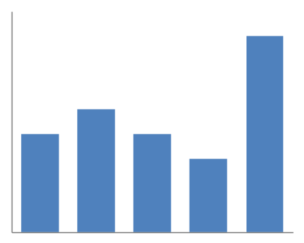
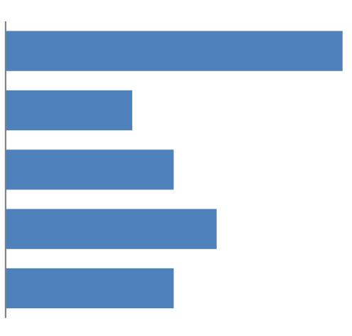
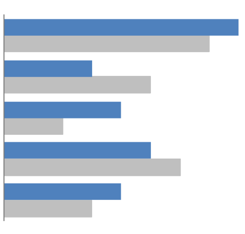
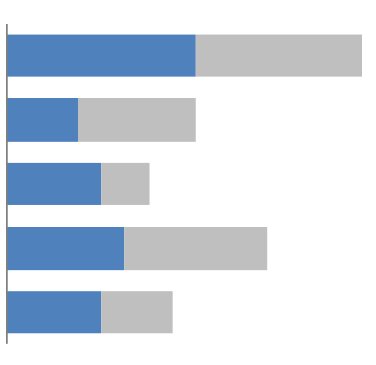
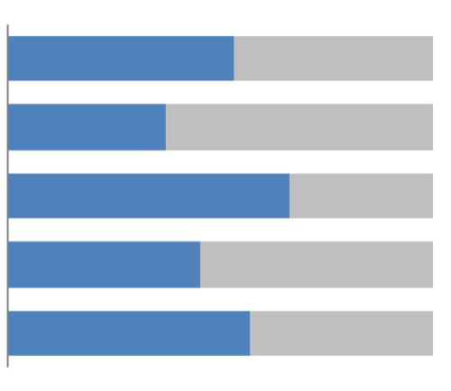
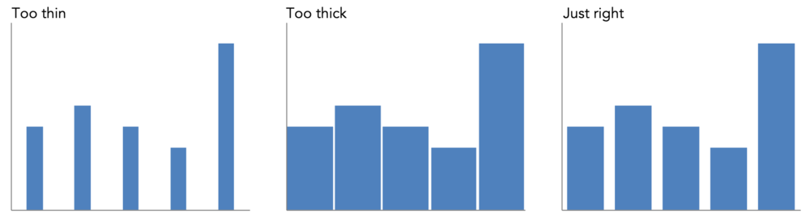
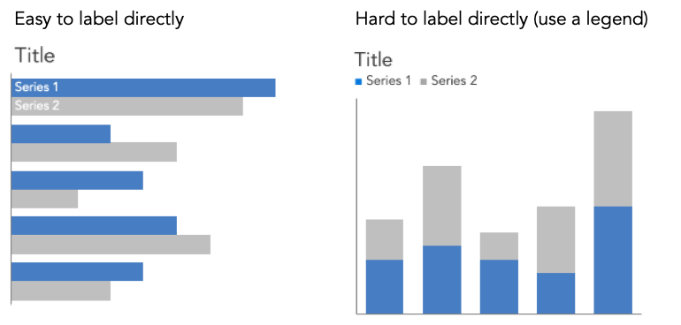

```{r setup, include=FALSE}
knitr::opts_chunk$set(echo = TRUE)
```

이 글은 ALEX VELEZ가 www.storytellingwithdata.com에 작성한 블로그를 번역한 글입니다. (<https://www.storytellingwithdata.com/blog/2020/2/19/what-is-a-bar-chart>)

### 막대 차트란?

막대 차트는 범주형 데이터 또는 그룹으로 정렬된 데이터를 그래프화하기 위해 일반적으로 사용되는 차트 유형이다. 공통 기준선에 정렬된 여러 사각형으로 구성된다. 각각의 길이는 나타내는 값에 비례한다.즉, 막대 차트에서 데이터는 막대의 길이로 인코딩됩니다. 우리는 정렬된 객체의 길이를 비교하기가 좋으므로 막대 챠트를 쉽게 해석할 수 있다. 이것이 막대차트가 일반적으로 사용되는 이유이다.

분석가는 막대 차트의 기준선부터 시작해서 꼭대기까지를 살펴본다. 그리고 비교하는 막대들의 기준선에서부터 측정한 상대적인 길이가 가장 긴 막대와 가장 짧은 막대를 구분함으로써 데이터를 분석하는 간단한 플롯이다. 또 여러 막대 높이의 차이로 인한 빈 공간을 통해 두 데이터간의 증가 차이를 비교할 수 있다.

막대 차트는 차트를 쉽게 읽을 수 있을 뿐아니라 전체적으로 인지하기 쉽다. 이미 표준화된 가로 또는 세로 막대 차트를 접했을 것이지만, 막대의 형태는 모양과 크기가 다양하게 사용된다.아래에 예는 가장 일반적으로 사용되는 막대 차트의 형태와 활용방법에 대한 링크이다.

#### 수직막대차트(Vertical Bar Chart)



위의 그림은 표준 수직 막대 차트(열 차트라고도 함)이며 막대차트에서 가장 일반적인 종류 중 하나이며, 막대차트를 생성할때 사용할 수 있는 거의 모든 도구를 보여준다. [수직막대차트를 사용하여 스토리를 전달하는 방법은 다음의 링크를 참조하라.](http://www.storytellingwithdata.com/blog/2012/05/telling-multiple-stories-part-1)

#### 수평막대차트(Horizontal Bar Chart)



수평막대차트는 수직막대차트를 옆으로 뒤집은 형태와 유사하다. 수평막대차트는 왼쪽편의 공간에 가로로 범주 이름을 쓸수 있기 때문에 범주이름이 긴 경우에 활용하기 좋다.(수직 막대차트에서 긴 범주 이름을 대각선으로 사용하는 방법의 대안). 수평막대차트는 왼쪽에서 오른쪽으로, 위에서 아래로 정보를 읽는 문화에 익숙한 형태의 구조이기 때문에 차트를 읽기가 편하다. [수평막대차트를 사용하여 스토리를 전달하는 방법은 다음의 링크를 참조하라.](https://www.storytellingwithdata.com/blog/2012/10/my-penchant-for-horizontal-bar-graphs)

#### 클러스터 막대(Cluster Bar)



수평, 수직 막대차트를 변형하면 하나 이상의 데이터 변량을 표현할 수 있다. 하지만 막대차트에 많은 데이터 변량을 표현하는 것은 중요한 요인(key)에 대한 집중과 식별에 어려움이 있을 수 있다. [이 링크는 클러스터 막대를 이용하는 예제를 보여준다. .](http://www.storytellingwithdata.com/blog/orytellingwithdata.com/2015/07/align-against-common-baseline.html)

#### 스택 막대(Stacked Bar)



스택막대는 가로와 세로 막대 차트에서 모두 사용 가능하다. 막대의 끝점을 통해 데이터의 전체합에 대한 비교가 가능하지만 각각의 범주내 세부 구성을 보여줄 수도 있다. 스택 막대의 문제는 범부내 세부구성들의 기준선이 일정하지 않기 때문에 이들을 비교하기가 어렵다는 점이다.[이 링크는 스택 막대를 이용하는 예제를 보여준다. .](https://www.storytellingwithdata.com/blog/2017/11/13/making-a-case-for-stacked-bars)

#### 100% 스택막대



스택막대에 대한 대안으로 사용하는 것은 100% 스택막대인데 절대적인 데이터 값보다는 상대적인 백분률이 표현된다. 이 버전의 장점은 비교를 위한 두 가지 일관된 기준을 제공한다는 것이다: 왼쪽에 하나, 다른 하나는 오른쪽에 있다. [설문조사 데이터를 시각화하는 좋은 방법에 대한 예를 링크를 통해 알아보라. .](http://www.storytellingwithdata.com/blog/2012/03/visualizing-survey-data)

#### 폭포 막대 차트


폭포 차트는 막대 차트의 고급형 변형으로 많이 사용되는 차트는 아니다. 이 차트는 주로 값의 변동을 시각화하는 데 유용한데, 첫 번째 막대는 시작 값을 나타내고 마지막 막대에는 마지막 수량이 표시된다. 그 사이에 있는 작은 막대들은 시작부터 끝까지 이동하는 증분 변화를 나타낸다. [링크는 Excel에서 폭포 차트를 만드는 방법이다.](https://www.storytellingwithdata.com/blog/2011/11/waterfall-chart)

### 막대차트 디자인 팁

다음은 막대차트를 만들때 고려해야하는 몇가지 팁이다.

#### 막대사이의 간격

여기에 특정 규칙은 없지만 일반적으로 막대 자치의 너비보다 간격이 좁아야 한다. Excel에서는 일반적으로 막대 너비의 30% ~ 40% 사이를 사용한다.목표는 건강한 균형을 맞추는 것이다 : 데이터가 눈에 띄지 않도록 너무 많은 공백을 두어서 데이터가 도드라지지 않는 것을 좋지 않지만  너무 가까워서 각각의 구분된 요소로 보이지 않고 하나의 모양처럼 보여지는 것도 좋지 않다. 이것을 결정하는데에는 사용자의 적절한 판단이 필요하다. (히스토그램을 그릴때는 예외인데 히스토그램은 막대차트와 유사하지만 데이터의 분포를 보여주는 다른 형태의 차트이기 때문이다.) [이 링크는 히스토그램과 막대 차트의 차이점을 설명한다.](http://www.storytellingwithdata.com/blog/2021/1/28/histograms-and-bar-charts)



#### 의도적인 막대 순서

막대의 순서에 의해 독자가 어떻게 해석해야 할지에 대해 잘 생각해야 한다. 만약 나이나 리커르트 척도와 같이 데이터 분류에 자체 순서가 있는 데이터의 경우는 데이터가 가진 자체적인 순서를 유지하는 것이 좋다. 만약 그렇지 않다면 전달하고자 하는 내용에 따라 작은 막대에서 큰 막대의 순서나 큰 막대에서 작은 막대의 순서와 같이 데이터에 기반하여 막대의 순서를 설정하는 것을 고려해야 한다.

#### 범례에 대한 고려

종종 다른 차트보다 막대 차트에서 더 많은 레이블을 사용하는 경우가 있다. 특히 카테고리를 축에 표기하지 않는 경우 더 그렇다. 일반적으로 막대차트는 빈공간이 많지 않기 때문에 필자는 막대안에 카테고리 이름을 넣어 혼란을 방지한다. 하지만 이 방법은 세로 막대나 스택 막대에서는 가로 공간이 제한되기 때문에 어렵다.  이러한 이유로, 막대 내부 또는 시각적으로 좋은 측면에 직접 레이블을 넣을 수 없다면 막대 차트에 범례를 추가하는 것은 드문 일이 아니다. 필자는 범례를 사용할 때에는 제목 아래에 배치함으로써 독자가 데이터를 보기 전에 차트를 읽는 방법을 접할 수 있도록 한다. 아래에서 보면 가로 대 세로 막대 차트에서 일반적으로 레이블을 지정하는 방법을 볼 수 있다.




#### 직접적인 데이터 레이블은 막대안으로 배치

막대차트는 매우 무겁고 잉크를 많이 소모할 것처럼 느껴진다. 만약 각각의 막대의 값을 표현하려면 막대안으로 레이들을 이동하여 혼동을 줄이는 것이 좋다. 위치상의 이 작은 변화는 동일한 양의 세부 정보를 유지하면서 더 적게 소모된다고 생각하도록 속일 수 있다.

#### 기준선은 0부터 시작

이것은 매우 중요한 규칙이다. 막대 차트에서는 데이터가 길이로 인코딩되기 때문에 전체 막대의 범위가 유지되어야 한다. 그렇지 않으면 상대적인 측정이 부정확해진다. 더 작은 차이를 전달하기 위해 기준을 변경해야 하는 경우 더 적합한 대체 차트 유형이 있을 수 있다.[이 링크는 이것이 중요한 이유와 이를 설명하기 위한 약간의 수학적 이론을 확인해 볼 수 있다.](http://www.storytellingwithdata.com/blog/2012/09/bar-charts-must-have-zero-baseline)  

### 막대차트의 예제

-   100% 스택 막대 꾸미기 1 : [보기](http://www.storytellingwithdata.com/blog/2014/09/show-full-picture)
-   100% 스택 막대 꾸미기 2 : [보기](https://www.storytellingwithdata.com/blog/2019/5/13/declutter-and-question-defaults)
-   가로막대 꾸미기 : [보기](https://www.storytellingwithdata.com/blog/2014/04/us-prison-population-revisualized)
-   막대차트의 작은 변형 : [보기](http://www.storytellingwithdata.com/blog/tag/Visual+Makeover)
-   막대에 대한 대안 : [보기](https://www.storytellingwithdata.com/blog/2017/10/13/novel-vs-the-boring-old-bar-chart)
-   또 다른 막대차트의 변형 : [보기](https://www.storytellingwithdata.com/blog/2017/10/13/novel-vs-the-boring-old-bar-chart)

수백 개의 추가 막대 차트 예제를 보려면 [기본 막대 차트](http://www.storytellingwithdata.com/blog/2020/2/3/swdchallenge-back-to-basics-with-bars), 막대 및 [선 차트](https://community.storytellingwithdata.com/challenges/64c0597e-5784-4080-b955-cba87342a537), [폭포 차트](http://www.storytellingwithdata.com/blog/2018/5/15/may-swdchallenge-recap-the-waterfall-chart)와 같은 막대가 포함된 SWD 챌린지를 확인하라.

