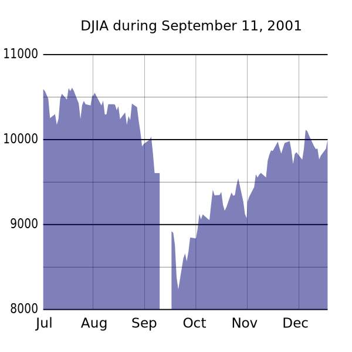

```{r setup, include=FALSE}
knitr::opts_chunk$set(echo = TRUE)
```

## 변화점(change point)

시계열 데이터는 시간에 따른 데이터 변화량을 기록하는 데이터로 다른 데이터와는 조금 다른 몇가지 특징을 가진다. 이 특징은 계절성, 자기상관성 등이 있지만 또 하나의 특징으로 말할 수 있는 것이 특정 시기에 발생한 외부적 요인에 따른 데이터의 급격한 변화 요인이다.

필자가 생각하는 변화점의 예로 가장 적절한 것은 미국의 9.11테러로 인한 증시에 변화량이라고 생각한다.



2001년 9월 11일 발생한 테러로 인해 뉴욕 증시 뿐만아니라 한국 증시도 패닉상태였다. 하루에 종합주가지수는 12%떨어졌는데 당시 개별 주식의 하한가가 -15%인 것을 감안하면 거의 모든 종목이 하한가였다는 것이다. 실제로 하한가 종목은 621개이고 상승종목은 15개에 불과했다.(이날 상승한 종목은 대체 뭐지???)

또한 가장 가까운 예로 2020년 2월까지 안정적 흐름으로 상승추세를 보이던 우리나라 신규 취업자의 흐름이 2020년 3월 갑자기 하락추세로 반전되었다. 코로나 19로 인해..

이와 같이 시계열 데이터는 특정 시기에 발생한 외부 충격에 의해 데이터의 추세가 갑자기 바뀌는 상황이 존재한다. 위에서 설명한 두가지 예는 데이터의 흐름을 보면 육안으로 확실히 데이터의 변화점을 알 수 있지만 육안으로 발견되지 않는 변화점은 어떻게 알 수 있을까?

R에서 이러한 시계열 데이터에 대한 변화점을 찾아내기 위해 많은 패키지가 제공되고 있지만 이 포스트에서는 `changepint` 패키지를 사용하여 시계열 데이터 상의 변화점을 찾아내는 방법을 알아보자.

## `changepoint` 패키지

`changepoint` 패키지는 일련의 수치형 벡터에서 데이터가 변화되는 변화점을 찾아내는데 사용되는 함수를 제공한다. 사실 R에서 변화점을 찾아내는 패키지는 `mcp`, `segmented`, `bcp`, `changepoint` 등 여러가지가 제공된다.

This is an R Markdown document. Markdown is a simple formatting syntax for authoring HTML, PDF, and MS Word documents. For more details on using R Markdown see <http://rmarkdown.rstudio.com>.

When you click the **Knit** button a document will be generated that includes both content as well as the output of any embedded R code chunks within the document. You can embed an R code chunk like this:

```{r cars}
summary(cars)
```

## Including Plots

You can also embed plots, for example:

```{r pressure, echo=FALSE}
plot(pressure)
```

Note that the `echo = FALSE` parameter was added to the code chunk to prevent printing of the R code that generated the plot.
