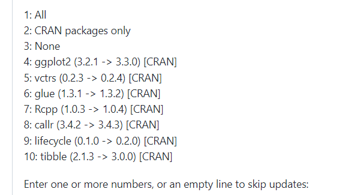
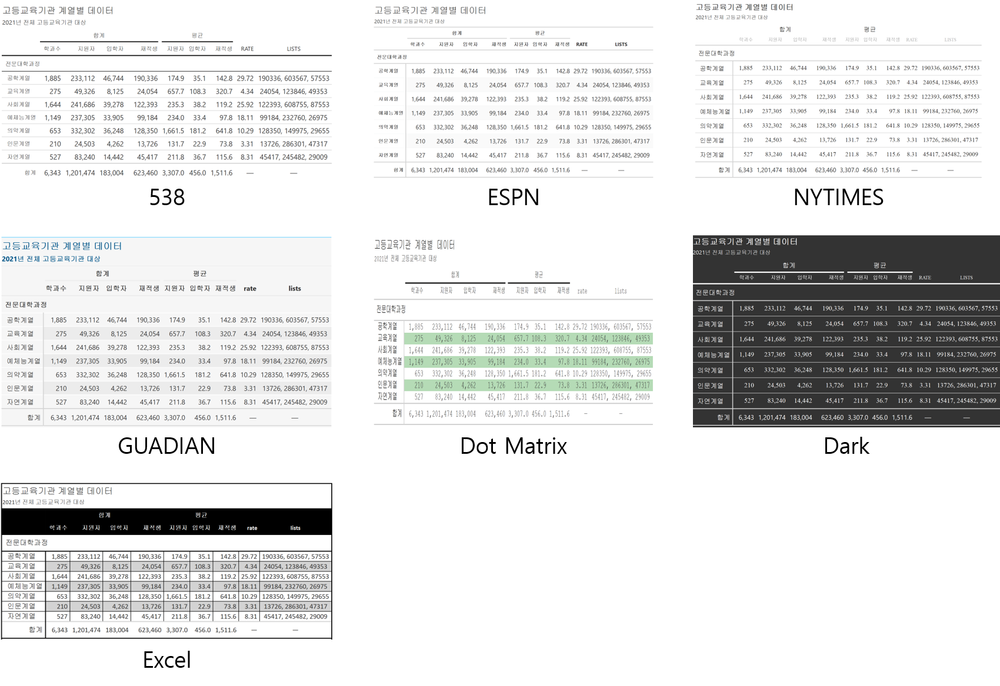

---
output:
  html_document:
    css: style.css
---

```{r setup, include=FALSE}
knitr::opts_chunk$set(collapse = TRUE, comment = "#>", echo = TRUE, message = FALSE, warning = FALSE)

library(showtext)
showtext_auto()
library(openxlsx)
library(tidyverse)

df <- read.xlsx(xlsxFile = '../gt/21년 고등 학과별 입학정원 입학 지원 재적 재학 휴학 외국인유학생 졸업 교원_211119.xlsx', sheet = '학과별 주요 현황',  startRow = 13, na.string = '-', colNames = T)


df$학제 <- fct_relevel(df$학제, '대학교', '교육대학', '산업대학', '기술대학', '방송통신대학', '사내대학(대학)', '원격대학(대학)', '사이버대학(대학)', '각종대학(대학)', '전문대학(2년제)', '전문대학(3년제)', '전문대학(4년제)', '기능대학', '원격대학(전문)', '사이버대학(전문)', '사내대학(전문)', '전공대학',  '일반대학원', '특수대학원', '전문대학원')

```

## `gtExtras` 패키지로 inline 그래프 그리기

앞의 포스트에서 그린 표는 워드프로세서에서 그리는 것이 가능한 것이지만 `data_color()`를 사용하여 데이터 색 강조는 워드프로세서에서는 불가능한 기능이다. 그러나 `data_color()`의 기능은 엑셀에서는 지원한다. 결국 지금까지 `gt`를 이용해서 그린 표는 엑셀에서는 그리는게 가능했다는 것이다. 하지만 이번 포스트에서 제공하는 기능은 워드프로세서도 엑셀도 지원하지 못하는 기능이다.

### `gtExtras` 패키지

`gtExtras` 패키지는 `gt` 객체로 그려진 표를 더 예쁘게 꾸미기 위해 추가적으로 제공하는 함수들을 위한 패키지이다. 하지만 `gtExtras` 패키지는 아직은 완전히 완성된 패키지는 아니기 때문에 CRAN에 등록되지 않고 Github에 등록되어 있다. 현재 0.2.2.11 버전이 나와 있다.

`gtExtras` 패키지의 설치는 다음과 같다.

```{r eval=FALSE}
# `remotes` 패키지가 설치되어 있지 않다면 `install.packages("remotes")`로 `remotes` 패키지를 설치하라
remotes::install_github("jthomasmock/gtExtras")
```

간혹 위의 코드를 실행하면 `gtExtras` 패키지를 설치하는데 필요한 몇가지 패키지를 업데이트하라는 메세지가 나온다. 그러면 'All'을 선택하여 전체 패키지를 업데이트해 주는 것이 좋다.



### Data 전처리

이번 포스트에서 사용하는 데이터는 이전 `gt` 관련 포스트에서 사용한 `df` 데이터를 사용하겠다. 다만 표의 표현에 적합하게 다음과 같이 전처리하여 사용하도록 하겠다.

```{r data_preprocessing}
library(gt)
library(tidyverse)

head(df)

## 학위과정의 순서를 맞추기 위해 학위롸정을 factor로 설정하고 level을 설정한다.
df$학위과정 <- fct_relevel(df$학위과정, '전문대학과정', '대학과정', '대학원과정')

df.extragt <- df |>
  ## df를 학위과정과 대계열로 그루핑
  group_by(학위과정, 대계열) |>
  ## 소규모 학교급(학과수가 100개 이하)을 제외
  filter(sum(학과수_전체) > 100) |>
  ## 그룹별로 학과수_전체, 지원자_전체_계, 입학자_전체_계, 재적생_전체_계의 합계와 평균 열을 생성
  summarise_at(vars(학과수_전체, 지원자_전체_계, 입학자_전체_계, 재적생_전체_계), funs(sum, mean)) |>
  ## 그룹 다시 묶어 그룹 속성을 없앰
  ungroup() |>
  ### 학위과정별로 재적생 비율을 구하기 위해 학위과정으로 다시그루핑
  group_by(학위과정) |>
  ## 각각의 행에 학과수_전체_sum의 합계에 대비한 학과수_전체_sum의 비율을 소수점 두자리까지 산출하여 rate열에 기록함
  mutate(rate = round(학과수_전체_sum/sum(학과수_전체_sum)*100, 2)) |>
  ## 그룹을 다시 묶어 그룹 속성을 없앰
  ungroup() |>
  ## 대계열별 재적생수 list를 만들기 위해 대계열로 다시 그루핑
  group_by(대계열) |>
  ## 각각의 행에 재적생_전체_계_sum의 데이터를 list로 만드는 열을 생성
  mutate(lists = list(재적생_전체_계_sum)) |>
  ## 그룹을 다시 묶어 그룹 속성을 없앰
  ungroup()

head(df.extragt)
```

앞선 포스트와는 다른 몇개의 열이 포함되었다. 이는 `gtExtras`의 기능을 사용하기 위해 추가적으로 산출한 열로 차차 설명된다. 

### `gt` 객체 생성

전처리한 데이터를 사용하여 `gt` 객체를 생성한다. 기본 표를 그리기 위해 필요한 몇가지 스타일을 지정하도록 하겠다. 

```{r basic}
gtextras.table <- df.extragt |> 
  ##  행이름을 '대계열', 그룹열 이름을 '학위과정'으로 설정하고 `gt` 객체를 생성
  gt(rowname_col = '대계열', groupname_col = '학위과정') |>
  ## 표제목과 표부제목을 설정
  tab_header(title = '고등교육기관 계열별 데이터', subtitle = '2021년 전체 고등교육기관 대상') |> 
  ## 3번 열부터 6번 열까지 소수점을 없애고 천단위 구분자를 두는 숫자 포맷으로 설정
  fmt_number(columns = 3:6, decimals = 0, use_seps = TRUE) |>
  ## 7번 열부터 10번 열까지 소수점 첫자리, 천단위 구분자를 두는 숫자 포맷으로 설정
  fmt_number(columns = 7:10, decimals = 1, use_seps = TRUE) |> 
  ## 3번 열부터 6번 열까지 '합계' 열 그룹(spanner)로 설정
  tab_spanner(columns = 3:6, label = '합계') |>
  ## 7번 열부터 10번 열까지 '평균' 열 그룹(spanner)로 설정
  tab_spanner(columns = 7:10, label = '평균') |> 
  ## 각각의 열 이름을 설정
  cols_label(대계열 = '대계열', 
               학과수_전체_sum = '학과수', 
               지원자_전체_계_sum = '지원자',
               입학자_전체_계_sum = '입학자', 
               재적생_전체_계_sum = '재적생', 
               학과수_전체_mean = '학과수', 
               지원자_전체_계_mean = '지원자',
               입학자_전체_계_mean = '입학자', 
               재적생_전체_계_mean = '재적생'
  ) |> 
  ## 요약 행을 생성 
  summary_rows(
    ## 행 그룹별로 생성
    groups = T,
    ## 3열부터 6열까지 해당 
    columns = 3:6,
    fns = list(
      ## 요약행은 합계값으로 설정
      합계 = ~sum(.)
    ),
    ## 요약 행은 숫자열이고 소수점은 없으며 천단위 구분자를 사용
    formatter = fmt_number, 
    decimals = 0,
    use_seps = TRUE
  ) |>
  ## 요약 행을 생성
  summary_rows(
    ## 행 그룹별로 생성
    groups = T,
    ## 7열부터 10열까지 해당
    columns = 7:10,
    ## 요약행은 합계값으로 설정
    fns = list(
      합계 = ~sum(.)
    ),
    ## 요약 행은 숫자열이고 소수점은 한자리이며 천단위 구분자를 사용
    formatter = fmt_number, 
    decimals = 1,
    use_seps = TRUE
  )  |>
  ## 전체 요약행 생성
  grand_summary_rows(
    ## 3열부터 6열까지 해당 
    columns = 3:6,
    ## 요약행은 합계값으로 설정
    fns = list(
      합계 = ~sum(.)
      ), 
    ## 요약 행은 숫자열이고 소수점은 없으며 천단위 구분자를 사용
    decimals = 0,
    use_seps = TRUE
  ) |>
  ## 전체 요약 행을 생성
  grand_summary_rows(
    ## 7열부터 10열까지 해당
    columns = 7:10,
    ## 전체 요약행은 합계값으로 설정
    fns = list(
      합계 = ~sum(.)
      ), 
    ## 전체 요약 행은 숫자열이고 소수점은 한자리이며 천단위 구분자를 사용
    decimals = 1,
    use_seps = TRUE
  ) |>
  ## 7번 열은 감춤
  cols_hide(column = 7) |>
  tab_options(table.font.size = 5)
```

### `gtExtras` 패키지 사용

이제 앞에서 기본적으로 설정한 `gt` 객체를 사용하여 `gtExtras`에서 제공하는 기능으로 표를 추가 보완하겠다.  먼저 `gtExtras` 패키지를 불러온다. 

```{r}
library(gtExtras)
```

#### 표 테마 사용

앞선 `gt` 패키지 포스트에서 각각의 표 요소들을 개별적으로 설정하여 사용자가 원하는 표를 설정하는 과정을 살펴보았다. 하지만 이렇게 하나 하나 표를 설정하는 것은 번거로운데다가 표를 완성해놓고 보면 색상의 배열이나 표의 구조가 영 마음에 들지 않는 경우가 있을 것이다. 여러 디자이너들이 미리 예쁘게 만들어 놓은 템플릿을 사용하면 좀 편하게 표를 디자인 할 수 있을 것이다. `gtExtras` 패키지는 사전에 정의된 7개의 템플릿을 제공한다. 이를 적용하는 함수는 다음과 같다. 

::: infobox

-   gt_theme_538() : five thirty eight(미국의 여론 조사 분석, 정치, 경제 및 스포츠 블로그를 운영하는 사이트)에서 사용하는 형태의 표

-   gt_theme_espn() : 미국 ESPN(스포츠 네트워크)에서 사용하는 형태의 표

-   gt_theme_nytimes() : 미국 뉴욕타임즈에서 사용하는 형태의 표

-   gt_theme_guardian() : 영국 가디언즈에서 사용하는 형태의 표

-   gt_theme_dot_matrix() : 도트 매트릭스 형태의 표

-   gt_theme_dark() : 어두운 형태의 표

-   gt_theme_excel() : 엑셀 형태의 표

:::



위에서 생성한 `gt` 객체를 `gtExtras`의 테마를 다음과 같이 사용할 수 있다. ESPN 테마를 사용하는 코드는 다음과 같다. 

```{r}
gtextras.table1 <- gtextras.table |>
  gt_theme_espn()

gtextras.table1
```


#### 막대 그래프를 행에 넣기

데이터 간의 양적 차이를 비교를 할 때 많이 사용되는 그래프가 막대 그래프이다. `gtExtrass`는 각각의 행에 해당하는 데이터에 대한 막대 그래프를 넣어주는 열을 생성할 수 있는데 `gt_plt_bar()`를 사용하면 생성할 수 있다. 

::: infobox
`r kableExtra::text_spec('gt_plt_bar(gt_object, column = NULL, color = "purple", ..., keep_column = FALSE, width = 70, scale_type = "none", text_color = "white")', bold = TRUE, background = 'grey', color = 'white', font_size = 20)`

-   gt_object : 표 그리기에 사용할 `gt` 객체

-   columns : 막대그래프를 그릴 열

-   color : 막대에 채워질 색 설정

-   keep_column : 원 값을 가진 열을 유지할지를 설정

-   width : 막대 그래프가 표시될 열의 너비 설정

-   scale_type : 막대에 원 값을 표기한다면 어떤 형태로 표기할 지를 설정(none, number, percent)

-   text_color : scale_type가 설정된 경우 글자색을 설정

:::

위의 `gt` 객체에 재적학생에 대한 인라인 막대 그래프를 넣어 보도록 하겠다. 먼저 `gt_duplicate_column()`을 사용하여 재적학생 합계 열을 하나 더 만들고 이 열을 막대 그래프로 바꾸는 코드는 다음과 같다.

::: infobox
`r kableExtra::text_spec('gt_duplicate_column(gt_object, column, after = dplyr::last_col(), append_text = "_dupe", dupe_name = NULL)', bold = TRUE, background = 'grey', color = 'white', font_size = 20)`

-   gt_object : 표 그리기에 사용할 `gt` 객체

-   columns : 중복이 필요한 열

-   after : 열의 위치 설정에 필요한 열

-   append_text : 열 이름에 붙여줄 문자

-   dupe_name : 중복된 열 이름

:::


```{r}
gtextras.table2 <- gtextras.table1 |>
  gt_duplicate_column(재적생_전체_계_sum, dupe_name = '재적생_막대그래프') |>
  gt_plt_bar(column = '재적생_막대그래프', keep_column = FALSE, width = 30)

gtextras.table2
```

이 결과 표를 보면 어떤 계열의 재적학생이 많은지가 한눈에 띈다. 대학과정의 공학계열과 사회계열의 재적학생이 매우 많은 것으로 보이고 전문대에서는 공학계열과 의약계열, 대학원에서는 사회계열 재적학생이 많은 것으로 보인다. 

#### 컬러 박스를 행에 넣기

`gtExtras` 패키지에서는 값의 크기를 작은 색깔 상자를 이용해서 표현하는 함수를 제공한다. 이 함수가 `gt_color_box()`이며 용법은 다음과 같다. 

::: infobox
`r kableExtra::text_spec('gt_color_box(gt_object, columns, palette = NULL, ..., domain = NULL, width = 70)', bold = TRUE, background = 'grey', color = 'white', font_size = 20)`

-   gt_object : 표 그리기에 사용할 `gt` 객체

-   columns : 컬러 박스를 그릴 열

-   palette : 컬러 박스에 사용할 팔레트

-   domain : 값의 범위

-   width : 컬러 벅스를 그릴 열 너비
:::

```{r}
gtextras.table3 <- gtextras.table2 |>
  gt_duplicate_column(재적생_전체_계_sum, dupe_name = '재적생_컬러박스') |>
  gt_color_box(columns = '재적생_컬러박스', domain = c(min(df.extragt$재적생_전체_계_sum), max(df.extragt$재적생_전체_계_sum)), palette = "ggsci::blue_material", width = 100) 

gtextras.table3
```

#### 백분율 막대 그래프 넣기

`gtExtras` 패키지에서는 백분율에 대한 막대 그래프를 넣는 기능을 제공한다. 이 기능은 `gt_plt_bar_pct()`함수로 생성할 수 있는데 이 함수를 적용하는 열은 백분율 수치로 표현된 열을 사용할 수도 있고 변환하도록 사용할 수도 있다. 

::: infobox
`r kableExtra::text_spec('gt_plt_bar_pct(gt_object, column, height = 16, fill = "purple", background = "#e1e1e1", scaled = FALSE)', bold = TRUE, background = 'grey', color = 'white', font_size = 20)`

-   gt_object : 표 그리기에 사용할 `gt` 객체

-   columns : 백분율 막대를 그릴 열

-   height : 백분율 막대 높이 설정

-   fill : 막대에 채울 색 설정

-   background : 전체 막대 배경 색 설정

-   scaled : 0부터 100까지 설정된 백분율 값인지 아닌지를 설정
:::

전처리 과정에서 계산했던 각 학위과정별 재적생 비율 열을 백분율 막대 그래프로 그리는 코드는 다음과 같다. 먼저 재적생 비율 열인 `rate`열을 중복하여 열을 생성하고 이 열을 `gt_plt_bar_pct()`함수로 백분률 막대 그래프를 생성한다.


```{r}
gtextras.table4 <- gtextras.table3 |>
  gt_duplicate_column(rate, dupe_name = '재적생비율_pct') |>
  gt_plt_bar_pct(column = '재적생비율_pct', scale = TRUE)

gtextras.table4
```

#### 백분율 점 그래프 넣기

`gtExtras`에서 제공하는 그래프 중에 가장 독특한 그래프가 바로 이 백분율 점 그래프이다. 백분률의 위치를 점으로 표현하는 이 그래프는 앞서 사용했던 각 학위과정별 재적생 비율 열을 `gt_plt_percentile()`을 사용하여 그릴 수 있다. 

::: infobox
`r kableExtra::text_spec('gt_plt_percentile(gt_object, column, palette = c("#007ad6", "#f0f0f0", "#f72e2e"), width = 25, scale = 1)', bold = TRUE, background = 'grey', color = 'white', font_size = 20)`

-   gt_object : 표 그리기에 사용할 `gt` 객체

-   columns : 백분율 점 그래프를 그릴 열

-   palette : 색 설정을 위한 팔래트

-   width : 백분율 점 그래프 너비 설정

-   scaled : 0부터 100까지 설정된 백분율 값인지 아닌지를 설정
:::

```{r}
gtextras.table5 <- gtextras.table4 |>
  gt_plt_percentile(column = rate, scale = TRUE) |>
  cols_label(rate = '재적생 비율')

gtextras.table5
```


#### 100% 누적 막대 그래프 넣기

앞서 언급한 바와 같이 아직 `gtExtras` 패키지는 개발이 완료되지 않았다. 그래서 몇개의 함수는 아직 그 기능이 완전치 않은데 100% 누적 막대 그래프가 그런 듯 하다. 100% 누적 막대 그래프는 특정 데이터의 구성비를 표현할 수 있는 좋은 기능인데 아직 2개나 3개의 구성비밖에 표현이 불가하다. 하지만 중요한 기능으로 보여 소개한다. 이 기능은 `gt_plt_bar_stack()`를 이용하여 구현할 수 있다. 다만 이 함수를 사용하기 위해서는 구성비로 표현될 데이터들을 `list`로 묶어서 표현된 열이 필요하다. 이를 위해 앞의 전처리 과정에서 `mutate(lists = list(재적생_전체_계_sum))`를 사용했다. 이 코드를 사용하기 위해 바로 앞에서 `group_by(대계열)`로 그루핑 했었기 때문에 대계열별 구성비가 표현될 것이다. 

::: infobox
`r kableExtra::text_spec('gt_plt_bar_stack(gt_object, column = NULL, palette = c("#ff4343", "#bfbfbf", "#0a1c2b"), labels = c("Group 1", "Group 2", "Group 3"), position = "fill", width = 70, fmt_fn = scales::label_number_si(trim = TRUE))', bold = TRUE, background = 'grey', color = 'white', font_size = 20)`

-   gt_object : 표 그리기에 사용할 `gt` 객체

-   columns : 100% 누적 막대 그래프를 그릴 열

-   palette : 색 설정을 위한 팔래트, 최대 3가지 색까지 설정 가능

-   labels : 각 그룹에 표기될 라벨 설정

-   position : 100% 누적 그래프, 단순 누적 그래프 설정

-   width : 100% 누적 막대 그래프 너비 설정

-   fmt_fn : 단위로 표현될 적합한 접두사 설정
:::

```{r}
gtextras.table6 <- gtextras.table5 |>
  gt_plt_bar_stack(column = lists, palette = c('red', 'darkgreen', 'darkblue'), labels = c('전문대학과정', '대학과정', '대학원과정'))

gtextras.table6
```

이 표중에 숫자값을 다 제거하고 그래프만 남기면 다음과 같다. 

```{r}
gtextras.table6 |>
  cols_hide(column = 3:10)
```

