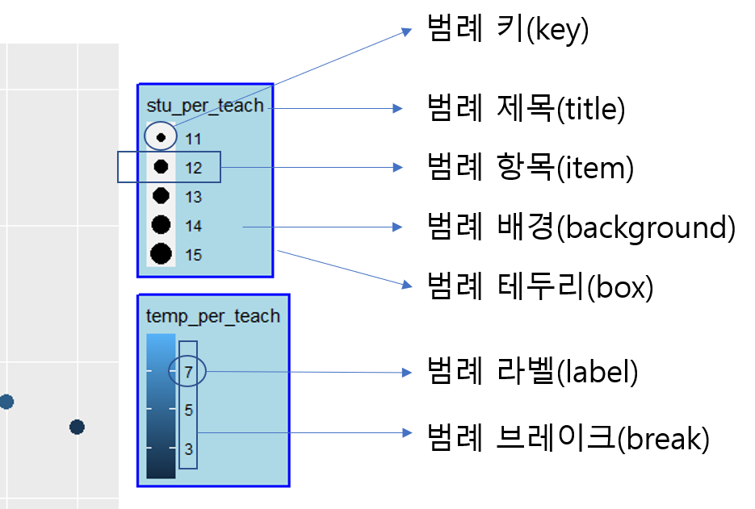

```{r setup, include=FALSE}
knitr::opts_chunk$set(echo = TRUE)
```

## 범례(Legned) - Part I
## 학급당 학생수, 교원당 학생수, 비정규 교원 비율을 하나의 Plot에..

그래프와 플롯을 사용해 데이터를 시각화할때 매우 중요한 것이 바로 범례이다. 범례는 그래프를 읽는 사람에게 그래프에 표현된 각종 표식들이 어떤 의미를 지니는 지를 독자에게 설명하는 매우 중요한 요소이다. 하지만 생각보다 범례를 자유롭게 다루는 것은 쉽지 않다. 하지만 `ggplot2`에는 범례를 설정하는 매우 많은 함수를 제공한다. 이번 포스트에서는 범례를 설정하는 다양한 방법을 알아보고자 한다.

이번 포스트에서 사용하는 데이터는 최근 공표된 2021년 교육통계 데이터를 사용해보고자 한다. 각 지역별 학생수, 학급수, 교원수, 비정규 교원수를 사용하여 학급당 학생수, 교원 1인당 학생수, 전체 교원수 중 비정규 교원의 비율을 산출하고 이 세가지 데이터를 하나의 그래프에 표현하여 이에 대한 범례를 어떻게 설정하는지 알아보겠다.

### 범례의 구성

`ggplot2`에서 표현되는 범례의 요소는 다음의 그림과 같다. 사실 범례를 설정하고자 할때 가장 난감한 것이 범례를 구성하고 있는 각각의 요소 이름을 몰라서 검색에 어려움을 겪는 경우가 있다. 그림을 보고 참고하면 자신이 설정하고자 하는 요소에 대해 검색이 쉬워질 수 있을 것이다.



### 데이터 Import

우선 필요한 데이터는 한국교육개발원 교육통계 홈페이지[(https://kess.kedi.re.kr)](https://kess.kedi.re.kr)의 [시도별 교육통계 주제별 자료 연도별 모음(1999-2021)](https://kess.kedi.re.kr/userfile/6733224)에서 다운로드하였다.

다운로드한 데이터는 다음과 같이 R안으로 불러들이고 불러들인 데이터 중 사용할 데이터만 선택한 후 학급당 학생수, 교원 1인당 학생수, 전체 교원수 중 비정규 교원의 비율을 산출하는 열을 생성한다.

```{r warning= FALSE, message=FALSE}
library(readxl)
library(tidyverse)

df <- read_excel('./주요-01 유초 연도별 시도별 교육통계 모음(1999-2021)_210901.xlsx', skip = 3, na = '-', sheet = '01 개황', col_types = c('numeric', 'text', 'text', rep('numeric', 48)), col_names = F)

df_adj <- df |>
  select(1:3, 5, 11, 17, 21) |>
  rename('year' = '...1', 'province' = '...2', 'sch_class' = '...3', 'class_total' = '...5', 'stu_total' = '...11', 'teach_total' = '...17', 'teach_tmp_total' = '...21') |>
  filter(sch_class == '초등학교', year == 2021) |>
  mutate(stu_per_cls = round(stu_total / class_total, 2), 
         stu_per_teach = round(stu_total / teach_total, 2), 
         temp_per_teach = (teach_tmp_total / teach_total) * 100)

df_adj$province <- fct_relevel(df_adj$province, '전국', '서울', '부산', '대구', '인천', '광주', '대전', '울산', '세종', '경기', '강원', '충북', '충남', '전북', '전남', '경북', '경남', '제주')

```

### 기본 Plot 생성

`ggplot2`를 사용하여 앞에서 생성한 학급당 학생수, 교원 1인당 학생수, 전체 교원수 중 비정규 교원의 비율을 시각화하는 하나의 plot을 다음과 같이 생성한다. 기본적으로 학급당 학생수 plot을 사용하는데 point의 크기로 교원 1인당 학생수, point의 색깔로 비정규 교원의 비율을 표현함으로써 하나의 plot에 세가지 정보를 시각화한다.

```{r basic_plot}
basic_plot <- df_adj |>
  ggplot(aes(x = province)) + 
  geom_point(aes(y = stu_per_cls, size = stu_per_teach, color = temp_per_teach)) +
  labs(x = '지역', y = '학급당 학생수')

basic_plot
```

위의 plot에서 보듯이 세가지 정보가 표현되지만 학급당 학생수는 Y축에 수치가 표현되어 있기 때문에 범례가 필요없지만 교원 1인당 학생수와 비정규 교원 비율은 범례가 표현된다. 위의 범례를 보면 범례의 제목이나 범례의 라벨 등이 데이터를 설명하기에 적절치 않아 보인다.

### 범례 제목 설정 : Legend title

범례 제목을 따로 설정하지 않는 경우에는 해당 범례에 설정된 열의 이름이 설정된다. 그래서 위의 plot에서도 `muatate`로 생성한 열이 이름들이 설정되어 있다. 이를 재설정하는 방법은 다음과 같이 두가지 방법이 있다. 

#### 1. `labs()`를 사용
이 방법은 `ggplot2`에서 제공하는 `labs()`에 범례 제목을 설정하는 방법이다. 

```{r legend_title_labs}
basic_plot +
  labs(size = '교원당 학생수(labs)', color = '비정규교원비율(labs)')
```


위와 같이 두개 이상의 범례가 있을때 `labs()`에서 어떤 범례의 제목을 변경할지를 지정할때는 `aes()`에서 설정한 매핑값을 지정함으로써 범례를 선택할 수 있다. 위의 basic_plot을 생성하는 코드 세번째 줄에서 size에는 교원당 학생수 열을, color에는 비정규 교원 비율 열을 매핑하였기 때문에 `labs()`에서 size의 제목과 color의 제목을 알맞게 설정해 줄 수 있다.

#### 2. scale_*()를 이용

범례 제목을 설정하는 또 하나의 방법은 `scale_*()`를 사용하는 방법이다. 위의 예제에서는 color와 size로 범례를 설정하였고 두 범례 모두 factor형태의 구분(discrete)된 값이 아니고 연속된(countinuous) 수치값이기 때문에 `scale_color_continuous()`와 `scale_size_continuous()`를 사용함으로써 범례 제목을 바꾸어 줄 수 있다. 해당 함수에서 범례 제목을 설정할 때는 `title` 매개변수를 사용하여 설정한다.

```{r legend_title_scale}
basic_plot + 
  scale_color_continuous(name = '비정규교원비율(scale)') + 
  scale_size_continuous(name = '교원당 학생수(scale)')

```

#### 3. guides()를 이용

위의 두가지 방법외에 `guides()`를 사용하는 방법이 있다. `guides()`는 범례 제목, 스타일, 위치 , 크기 , 라벨 위치  등 범례를 세부적으로 조정할 수 있는 매개변수를 제공한다. 범례 제목을 변경하는 코드는 다음과 같다. 

```{r legend_title_guides}
basic_plot + 
  guides(color = guide_legend(title = '비정규교원비율'), 
         size = guide_legend(title = '교원당 학생수'))
```

`guides()`를 사용하는 방법은 동일한 형태로 `scales_*()`을 사용하여 다음과 같이 쓸 수 있다. 

```{r legend_title_guides1}
basic_plot + 
  scale_color_continuous(guide = guide_legend(title = '비정규교원비율')) + 
  scale_size_continuous(guide = guide_legend(title = '교원당 학생수'))
```

여기서 하나 이상한 것이 보이는가? 앞선`labs()`, `scale_*()`를 사용했을 때는 color 범례가 colorbar 형태로 나타났다. `guide()`로 표현할 수 있는 범례 스타일은 리스트의 형태로 보여지는 `legend`와 연속된 컬러의 막대 형태로 보여지는 `colorbar`의 두가지 형태이다. 위의 코드에서 `guide_legend()`를 사용했기 때문에 리스트 형태의 범례가 나타난 것이다. 이를 `labs()`와 같은 형태로 보이기 위해서는 `guide_colorbar()`를 사용하면 된다. 

```{r guide_colorbar}
basic_plot + 
  scale_color_continuous(guide = guide_colorbar(title = '비정규교원비율')) + 
  scale_size_continuous(guide = guide_legend(title = '교원당 학생수'))
```

### 범례 라벨 설정 : Legend label

범례 제목을 설정하는 것만큼 많이 사용되는 범례 설정은 범례 아이템들의 라벨을 설정하는 것이다. 위의 plot에서 교원당 학생수는 단위가 명이고 비정규 비율은 단위가 %이다. 이를 제목에 설정할 수도 있지만 아이템 라벨에 직접 설정해주면 데이터를 이해하기가 더 쉬워질 것이다.
범례 라벨을 설정하기 위해서는 범례의 breaks를 같이 설정해서 범례 아이템의 세트를 만들어 주어야 한다. `scale_*()`에 `breaks`와 `labels`를 사용해 다음과 같이 설정해 줄 수 있다. 

```{r legend_label}
basic_plot + 
  scale_color_continuous(name = '비정규교원비율', breaks = c(3, 5, 7), labels = c('3%', '5%', '7%')) + 
  scale_size_continuous(name = '교원당 학생수', breaks = c(11, 12, 13, 14, 15), labels = c('11명', '12명', '13명', '14명', '15명')) 

```

### 범례 아이템 순서 반전

위의 plot에서 color 범례는 내림차순으로 size 범례는 오름차순으로 정렬되어 있다. 두 개의 정렬을 맞추기 위해서는 color 범례를 오름차순으로 설정해주거나 size 범례를 내림차순으로 설정해주어야 하는데 이는 `guides()`의 `reverse`를 TRUE로 설정함으로써 간단히 바꿀 수 있다.

```{r legend_order1}
basic_plot + 
  guides(color = guide_colorbar(title = '비정규교원비율', reverse = TRUE), 
         size = guide_legend(title = '교원당 학생수'))
```

위의 코드는 `scale_*()`을 이용하여 다음과 같이 사용할 수 있다. 

```{r legend_order2}
basic_plot + 
  scale_color_continuous(name = '비정규교원비율', 
                         breaks = c(3, 5, 7), 
                         labels = c('3%', '5%', '7%'), 
                         guide = guide_colorbar(reverse = TRUE)) + 
  scale_size_continuous(name = '교원당 학생수', 
                        breaks = c(11, 12, 13, 14, 15), 
                        labels = c('11명', '12명', '13명', '14명', '15명')) 
```

### 다중 범례 순서 설정

위의 plot에서는 두개의 범례가 존재한다. 만약 두개의 범례의 순서를 바꾸기를 원한다면 `guide()`의 `order` 매개변수에 순서를 명기해주면 순서대로 표기된다. 

```{r legend_order3}
basic_plot + 
  guides(color = guide_colorbar(title = '비정규교원비율', reverse = TRUE, order = 1), 
         size = guide_legend(title = '교원당 학생수', order = 0))
```

위의 코드는 `scale_*()`를 사용하여 다음과 같이 사용할 수 있다. 

```{r legend_order4}
basic_plot + 
  scale_color_continuous(name = '비정규교원비율', 
                         breaks = c(3, 5, 7), 
                         labels = c('3%', '5%', '7%'), 
                         guide = guide_colorbar(reverse = TRUE, order = 1)) + 
  scale_size_continuous(name = '교원당 학생수', 
                        breaks = c(11, 12, 13, 14, 15), 
                        labels = c('11명', '12명', '13명', '14명', '15명'), 
                        guide = guide_legend(order = 0)) 
```