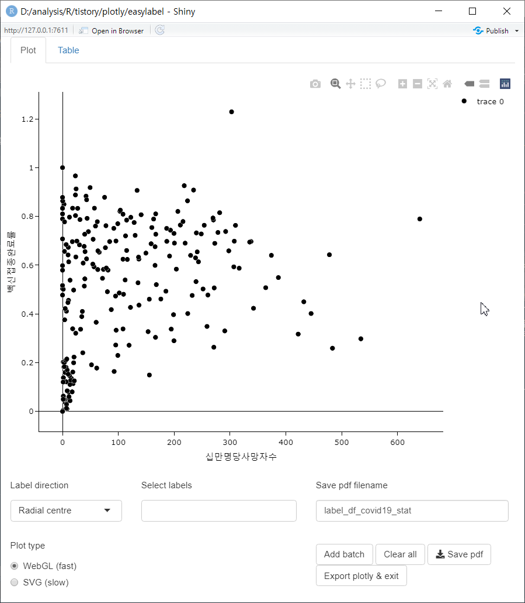
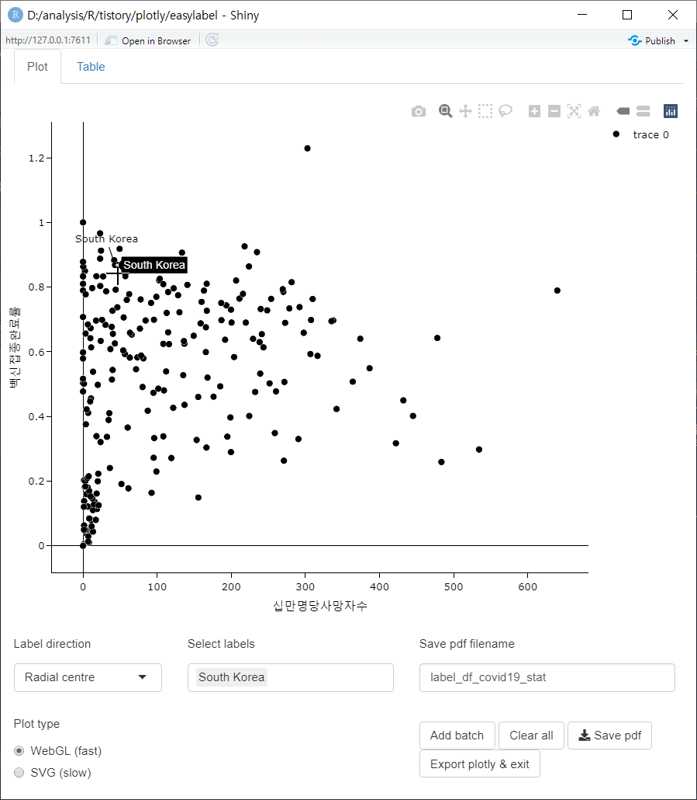

---
output:
  html_document:
    css: D:/analysis/R/tistory/plotly/style.css
---

```{r setup, include=FALSE}
knitr::opts_chunk$set(echo = TRUE, message = FALSE, warning = FALSE)
library(showtext)
showtext_auto()
library(tidyverse)
library(readxl)
library(patchwork)
library(plotly)
```

```{r include = FALSE, message = FALSE, warning = FALSE}
## 데이터 전처리를 위한 패키지 설치 및 로딩
if(!require(readr)) {
  install.packages('readr')
  library(readr)
}

if(!require(lubridate)) {
  install.packages('lubridate')
  library(lubridate)
}

if(!require(tidyverse)) {
  install.packages('tidyverse')
  library(tidyverse)
}

                      
## covid19 데이터 로딩(온라인에서 바로 로딩할 경우)
df_covid19 <- read_csv(file = "https://covid.ourworldindata.org/data/owid-covid-data.csv",
                            col_types = cols(Date = col_date(format = "%Y-%m-%d")
                                             )
                            )
## 2. 전체 데이터셋 중 최근 100일간의 데이터를 필터링한 df_covid19_100 생성
df_covid19_100 <- df_covid19 |> 
  ## 한국 데이터와 각 대륙별 데이터만을 필터링
  filter(iso_code %in% c('KOR', 'OWID_ASI', 'OWID_EUR', 'OWID_OCE', 'OWID_NAM', 'OWID_SAM', 'OWID_AFR')) |>
  ## 읽은 데이터의 마지막 데이터에서 100일전 데이터까지 필터링
  filter(date >= max(date) - 100) |>
  ## 국가명을 한글로 변환
  mutate(location = case_when(
    location == 'South Korea' ~ '한국', 
    location == 'Asia' ~ '아시아', 
    location == 'Europe' ~ '유럽', 
    location == 'Oceania' ~ '오세아니아', 
    location == 'North America' ~ '북미', 
    location == 'South America' ~ '남미', 
    location == 'Africa' ~ '아프리카')) |>
  ## 국가 이름의 순서를 설정 
  mutate(location = fct_relevel(location, '한국', '아시아', '유럽', '북미', '남미', '아프리카', '오세아니아')) |>
  ## 날짜로 정렬
  arrange(date)


## 3. df_covid19_100을 한국과 각 대륙별열로 배치한 넓은 형태의 데이터프레임으로 변환
df_covid19_100_wide <- df_covid19_100 |>
  ## 날짜, 국가명, 확진자와, 백신접종완료자 데이터만 선택
  select(date, location, new_cases, people_fully_vaccinated_per_hundred) |>
  ## 열 이름을 적절히 변경
  rename('date' = 'date', '확진자' = 'new_cases', '백신접종완료자' = 'people_fully_vaccinated_per_hundred') |>
  ## 넓은 형태의 데이터로 변환
  pivot_wider(id_cols = date, names_from = location, 
              values_from = c('확진자', '백신접종완료자')) |>
  ## 날짜로 정렬
  arrange(date)

## 4. covid19 데이터를 국가별로 요약한 df_covid19_stat 생성
df_covid19_stat <- df_covid19 |> 
  group_by(iso_code, continent, location) |>
  summarise(인구수 = max(population, na.rm = T), 
            인당GDP = max(gdp_per_capita, na.rm = T),
            전체확진자수 = sum(new_cases, na.rm = T),
            전체사망자수 = sum(new_deaths, na.rm = T), 
            십만명당중환자실 = last(icu_patients_per_million),
            재생산지수 = last(reproduction_rate),
            봉쇄지수 = max(stringency_index), 
            전체검사자수 = max(total_tests, na.rm = T), 
            신규검사자수 = sum(new_tests, na.rm = T),
            전체백신접종자수 = max(total_vaccinations, na.rm = T),
            백신접종자완료자수 = max(people_fully_vaccinated, na.rm = T),
            부스터접종자수 = max(total_boosters, na.rm = T),
            인구백명당백신접종완료률 = max(people_fully_vaccinated_per_hundred, na.rm = T),
            인구백명당부스터접종자수 = max(total_boosters_per_hundred, na.rm = T)
            ) |> 
    ungroup() |>
    mutate(십만명당사망자수 = round(전체사망자수 / 인구수 *100000, 5),
           백신접종완료률 = 백신접종자완료자수 / 인구수)

## 여백 설정을 위한 리스트 설정
margins <- list(t = 50, b = 25, l = 25, r = 25)

  library(readxl)

df_취업률 <- read_excel('D:/analysis/R/tistory/plotly/2020년 학과별 고등교육기관 취업통계.xlsx', 
                     ## '학과별' 시트의 데이터를 불러오는데,
                     sheet = '학과별',
                     ## 앞의 13행을 제외하고
                     skip = 13, 
                     ## 첫번째 행은 열 이름으로 설정
                     col_names = TRUE, 
                     ## 열의 타입을 설정, 처음 9개는 문자형으로 다음 79개는 수치형으로 설정
                     col_types = c(rep('text', 9), rep('numeric', 79)))

## df_취업률에서 첫번째부터 9번째까지의 열과 '계'로 끝나는 열을 선택하여 다시 df_취업률에 저장
df_취업률 <- df_취업률 |> 
  select(1:9, ends_with('계'), '입대자')

## 랜덤 샘플을 위한 시드 설정
set.seed(123)

## df_취업률에서 졸업자가 500명 이하인 학과 2000개 샘플링
df_취업률_2000 <- df_취업률 |> 
  filter(졸업자_계 < 500) |> 
  sample_n(2000)

## 열 이름을 적절히 설정
names(df_취업률_2000)[10:12] <- c('졸업자수', '취업률', '취업자수')

```

사용데이터 : <https://2stndard.tistory.com/68>

R이든 python이든 어떤 툴을 사용해서 데이터 분석을 시작할 때는 대부분 데이터를 살펴보는 일부터 시작한다. 데이터에 대한 기술통계를 구해서 NA값이라든지 전체 분포를 살펴보고 연관이 있어 보이는 변수에 대해 산점도를 그려서 데이터의 전체적인 분포를 살펴보기 마련이다.

산점도를 그려서 데이터를 확인할 때 가장 애매한 것이 분석자가 관심있는 데이터가 어디에 위치하는지 알아보는 것이다. 물론 이를 위해 색을 달리 처리한다든지 모양을 달리 처리한다든지 할 수 있겠지만 관심있는 데이터가 많으면 색이나 모양과 데이터를 매칭한다는 것도 헤깔리는 일임에 틀림없다. 이런 경우 해당 데이터에 라벨을 표시해주면 한눈에 알아보기 쉽지만 데이터가 겹치면 또 알아보기 힘들다.

`ggpplot2`에서는 `ggrepel` 패키지에서 제공하는 `geom_text_repel()`과 `geom_label_repel()`을 사용하면 겹치지 않게 텍스트나 라벨을 붙여줄 수 있다. 그렇다면 `plotly`에서 산점도에서 겹치지 않도록 라벨을 붙여주는 방법을 알아보자.

`plotly`로 그려진 시각화에서도 겹치지 않는 라벨을 위한 패키지가 제공되는데 `easylabel`을 사용한다.

```{r eval = FALSE}
install.packages('easylabel')
library(easylabel)
```

```{r echo = FALSE}
library(easylabel)
```

`easylabel`패키지에서 제공하는 라벨을 그리는 함수는 `easylabel()`이다. `easylabel()`은 shiny와 plotly 기반의 시각화로 산점도를 보여준다. 여기서 하나 주의해야 하는 것은 `plotly`에서 변수 매핑에 `~`를 사용했지만 `easylabel()`에서는 따옴표를 사용해 준다는 것이다. 또 기본적으로 사용하는 라벨 텍스트는 데이터프레임의 'rowname'을 사용하는데 만약 'rowname'이 설정되지 않았다면 `labs` 매개변수로 설정해주어야 한다.

```{r eval = FALSE}
column_to_rownames(df_covid19_stat, var = 'location') |>
  easylabel::easylabel(x = '십만명당사망자수', y = '백신접종완료률')

df_covid19_stat |> 
  easylabel::easylabel(x = '십만명당사망자수', y = '백신접종완료률',
                       labs = 'location')

```

위의 코드를 실행시키면 아래와 같은 shiny app이 실행이 된다.  



여러가지 기능에 대한 버튼들이 있는데 정작 라벨 이름이 표시되어 있지 않다. 라벨 이름을 표시하기 위해서는 산점도의 점을 클릭하면 해당 점에 해당하는 라벨이 표시되고 표시된 라벨을 드래그하면 라벨의 위치를 조절할 수 있다. 



만약 shiny app을 실행하지 않고 `plotly` 객체로 시각화하려면 `output_shiny = FALSE`를 매개변수로 사용한다. 다만 이 경우는 shiny app처럼 마우스 클릭으로 라벨이 추가되지 않는다. 따라서 이 경우는 `startLabels` 매개변수에 표시되어야 할 데이터 레벨을 벡터로 전달해 줌으로써 표시할 수 있다. 

아래의 `plotly`에서도 라벨을 원하는 위치로 옮겨볼 수 있다. 

```{r eval = FALSE}
df_covid19_stat |> 
  easylabel::easylabel(x = '십만명당사망자수', y = '백신접종완료률',
                       labs = 'location',
                       startLabels = pull(df_covid19_stat[df_covid19_stat$location %in% c('South Korea', 'United Kingdom', 'France', 'United States'), 'location']),
                       output_shiny = FALSE)

```


