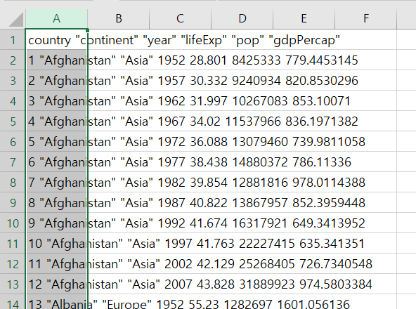
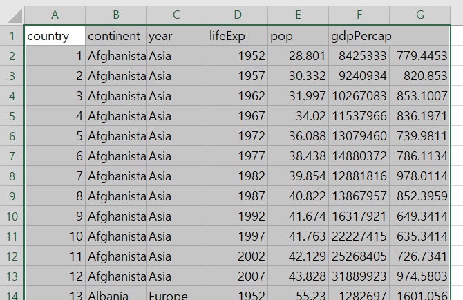
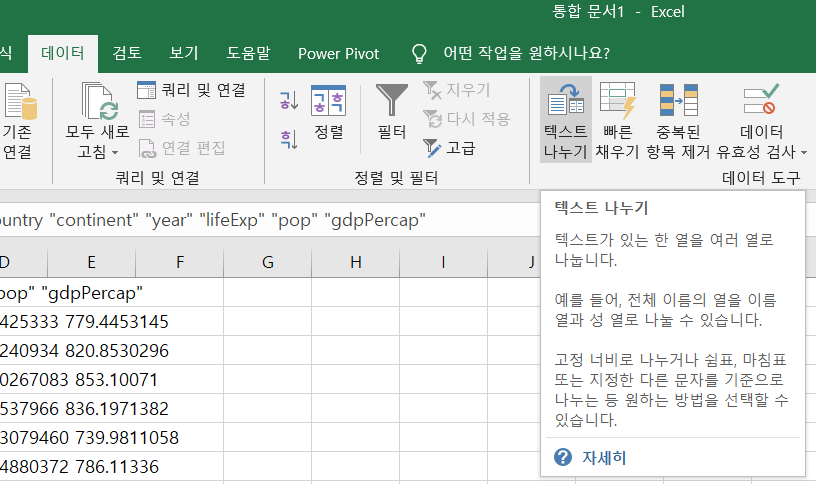
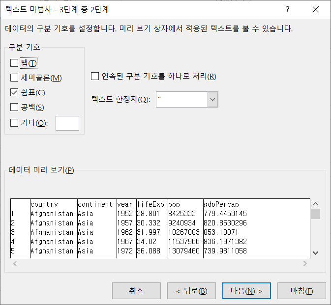

---
output:
  html_document:
    css: "style.css"
---

```{r setup, include=FALSE}
knitr::opts_chunk$set(echo = TRUE)
```

## 클립보드 데이터 읽기, 쓰기

R에서 데이터를 분석하기 위해서 가장 먼저 해야할 일은 가지고 있는 데이터를 R로 불러들이는 작업이다. 또 많이 하는 작업은 R에서 분석한 데이터를 외부에서 사용할 수 있도록 파일로 정리하는 작업이다.

본 포스트에서는 R에서 데이터를 불러 읽어들이거나 외부 프로그램에서 사용할 수 있도록 클립보드(clipboard)로 데이터를 넣거나(ctrl+c) 클립보드의 데이터를 읽어오는(ctrl+v) 방법을 설명하고자 한다.

단 이 포스트에서는 windows 운영체제에서 사용하는 방법에 한한다.(필자는 iOS를 매우 매우 싫어한다.)

이 포스트에서 사용하는 데이터는 `gapminder` 패키지의 gapminder 데이터프레임을 사용한다.

```{r gapminder, message=FALSE, warning=FALSE}
library(gapminder)
```

### 클립보드로 데이터 내보내기

R에서 생성된 데이터를 외부 프로그램에서 사용하기 위해서 클립보드로 데이터를 붙여넣기(ctrl+v) 위해서는 `write.csv` 함수를 사용하는 방법과 `clipr` 패키지를 사용하는 방법의 두가지를 설명한다.

#### `write.csv()` 사용

R에서 생성된 데이터를 컴퓨터 메모리의 클립보드(clipboard)로 내보내면 MS Excel이나 다른 많은 프로그램에서 사용할 수 있다. 특히 CSV(Comma Seperated Values) 파일을 이용하면 MS Excel이나 메모장, 대부분의 프로그램에서 데이터를 불러와서 사용할 수 있다.

`write.csv()`의 사용 매개변수는 다음과 같다.

::: {.comment}
write.csv(x, file = "", append = FALSE, quote = TRUE, sep = " ", eol = "\n", na = "NA", dec = ".", row.names = TRUE, col.names = TRUE, qmethod = c("escape", "double"), fileEncoding = "")
:::

`write.csv()`를 사용하여 데이터를 클립보드에 붙여넣기 위해서는 `write.csv()`의 파일명을 지정하는 두번째 매개변수에 `'clipboard'` 키워드를 설정하면 클립보드에 첫번째 매개변수에 설정된 x가 클립보드로 들어간다. 이 후 엑셀이나 메모장에서 붙여넣기(ctrl + v)를 수행하면 x를 사용할 수 있다. 나머지 매개변수는 디폴트를 사용하면 다음과 같이 사용할 수 있다.

```{r write.csv, error=TRUE}
write.csv(gapminder, 'clipboard')
```

그런데 위와 같이 에러가 난다. 왜일까?

`write.csv()` 는 클립보드로 사용하는 메모리의 크기가 32kb에 불과하다. 따라서 32kb를 넘어가는 크기의 데이터를 클립보드로 붙여넣을 때 위와 같은 에러가 난다. 이 경우에는 `'clipboard'` 의 뒤에 2의 자승의 수치를 넣어주면 그만큼의 메모리를 사용할 수 있다. 예를 들어 128kb(2\^7)의 메모리를 사용하기 위해서는 `'clipboard-128'`로 설정해주면 gapminder 데이터를 사용할 수 있다.

```{r write.csv1}
write.csv(gapminder, 'clipboard-128')
```

그러면 클립보드로 붙여넣은 데이터를 엑셀에 붙여넣어보면 다음과 같다.



원하는 형태대로 들어오지 않는 듯 보인다. 이를 수정하는 방법은 엑셀에서 수정하는 방법이 있고 클립보드에 붙여넣을때 매개변수를 조정하는 방법 2가지가 있다.

##### 매개변수 조정

`write.csv()`를 호출할 때 `sep = '\t'` 매개변수를 설정하여 열의 구분자를 콤마가 아닌 탭으로 설정하면 엑셀에서 잘 불러들일 수 있다. 

```{r write.csv2}
write.csv(gapminder, 'clipboard-128', sep = '\t')
```



##### 엑셀에서 조절

우선 잘못 붙여넣어진 모든 열을 선택한 후에 데이터->텍스트나누기를 실행하고 데이터 구분 기호를 공백을 선택하면 데이터가 변환되어 정상적으로 사용할 수 있다. 





#### `clipr`의 `write_clip()` 패키지 사용

`clipr` 패키지는 R에서 클립보드를 사용하기 위한 함수를 제공하는 패키지이다. 이 패키지에서는 `write_clip()`을 제공하는데 이 함수를 사용하면 매개변수로 전달하는 데이터를 클립보드로 붙여넣을 수 있다. 

```{r writeclip, eval=FALSE, message=FALSE, warning=FALSE}
library(clipr)
gapminder |> write_clip()
```

`write_clip()`은 기본적으로 데이터간 구분자를 탭을 사용하기 떄문에 엑셀에서도 정상적으로 붙여넣어진다. 

### 클립보드 데이터 가져오기

클립보드에 넣어진 외부 데이터를 R로 가져오기 위해서는 `read.csv()`를 사용하는 방법과 `clipr` 패키지를 사용하는 방법이 있다.

#### `read.csv()` 사용

클립보드에 적재된 데이터를 R로 불러들이기 위해서는 `read.csv()`를 사용할 수 있다. `read.csv()`의 첫번째 매개변수에 `'clipboard'`를 설정하면 클립보드에 적재된 데이터를 불러들일수 있다. 단 엑셀에서 카피한 클립보드의 구분자는 '\t'로 설정되기 때문에 `sep = '\t'`를 설정하여 불러들이면 정상적으로 불러들일 수 있다. 

`read.csv()`의 사용 매개변수는 다음과 같다.

::: {.comment}
read.csv(file, header = TRUE, sep = ",", quote = "\"", dec = ".", fill = TRUE, comment.char = "", ...)
:::

다음 코드는 클립보드에 붙여넣은 데이터를 df 데이터프레임에 저장하는 코드이다. 

```{r readcsv}
df <- read.csv('clipboard', sep = ',')
head(df)
```


#### `clipr`의 `read_clip()` 사용

앞서 설명한 바와 같이 `clipr` 패키지는 R에서 클립보드를 사용하기 위한 함수를 제공하는 패키지이다. 이 패키지에서는 `read_clip()`을 제공하는데 이 함수를 사용하면 클립보드에 적재된 데이터를 R에 저장하여 사용할 수 있다. 

```{r readclip, eval=FALSE, message=FALSE, warning=FALSE}
df1 <- read_clip()
```

