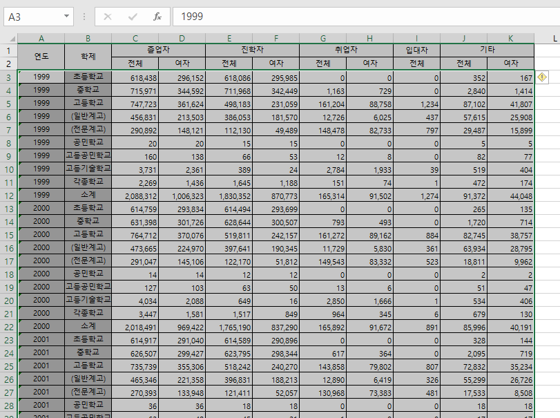

```{r setup, include=FALSE}
knitr::opts_chunk$set(echo = TRUE, warning = FALSE, message = FALSE)
```

## 데이터프레임에서 천단위 구분자 삭제하기

엑셀이나 CSV파일에서 데이터를 읽어들을 떄 간혹 천단위 구분자때문에 수치형 변수를 문자로 읽어들이는 경우가 있다. 이렇게 불러들이면 수치 연산이 불가능하기 때문에 이 부분을 어떻게 해서든 수정해야 한다. 이번 포스트에서는 천단위 구분자를 없애고 숫자로 변환하는 과정을 세가지 방법으로 알아보겠다.

### Data Import

이번 포스트에서 사용할 데이터는 [교육통게 서비스 홈페이지](https://kess.kedi.re.kr)의 [연도별 고등학교 졸업 후 상황 데이터](https://kess.kedi.re.kr/stats/school?menuCd=0101&cd=5557&survSeq=2021&itemCode=01&menuId=m_010105&uppCd1=010105&uppCd2=010105&flag=A)를 사용하겠다. 이번에는 CTRL + C를 이용한 클립보드를 통해 데이터를 불러들이도록 하겠다.

다음의 그림과 같이 다운로드된 파일을 엑셀에서 열고 1, 2행의 헤더 부분을 제외한 나머지 부분을 선택하고 CRTL + C를 이용해서 클립보드로 복사한 후 다음의 코드로 R로 불러들인다.



```{r}
library(tidyverse)
library(readxl)
df.after_gradu <- read.csv('clipboard', header = FALSE, sep = '\t')
head(df.after_gradu)
```

### `gsub()` 천단위 문자 삭제

천단위 문자를 삭제하기 위해서는 `gsub()`를 사용한다. `gsub()`는 문자열에서 특정 문자열을 치환하는 함수이다. 아래와 같이 천단위가 들어간 열의 데이터에서 천단위를 제거할 수 있다. 

```{r}
gsub(",", "", df.after_gradu[, 3]) |> head()
```

### 데이터프레임 각 열의 천단위 문자 삭제 방법

#### 1. 초급 : 노가다

가장 단순하게 생각할 수 있는 것이 각각의 열마다 변환해서 넣어주는 방법이다. `gsub()`로 변환한 결과는 여전히 문자열이기 떄문에 `as.numeric()`으로 수치형 변수로 변환하는 과정이 필요하다. 가장 쉽게 구현할 수 있지만 변환해야 할 열이 많아지면 상당히 헤깔려서 오류가 나기 쉽다. 그리고 코드가 영 보기좋지 않고 왠지 초보같은 느낌이 난다. 

```{r}
df.after_gradu[, 3] <- as.numeric(gsub(",", "", df.after_gradu[, 3]))
df.after_gradu[, 4] <- as.numeric(gsub(",", "", df.after_gradu[, 4]))
df.after_gradu[, 5] <- as.numeric(gsub(",", "", df.after_gradu[, 5]))
df.after_gradu[, 6] <- as.numeric(gsub(",", "", df.after_gradu[, 6]))
df.after_gradu[, 7] <- as.numeric(gsub(",", "", df.after_gradu[, 7]))
df.after_gradu[, 8] <- as.numeric(gsub(",", "", df.after_gradu[, 8]))
df.after_gradu[, 9] <- as.numeric(gsub(",", "", df.after_gradu[, 9]))
head(df.after_gradu)
```


#### 2. 중급 : for loop

C나 Java 같은 프로그래밍을 조금만 해본 사람이라면 위의 코드를 보고 왜 for loop를 안썼지? 라고 할 것이다. R에서도 for loop를 지원하기 때문에 사용이 가능하다. 다만 R에서는 for loop를 권장하지 않는다. R과 같이 대량의 데이터를 처리하기 위한 프로그래밍에서는 병렬 프로그래밍을 사용할 수 있다. 병렬 프로그래밍은 프로그램 단위를 여러개로 나눠서 동시에 여러 CPU 혹은 GPU에서 실행시키고 결과를 합해서 처리하는 방식이다. 그런데 loop의 경우 동시에 실행을 시키면 다른 loop의 결과를 사용해야 하는 경우가 발생한다. 이를 병목현상이라고 하는데 이런 경우 시스템의 성능을 매우 저하시킨다. 병렬 프로그램이 아니어도 R에서의 for loop 성능은 썩 좋지 않다고 알려져 있다. 하지만 이번 예제와 같이 소량의 데이터는 별 문제없이 사용할 수 있다. 

```{r}
for(i in 3:9) {
  df.after_gradu[, i] <- as.numeric(gsub(",", "", df.after_gradu[, i]))
}

head(df.after_gradu)

```


#### 3. 고급 : `apply()`

R에서 사용하는 언어는 객체지향 언어와 함수지향 언어적 특성을 사용한다. 특히 함수지향 언어의 특성을 대표하는 함수가 `apply()` 함수이다. `apply()`함수는 for loop의 기능을 함수로 표현한 것으로 데이터프레임에 행방향 또는 열방향으로 동일한 함수를 적용할 때 사용한다. 이 함수를 앞선 예에서 사용하기 위해서 하나 더 알아야하는 개념이 람다 함수이다. 

람다 함수는 인라인 함수라고도 불리는데 함수의 선언을 따로 하지 않고 함수를 사용하는 곳에서 정의함으로써 특별한 함수명이 없어도 실행될 수 있는 함수이다. 비교적 간단하고 재활용이 될 필요가 없는 함수를 정의할 때 사용할 수 있는 방법이다. 

람담 함수와 `apply()`를 사용하여 앞선 기능을 구현하는 코드는 다음과 같다. 

```{r}
df.after_gradu <- as.data.frame(apply(df.after_gradu, 2, function(x) gsub(",", "", x)))

df.after_gradu[, 3:11] <- apply(df.after_gradu[, 3:11], 2, as.numeric)

head(df.after_gradu)
```

위에서는 `apply()`를 두번 사용하여 변환하였다. 첫번째 사용은 `gsub()`를 사용하여 천단위 구분자를 없애는데 사용했다. `gsub()`함수를 사용하려면 하나 이상의 매개변수가 필요하기 때문에 람다함수의 형태로 매개변수를 넘겨주는 방식으로 `apply()`를 실행시켰다. 여기에 앞선 코드와 다른 `as.data.frame()`을 사용했다. `apply()`로 변환된 결과는 matrix로 반환되는데 이를 데이터 프레임으로 전환시킨 것이다. 
두번쨰 `apply()`는 문자형을 수치형으로 변환해주는 `as.numeric()`을 실행하는 데 사용하였는데 `as.numeric()`은 `gsub()`와는 달리 하나의 매개변수만을 필요로하기 때문에 람다 함수 형태로 사용하지 않았고 3번쨰열부터 11번쨰 열까지만을 변환하도록 지정하였다. 

