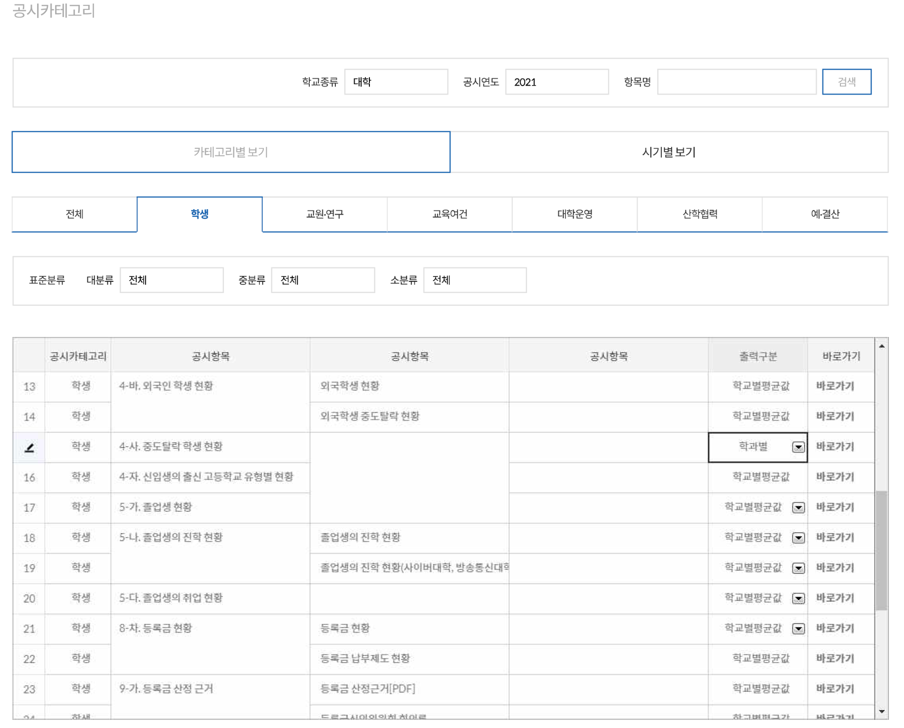

---
output:
  html_document: 
    css: D:/analysis/R/tistory/plotly/style.css
---

```{r setup, include=FALSE}
knitr::opts_chunk$set(echo = TRUE, message = FALSE, warning = FALSE, dpi = 90)
library(showtext)
showtext_auto()
library(tidyverse)
library(readxl)
update_geom_defaults("text", list(size = 6))
```

## 대학의 중도탈락생 분석

최근 한 국회의원이 서울대학교의 중도탈락생을 분석하여 자료를 발표한 후["의대 갈래" 서울대 자퇴 지난해 330명 '최다'..10명 중 7명이 이공계](https://v.daum.net/v/20220921094258824) 이에 관련한 다양한 기사[단독 - 서울대 자퇴 330명은 어디로 갔을까](https://www.seoul.co.kr/news/newsView.php?id=20220921001009&wlog_tag3=daum)가 나왔다.

국회의원이 발표한 데이터와 각종 기사에서 분석한 기사들을 데이터를 중심으로 다시 체크해보도록 한다.

### 데이터 출처

관련한 기사의 출발이 된 국회의원이 분석한 자료는 서울대에서 제출받은 자료라고 기사에 나와있다. 이 후 한 사설기관(하늘교육 종로학원)에서 분석한 기사는 [대학알리미](https://www.academyinfo.go.kr/index.do)에서 데이터를 추출해서 사용했다. 따라서 이 포스트에서도 대학알리미에서 다운로드 받은 데이터를 사용하였다.



위에서 보는 '중도탈락 학생현황'의 학과별 자료를 중계열 단위로 총 34개 파일을 만들어(파일명을 1.xlsx, 2.xlsx, ...) 이 파일을 모두 하나로 합쳐 데이터프레임을 만들었다.

```{r eval = FALSE}
df_dropout <- NULL

i <- 1

for (i in 1:34) {
  df_dropout <- rbind(df_dropout, read_excel(paste0(i, '.xlsx'), 
                                 sheet = 'Sheet1',
                                 skip = 5, 
                                 col_names = F, 
                                 col_types = c(rep('text', 12), rep('numeric', 11))))
}


colnames(df_dropout) <- c('기준연도',	'학교종류',	'설립구분',	'지역',	'상태',	'학교', '대계열', '중계열', '학과', '구분', '학과특성', '학과상태', '재적학생계', '중도탈락계', '미등록', '미복학', '자퇴',	'학사경고',	'학생활동',	'유급제적',	'수업연한초과',	'기타',	'중도탈락학생비율')
)

df_dropout$지역 <- fct_relevel(df_dropout$지역, '서울', '부산', '대구', '인천', '광주', '대전', '울산', '세종', 
                               '경기', '강원', '충북', '충남', '전북', '전남', '경북', '경남', '제주')

```


```{r echo = FALSE}
df_dropout <- NULL

i <- 1

for (i in 1:34) {
  df_dropout <- rbind(df_dropout, read_excel(paste0('D:/R/data/droptout/middle/', i, '.xlsx'), 
                                 sheet = 'Sheet1',
                                 skip = 5, 
                                 col_names = F, 
                                 col_types = c(rep('text', 12), rep('numeric', 11))))
}


colnames(df_dropout) <- c('기준연도',	'학교종류',	'설립구분',	'지역',	'상태',	'학교', '대계열', '중계열', '학과', '구분', '학과특성', '학과상태', '재적학생계', '중도탈락계', '미등록', '미복학', '자퇴',	'학사경고',	'학생활동',	'유급제적',	'수업연한초과',	'기타',	'중도탈락학생비율')


df_dropout$지역 <- fct_relevel(df_dropout$지역, '서울', '부산', '대구', '인천', '광주', '대전', '울산', '세종', '경기', '강원', '충북', '충남', '전북', '전남', '경북', '경남', '제주')

```

### EDA

데이터가 정상적으로 불러들여졌는지 데이터의 형태를 먼저 살펴봐야 한다. 앞서 포스팅한 EDA 패키지와 `skimr` 패키지를 사용하여 전체 데이터가 어떻게 구성되어 있는지 살펴본다. 

`skimr` 패키지의 `skim()` 데이터프레임의 전반적인 구조를 살펴보는데 사용되는 함수이다. 

```{r}
skimr::skim(df_dropout)
```

위의 결과에서 보면 전체 행의 수는 21,113개, 열의 수는 23개이다. 여기에 11개의 열이 문자열, 1개가 팩터형, 11개가 수치형 변수로 구성되어 있는데 전체적으로 결측치는 없는 것이 보여진다. 문자형 변수와 팩터형 변수 중에는 그 변량이 너무 많거나(학교 : 248개, 학과 : 8611개) 1개 뿐인(기준연도) 변수를 제외하면 의미있게 사용되는 변수는 문자형 8개, 팩터형 1개이다. 수치형 변수들은 전반적으로 오른쪽으로 치우친 형태로 되어 있기 때문에 이상치에 대한 처리가 필요할 것으로 보여진다. 

수치형 변수에 대한 분포를 좀 더 정확히 살펴보기 위해 `smartEDA` 패키지의 `EmpNumViz()`를 사용한다.  

```{r}
df_dropout |> SmartEDA::ExpNumViz(Page=c(3,4))

```

데이터가 전체적으로 매우 크게 기울여져 있기 때문에 전체 데이터 분포를 보기 위해 각각의 변수에 대해 박스플롯을 그려 전체 데이터와 이상치의 분포를 살펴본다.

첫번째 '학교종류' 변수에 대한 박스플롯을 그려본다. 

```{r}
df_dropout |> SmartEDA::ExpNumViz(Page=c(3,4), target = '학교종류')

```

데이터를 전반적으로보면 '방송통신대학'과 '사이버대학(대학)'에서 데이터의 범위가 크게 나타난다. 운이 좋게도 첫 번째 변수에서 데이터를 전체적으로 치우치게 만드는 요인을 찾아낸것이다. 

'학교종류' 열의 변량을 살펴보면 '방송통신대학'과 '사이버대학(대학)'은 온라인 대학, 나머지 대학은 오프라인 대학으로 구분할 수 있다. 다음과 같이 추가적인 열을 만들어 오프라인 대학과 온라인 대학을 구분한다. 

```{r}
df_dropout <- df_dropout |>
  mutate(학교그룹 = case_when(
    학교종류 == '각종학교(대학)' ~ '오프라인대학', 
    학교종류 == '교육대학' ~ '오프라인대학',
    학교종류 == '기술대학' ~ '오프라인대학',
    학교종류 == '대학교' ~ '오프라인대학',
    학교종류 == '방송통신대학' ~ '온라인대학',
    학교종류 == '사이버대학(대학)' ~ '온라인대학',
    학교종류 == '산업대학' ~ '오프라인대학'
  ))

```


```{r}
df_dropout |> 
  filter(학교그룹 == '오프라인대학') |> 
  SmartEDA::ExpNumViz(Page=c(3,4), target = '학교종류')

```

이제보면 대학교 분포의 범위가 크게 나오지만 전체 범위와 거의 유사하기 때문에 제거하는 것이 큰 의미가 없다. 

다음으로 '설립구분' 열에 대해 살펴본다. 

```{r}
df_dropout |> 
  SmartEDA::ExpNumViz(Page=c(3,4), target = '설립구분')

```
위의 결과를 보면 국립의 범위가 넓지만 국립은 뺄 수 없는 변량이기 때문에 '설립구분'은 그냥 넘어간다. 

다음으로 '설립구분' 열에 대해 살펴본다. 

```{r}
df_dropout |> 
  SmartEDA::ExpNumViz(Page=c(3,4), target = '상태')

```

'상태' 변수의 변량에는 '기존'과 '폐교'로 구성된다. 이 중 '폐교'는 데이터 분석에 오히려 왜곡을 발생시킬수 있기 때문에 해당 데이터는 제거하도록 하겠다. 

```{r}
df_dropout <- df_dropout |>
  filter(상태 != '폐교')

```

다음 '대계열'과 '중계열'은 학과, 전공을 구분하기 위해 필수적으로 필요한 변수이고 '학과'는 변량이 너무 많아 의미가 없는 변수이기 때문에 넘어간다. 

'구분', '학과특성', '학과상태' 열도 데이터가 특정 변량에 집중되기 때문에  이상치라고 볼 변량이 없다. 

```{r}
df_dropout |> 
  SmartEDA::ExpNumViz(Page=c(3,4), target = '구분')

```

```{r}
df_dropout |> 
  SmartEDA::ExpNumViz(Page=c(3,4), target = '학과특성')

```


```{r}
df_dropout |> 
  SmartEDA::ExpNumViz(Page=c(3,4), target = '학과상태')

```


### 기사 데이터 검증

앞서 최초의 기사에 언급된 국회의원 자료에는 '서울대 자퇴가 330명, 이중 이공계열이 86.1%'이라는 것이 핵심 데이터였다. 

지금 전치리된 데이터로 이 데이터가 산출되는지 살펴본다. 

```{r}
df_dropout |> 
  filter(학교 == '서울대학교') |>
  group_by(학교) |>
  summarise(재적학생계 = sum(재적학생계),
    중도탈락계 = sum(중도탈락계), 
    자퇴계 = sum(자퇴),
    중도탈락비율 = scales::percent(중도탈락계/재적학생계, accuracy = 0.1),
    자퇴비율 = scales::percent(자퇴계/중도탈락계, accuracy = 0.1)
    )
```

위의 결과를 보면 자퇴자의 수가 330명으로 기사의 데이터와 동일하다. 또 서울대학교의 전체 재적학생대비 중도탈락자의 비율은 1.9%이고 중도탈락자 중 자퇴자의 비율은 81.5%로 나타나고 있다. 

```{r}
df_dropout |> 
  filter(학교 == '서울대학교') |>
  group_by(대계열) |>
  summarise(재적학생계 = sum(재적학생계),
            중도탈락계 = sum(중도탈락계), 
            자퇴계 = sum(자퇴)) |>
  mutate(중도탈락비율 = scales::percent(중도탈락계 / sum(재적학생계)), 
         자퇴비율 = scales::percent(자퇴계 / sum(중도탈락계)))
```

이공계인 공학과 자연과학의 자퇴비율은 81.6%로 나타나서 전처리한 데이터와 기사의 데이터가 일치하기 때문에 데이터는 정상적으로 처리되었다고 볼수 있겠다. 

그러면 이 데이터를 좀 더 상세하게 살펴보겠다. 

#### 서울대 중도탈락자의 구성

분석 데이터에는 중도탈락자의 구성이 자퇴 뿐아니라 8개의 구분으로 세분화하고 있다. 이들의 구성비는 다음과 같다. 

```{r}
df_dropout |> 
  filter(학교 == '서울대학교') |>
  pivot_longer(15:22, names_to = '중도탈락구분', values_to = '탈락자수') |>
  group_by(중도탈락구분) |>
  summarise(탈락자수 = sum(탈락자수)) |>
  mutate(탈락자비율 = scales::percent(탈락자수 / sum(탈락자수)))
```

전체적으로 자퇴가 81.5%로 거의 다수를 차지하고 있다. 이를 다시 학과 전공 대분류로 살펴보자

```{r}
df_dropout |> 
  filter(학교 == '서울대학교') |>
  pivot_longer(15:22, names_to = '중도탈락구분', values_to = '탈락자수') |>
  group_by(대계열, 중도탈락구분) |>
  summarise(탈락자수 = sum(탈락자수)) |>
  pivot_wider(names_from = '대계열', values_from = '탈락자수')
```

위의 데이터를 보면 서울대학교의 중도탈락자는 대체로 자퇴자가 많이 나타나고 있는 것으로 보인다. 그럼 자퇴자의 데이터를 중계열별로 상세히 살펴보자. 

```{r}
df_dropout |> 
  filter(학교 == '서울대학교') |>
  select(c(1:14, 17)) |>
  mutate(중도탈락비율 = 중도탈락계 / 재적학생계, 
         자퇴자비율 = 자퇴 / 중도탈락계) |>
  group_by(대계열, 중계열) |>
  summarise(재적학생계 = sum(재적학생계), 
            중도탈락계 = sum(중도탈락계), 
            자퇴 = sum(자퇴)) |>
  mutate(중도탈락비율 = scales::percent(중도탈락계 / sum(재적학생계)), 
            자퇴자비율 = scales::percent(자퇴 / sum(중도탈락계))) |> drop_na() |>
  kableExtra::kable(format = 'pipe', align = "llrrrrr")
```

자퇴자가 많은 공학과 자연과학 계열을 살펴보자면 공학 계열에서는 교육과 산업안전 중계열에서 중도탈락자와 자퇴자가 적고 나머지 중계열에서 비슷비슷한 분포를 보이고 있다. 그러나 자연과학계열에서는 농림수산 분류와 화학생명공학환경 분류에 집중되고 있는 경향이 눈에 띈다. 또 자연과학계열의 교육분류도 꽤 높게 나타나고 있다. 

#### 재적학생 대비 중도탈락자의 비율

그렇다면 이 경향은 서울대만의 경향일까? 일부 상위권 대학의 경향일까? 위의 데이터를 좀 넓혀서 SKY 데이터로 확장시켜보겠다. 

```{r}
df_dropout |> 
  filter(학교 %in% c('서울대학교', '연세대학교', '고려대학교')) |>
  summarise(재적학생계 = sum(재적학생계),
    중도탈락계 = sum(중도탈락계), 
    자퇴계 = sum(자퇴),
    중도탈락비율 = scales::percent(중도탈락계/재적학생계, accuracy = 0.1),
    자퇴비율 = scales::percent(자퇴계/중도탈락계, accuracy = 0.1)
    )
```

서울대학교의 경우는 중도탈락자의 비율은 1.9%, 자퇴비율은 81.5%로 나오지만 SKY 대학으로 넓히면 중도탈락비율은 2.6%로 0.7%p 높아지고 자퇴비율은 83.6%로 2.1%p 높아진다.


```{r}
df_dropout |> 
  filter(학교 %in% c('서울대학교', '연세대학교', '고려대학교')) |>
  group_by(대계열) |>
  summarise(재적학생계 = sum(재적학생계),
            중도탈락계 = sum(중도탈락계), 
            자퇴계 = sum(자퇴)) |>
  mutate(중도탈락비율 = scales::percent(중도탈락계 / sum(재적학생계)), 
         자퇴비율 = scales::percent(자퇴계 / sum(중도탈락계)))

```


위의 결과에서 보면 의학 계열과 예체능 계열의 전체 재적학생대비 중도탈락 비율은 서울대학과 KY 대학 모두 크지 않게 나온다. 하지만 자연과학 계열, 인문사회 계열, 공학 계열은 상대적으로 크게 나오는데 모두 KY 대학이 크게 나오고 서울대학과 편차도 의학, 예체능보다 크게 나온다. 특히 인문사회 계열의 차이가 가장 크게 나오는 것을 보면 자연과학 계열, 공학계열이 늘어난 것보다 인문사회 계열이 더 크게 늘어난 것을 볼 수 있다.  


위의 데이터를 보면 서울대학교에서는 인문사회의 중도탈락 비율이 16.4%였지만 SKY로 확대해보니 23.1%까지 늘어났다. 이것은 KY쪽 대학에서 인문사회 계열의 중도탈락자가 늘어났다는 의미이다. 

#### 계열별 재적학생 대비 중도탈락자의 비율

그렇다면 이번에는 계열별 재적학생 대비 자퇴 비율을 서울대학교 데이터와 KY 데이터로 나누어 덤벨 챠트를 통해  시각화하여 본다. 

```{r}
temp <- inner_join(
  df_dropout |>
    filter(학교 %in% c('서울대학교')) |>
    group_by(대계열) |>
    summarise(재적학생계 = sum(재적학생계),
              중도탈락계 = sum(중도탈락계)) |>
    mutate(중도탈락비율 = 중도탈락계 / sum(재적학생계)),
  df_dropout |> 
    filter(학교 %in% c('연세대학교', '고려대학교')) |>
    group_by(대계열) |>
    summarise(재적학생계 = sum(재적학생계),
              중도탈락계 = sum(중도탈락계)) |>
    mutate(중도탈락비율 = 중도탈락계 / sum(재적학생계)),
  by = '대계열') |>
  mutate(delta = abs(중도탈락비율.x - 중도탈락비율.y), 
         position = ifelse(중도탈락비율.x < 중도탈락비율.y, 
                        중도탈락비율.x + (중도탈락비율.y - 중도탈락비율.x) / 2, 
                        중도탈락비율.y + (중도탈락비율.x - 중도탈락비율.y) / 2
                        )
  )

temp |>
  ggplot(aes(y = 대계열)) +
  geom_segment(aes(x = 중도탈락비율.x, xend = 중도탈락비율.y, yend = 대계열), 
               color = ifelse(temp$중도탈락비율.x > temp$중도탈락비율.y, 'dark red', 'dark cyan')) +
  geom_point(aes(x = 중도탈락비율.x, color = '서울대')) +
  geom_point(aes(x = 중도탈락비율.y, color = 'KY')) +
  geom_text(aes(x = 중도탈락비율.x, label = scales::percent(중도탈락비율.x, accuracy = 0.01)), 
            color = 'dark red', 
            vjust = -0.5,
            hjust = ifelse(temp$중도탈락비율.x > temp$중도탈락비율.y, 0, 1)) +
  geom_text(aes(x = 중도탈락비율.y, label = scales::percent(중도탈락비율.y, accuracy = 0.01)), 
            color = 'dark cyan', 
            vjust = -0.5, 
            hjust = ifelse(temp$중도탈락비율.y > temp$중도탈락비율.x, 0, 1)) +
  geom_text(aes(x = position, 
                label = scales::percent(delta, accuracy = 0.01, suffix = '%p')), 
            vjust = 1.2) +
  scale_x_continuous(labels = scales::percent, expand = c(0.001, 0.001)) +
  scale_color_manual(name = '구분', values = c('서울대' = 'dark red', 'KY' = 'dark cyan')) +
  labs(x = '전체 재적학생 대비 중도탈락비율', caption = '데이터 출처 : 대학알리미')  +
theme(text = element_text(size=25))

```

위의 데이터를 보면 서울대학교 데이터와 KY 대학교 데이터는 뭔가 경향이 살짝 달라보인다. 그렇다면 전국 단위로 데이터를 그려보겠다. 

```{r}
temp <- inner_join(
  df_dropout |>
    filter(학교 %in% c('서울대학교')) |>
    group_by(대계열) |>
    summarise(재적학생계 = sum(재적학생계),
              중도탈락계 = sum(중도탈락계)) |>
    mutate(중도탈락비율 = 중도탈락계 / sum(재적학생계)),
  df_dropout |> 
    filter(학교종류 == '대학교') |>
    group_by(대계열) |>
    summarise(재적학생계 = sum(재적학생계),
              중도탈락계 = sum(중도탈락계)) |>
    mutate(중도탈락비율 = 중도탈락계 / sum(재적학생계)),
  by = '대계열') |>
  mutate(delta = abs(중도탈락비율.x - 중도탈락비율.y), 
         position = ifelse(중도탈락비율.x < 중도탈락비율.y, 
                        중도탈락비율.x + (중도탈락비율.y - 중도탈락비율.x) / 2, 
                        중도탈락비율.y + (중도탈락비율.x - 중도탈락비율.y) / 2
                        )
  )

temp |>
  ggplot(aes(y = 대계열)) +
  geom_segment(aes(x = 중도탈락비율.x, xend = 중도탈락비율.y, yend = 대계열), 
               color = ifelse(temp$중도탈락비율.x > temp$중도탈락비율.y, 'dark red', 'dark cyan')) +
  geom_point(aes(x = 중도탈락비율.x, color = '서울대')) +
  geom_point(aes(x = 중도탈락비율.y, color = '전체')) +
  geom_text(aes(x = 중도탈락비율.x, label = scales::percent(중도탈락비율.x, accuracy = 0.01)), 
            color = 'dark red', 
            vjust = -0.5, 
            hjust = ifelse(temp$중도탈락비율.x > temp$중도탈락비율.y, 0, 1)) +
  geom_text(aes(x = 중도탈락비율.y, label = scales::percent(중도탈락비율.y, accuracy = 0.01)), 
            color = 'dark cyan', 
            vjust = -0.5, 
            hjust = ifelse(temp$중도탈락비율.y > temp$중도탈락비율.x, 0, 1)) +
  geom_text(aes(x = position, 
                label = scales::percent(delta, accuracy = 0.01, suffix = '%p')), 
            vjust = 1.2) +
  scale_x_continuous(labels = scales::percent, expand = c(0.002, 0.002)) +
  scale_color_manual(name = '구분', values = c('서울대' = 'dark red', '전체' = 'dark cyan')) +
  labs(x = '전체 재적학생 대비 중도탈락비율', caption = '데이터 출처 : 대학알리미')  +
theme(text = element_text(size=25))

```

전체 대학으로 확대해보면 몇 가지 데이터의 특징이 보인다. 정리해보면 다음과 같다. 

-   자연과학계열은 서울대학과 전체 대학의 중도탈락비율이 같게 나온다. KY 대학교에서는 자연과학 계열이 다소 높았지만 전체 대학으로 볼때는 0.81%로 산출된다. 
-   인문사회계열은 서울대학교와 전체 대학의 편차가 가장 크게 나타난다. 게다가 전체 대학의 계열 중에서 중도탈락비율이 가장 크게 나타나는 계열이 인문사회계열로 전체 재적학생의 약 2%가 중도탈락한다. 
-   의학계열은 오히려 서울대학교 학생의 중도탈락비율이 더 작게 나타난다. 게다가 전체 대학의 의학계열 중도탈락자는 전체 재적학생 19478명 중 40명으로 0.002%에 불과하다. 게다가 전국 대학의 전체 중도탈락자 40명중에 5명(12.5%)가 서울대학교 학생이다. 
-   예체능계열은 전체 대학의 중도탈락자 비율이 0.58%로 타나타서 의학계열을 제외하면 대계열 중 가장 낮은 중도탈락비율을 보인다. 
-   공학계열은 전체 계열중 중도탈락비율이 두번쨰로 높게 나타난다.

이를 중계열별 세부현황을 보도록한다. 

```{r dpi = 120, fig.height=15}
temp <- inner_join(
  df_dropout |>
    filter(학교 %in% c('서울대학교')) |>
    group_by(대계열, 중계열) |>
    summarise(재적학생계 = sum(재적학생계),
              중도탈락계 = sum(중도탈락계)) |>
    mutate(중도탈락비율 = 중도탈락계 / sum(재적학생계)),
  df_dropout |> 
    filter(학교종류 == '대학교') |>
    group_by(대계열, 중계열) |>
    summarise(재적학생계 = sum(재적학생계),
              중도탈락계 = sum(중도탈락계)) |>
    mutate(중도탈락비율 = 중도탈락계 / sum(재적학생계)),
  by = c('대계열','중계열')) |>
  mutate(delta = abs(중도탈락비율.x - 중도탈락비율.y), 
         position = ifelse(중도탈락비율.x < 중도탈락비율.y, 
                        중도탈락비율.x + (중도탈락비율.y - 중도탈락비율.x) / 2, 
                        중도탈락비율.y + (중도탈락비율.x - 중도탈락비율.y) / 2
                        )
  )

temp |>
  ggplot(aes(y = 중계열)) +
  geom_segment(aes(x = 중도탈락비율.x, xend = 중도탈락비율.y, yend = 중계열), 
               color = ifelse(temp$중도탈락비율.x > temp$중도탈락비율.y, 'dark red', 'dark cyan')) +
  geom_point(aes(x = 중도탈락비율.x, color = '서울대')) +
  geom_point(aes(x = 중도탈락비율.y, color = '전체')) +
  geom_text(aes(x = 중도탈락비율.x, label = scales::percent(중도탈락비율.x, accuracy = 0.01)), 
            color = 'dark red', 
            vjust = -0.5, 
            hjust = ifelse(temp$중도탈락비율.x > temp$중도탈락비율.y, 0, 1)) +
  geom_text(aes(x = 중도탈락비율.y, label = scales::percent(중도탈락비율.y, accuracy = 0.01)), 
            color = 'dark cyan', 
            vjust = -0.5, 
            hjust = ifelse(temp$중도탈락비율.y > temp$중도탈락비율.x, 0, 1)) +
  geom_text(aes(x = position, 
                label = scales::percent(delta, accuracy = 0.01, suffix = '%p')), 
            vjust = 1.2) +
  scale_x_continuous(labels = scales::percent, expand = c(0.002, 0.002)) +
  scale_color_manual(name = '구분', values = c('서울대' = 'dark red', '전체' = 'dark cyan')) +
  labs(x = '전체 재적학생 대비 중도탈락비율', caption = '데이터 출처 : 대학알리미') +
  facet_wrap(~대계열, scale = 'free', ncol = 1)  +
theme(text = element_text(size=25))
```


