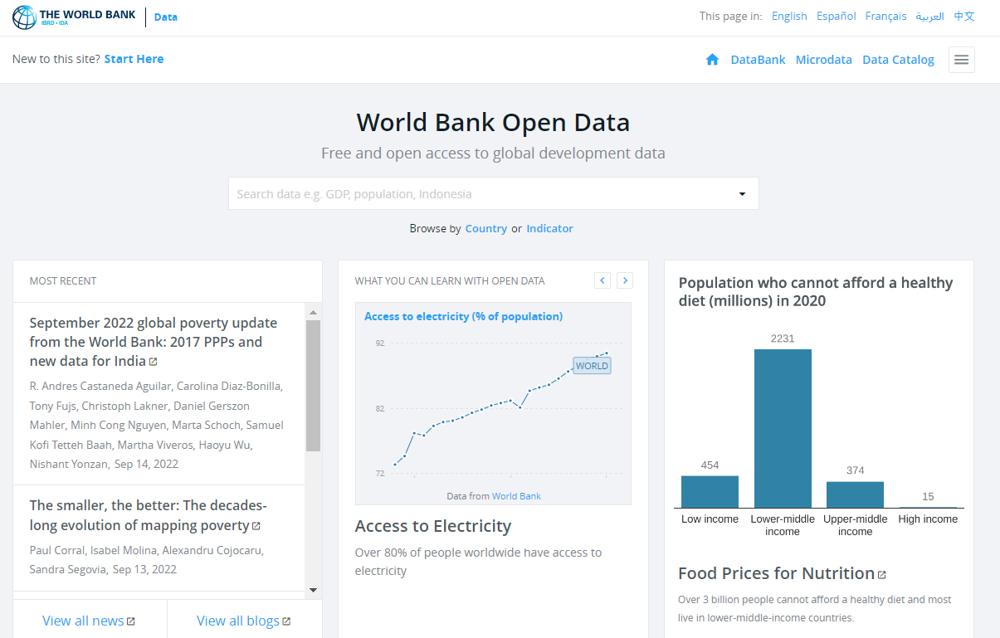
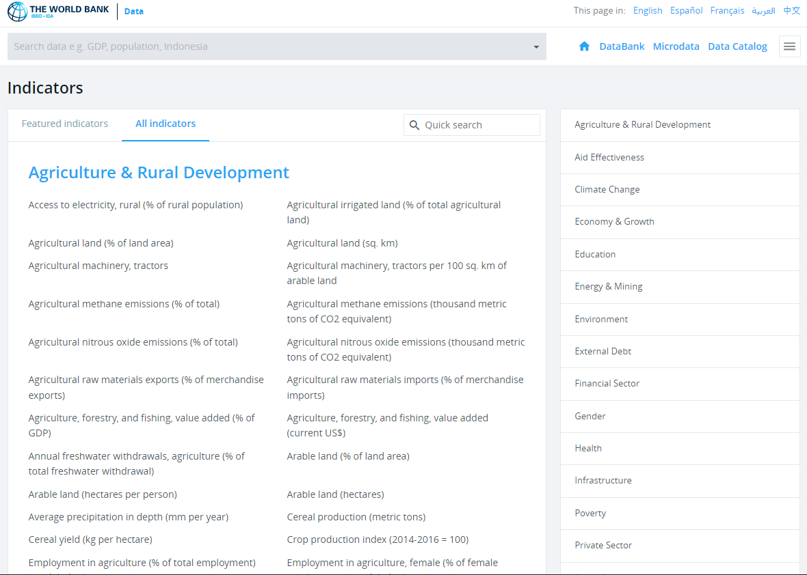

---
output:
  html_document: 
    css: D:/analysis/R/tistory/plotly/style.css
---

```{r setup, include=FALSE}
knitr::opts_chunk$set(echo = TRUE, message = FALSE, warning = FALSE, dpi = 90)
library(showtext)
showtext_auto()
library(tidyverse)
library(readxl)
library(WDI)
```

## WDI

세계은행(世界銀行, World Bank)1946년 8월에 전 세계의 빈곤 퇴치 및 개발도상국의 경제 발전을 목표로 1944년 7월 브레튼 우즈 체제에 발족하여 1945년 설립된 다자개발은행이다.

국제통화기금(IMF), 세계무역기구(WTO)와 함께 3대 국제경제 트로이카로 꼽히며, 영향력으로 봤을 때는 IMF하고 함께 세계 경제의 양대 산맥을 형성하고 있다.[^1]

[^1]: <https://ko.wikipedia.org/wiki/%EC%84%B8%EA%B3%84%EC%9D%80%ED%96%89>

세계은행에서 많은 일을 하지만 데이터 분석하는 사람들에게는 매우 방대한 전세계 관련 데이터베이스를 개방하고 있다는 것이다. 단지 경제에 관련된 데이터베이스 뿐 아니라 사회, 보건, 교육 등 많은 데이테베이스를 개방한다.



`WDI` 패키지는 월드 뱅크에서 제공하는 데이터베이중에서 40개 이상의 데이터베이스를 액세스를 하는 함수를 제공한다. 특히 월드 뱅크에서 산출하는 세계 개발 지수(World development Indicators), 국제 채무 통계, 기업 활동, 인적 자본 지수, 하위 국가 빈곤 지수와 같은 다양한 통계, 인덱스도 엑세스할 수 있다는 장점도 있다.

### 패키지 설치

`WDI` 패키지는 CRAN에 등록된 정식 패키지이기 떄문에 다음과 같이 바로 설치가 가능하다.

```{r eval = FALSE}
if (!requrie(WDI)) {
  install.packages('WDI')
  library(WDI)
}
```

만약 최신 개발 버전을 설치하고자 한다면 다음과 같이 설치할 수 있다.

```{r eval = FALSE}
library(remotes)
install_github('vincentarelbundock/WDI')

```

### 데이터 찾기 : WDIsearch()

`WDI` 패키지에서 액세스 가능한 데이터를 키워드로 검색하기 위해서 `WDIsearch()`를 사용할 수 있다. `WDIsearch()`는 'string', 'field', 'short', 'cache'의 네 가지 매개변수를 사용한다.

-   string : field로 설정된 열에서 찾을 문자열을 지정
-   field : `WDI` 패키지에서 제공하는 월드 뱅크 데이터의 열 중에 키워드를 찾을 열 설정하는데 열은 'indicator', 'name', 'description', 'sourceDatabase', 'sourceOrganization'의 다섯가지 열이 있음
-   short : TRUE로 설정하면 인디케이터의 코드와 이름만 보여주고 FALSE로 설정하면 전체 데이터 열을 다 보여줌
-   cache : 생략되면 자신의 컴퓨터에 저장되지 않은 온라인 데이터를 가져옴

`WDI`에서 제공하는 데이터의 전체 목록을 확인하기 위해서는 매개변수 없이 `WDIsearch()`를 사용할 수 있겠지만 데이터가 너무 많아 이렇게 확인하기 보다는 World bank 홈페이지([https://data.worldbank.org/indicator?tab=all)를](https://data.worldbank.org/indicator?tab=all)를){.uri} 참조하는 것이 더 좋겠다.



다음은 월드 뱅크에서 제공하는 데이터 중 'gdp'와 관련된 인디케이터 데이터를 찾거나 데이터 이름이 'children'과 관련된 데이터를 찾는 코드는 다음과 같다.

```{r}
as.data.frame(WDIsearch(string = 'gdp', field = 'indicator')) |> head(10)

```

```{r}
as.data.frame(WDIsearch(string = 'children', field = 'name')) |> 
  head(10)
```

### 데이터 다운로드 : WDI()

`WDIsearch()`를 통해 자신이 찾는 데이터를 검색했다면 해당 데이터를 다운로드 해야한다. 다운로드를 위해서는 `WDI()`를 사용하는데 주로 사용되는 매개변수는 다음과 같다 .

-   indicator : 다운로드를 원하는 데이터에 대한 indicator, 다운로드하기 위한 데이터의 ID로 사용됨
-   country : 다운로드 데이터 중 특정 국가를 제한하는 매개변수로 ISO-2 character code를 사용(https://www.iban.com/country-codes)한다. 
-   start : 데이터 검색 시작년도
-   end : 데이터 검색 종료년도

다음은 앞서 검색한 정보중에 '한국의 연간 GDP 성장률'을 다운로드 한다.  

```{r}
WDI(indicator = 'NY.GDP.MKTP.KD.ZG', country = 'KR')

```

다음은 한국, 미국, 일본의 연평균 GDP 성장률, 경상 수지(GDP 대비 %), 외국인 직접 투자, 순유입(GDP 대비 %), 외국인 직접 투자, 순유출(GDP 대비 %)를 선그래프를 시각화하면 다음과 같다. 

```{r}
WDI(indicator = c('NY.GDP.MKTP.KD.ZG', 'BN.CAB.XOKA.GD.ZS', 'BX.KLT.DINV.WD.GD.ZS', 'BM.KLT.DINV.WD.GD.ZS'), 
    country = c('KR', 'US', 'JP')) |>
  rename(`GDP 성장률(연간 %)` = NY.GDP.MKTP.KD.ZG, 
         `경상 수지(GDP 대비 %)` = BN.CAB.XOKA.GD.ZS, 
         `외국인 직접 투자, 순유입(GDP 대비 %)` = BX.KLT.DINV.WD.GD.ZS, 
         `외국인 직접 투자, 순유출(GDP 대비 %)` = BM.KLT.DINV.WD.GD.ZS) |>
  pivot_longer(4:7, names_to = '구분') |>
  ggplot(aes(x = year)) +
  geom_line(aes(y = value, group = country, color = country)) +
  facet_wrap(~구분, scales = 'free_y') +
  labs(x = '연도', y = '비율(%)', color = '국가', caption = 'source : World Bank Database')

```


