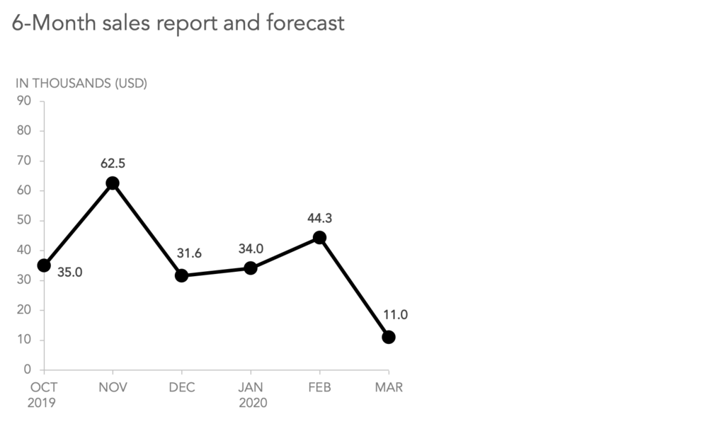
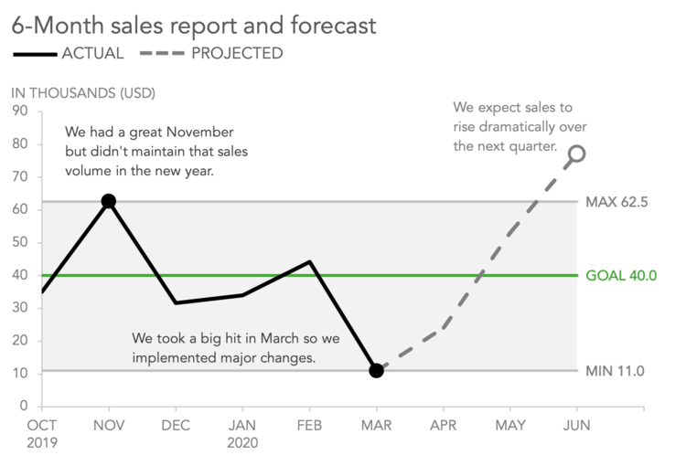
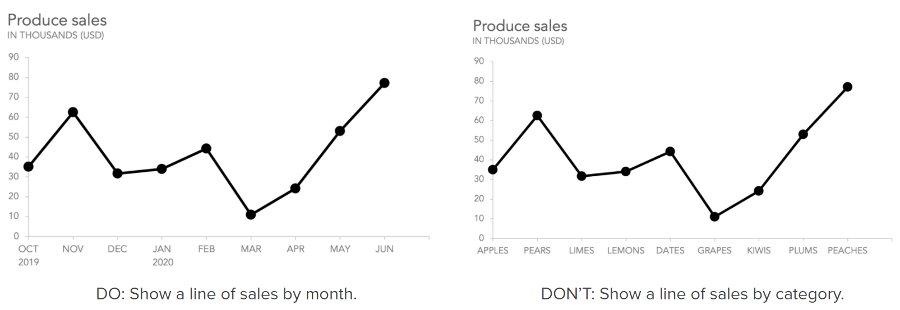
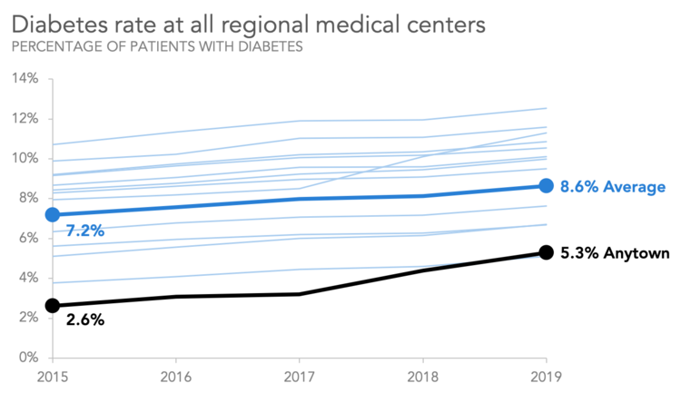
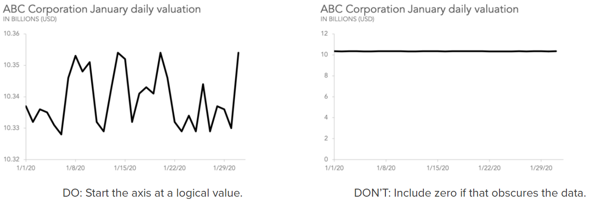
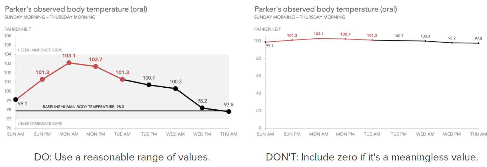
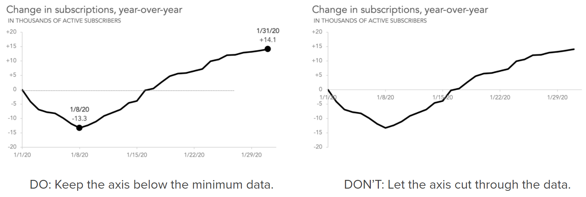

```{r setup, include=FALSE}
knitr::opts_chunk$set(echo = TRUE)
```

이 글은 MIKE CISNEROS가 www.storytellingwithdata.com에 작성한 블로그를 번역한 글입니다.
([https://www.storytellingwithdata.com/blog/2020/3/24/what-is-a-line-graph/](https://www.storytellingwithdata.com/blog/2020/3/24/what-is-a-line-graph/#kind-of-data=){.uri})

### 선 그래프란?

선 그래프 (또는 꺾은 선형 차트)는 시간의 흐름에 따라 데이터 값의 변화를 보여주거나 시간에 따라 이 지남에 따라 여러 변량의 변화를 비교할 때 적합한 데이터 시각화 방법이다.
선 그래프 사용에 "시간의 흐름에 따라" 라는 문구가 가장 핵심적인 문구이다.

선 그래프는 간단하고 이해하기 쉽고 효율적이므로 시간의 흐름에 따른 데이터의 변화량을 표현하는데 일반적으로 사용되고 효과적인 차트이다.
다음과 같은 경우에 꺾은 선형 차트가 적합하다.

1.  한 번에 많은 데이터 비교
2.  시간 경과에 따른 변화 및 추세 표시
3.  중요한 컨텍스트 및 주석 포함
4.  예측 데이터 및 불확실성 표시
5.  데이터 시리즈 내 및 데이터 시리즈 전반의 이상 징후 강조

반면 다음의 경우는 선그래프가 반드시 최선의 선택은 아니다.

1.  단순한 사물의 수량 표시
2.  범주 형 데이터 작업
3.  일부와 전체 비교를 위한 시각화
4.  데이터가 희소한 데이터 세트

이 포스트는 선 그래프의 작동 방식과 의미있는 정보와 컨텍스트를 제공하는 그래프를 작성하는 방법에 대해 설명하고 다음의 질문에 대해 기술한다.

1.  어떤 종류의 데이터가 선 그래프에 표현되는가?
2.  동시에 얼마나 라인을 표시 할 수 있는가?
3.  y 축이 반드시 0부터 시작해야하는가?
4.  그래프의 상단과 하단에 어느 정도의 공간을 남겨야하는가?

이 후의 포스트에서는 기울기 그래프(slope graph) 및 영역 그래프(area graph)와 같은 선 그래프의 몇 가지 특수 변형 그래프에 대해 자세히 설명한다.

### 선 그래프는 어떻게 작동하는가?

선 그래프의 선은 작은 역사를 표현한다.

예를 들어 특정 점포에서 발생한 판매 이익을 매월 말에 기록하는 것과 같이 선 그래프의 선은 추적하기를 원하는 값의 서로 다른 시점에서의 표현값이다.

이러한 측정 값이 많이 확보되면 그래프에 시간에 따라 해당 포인트를 플로팅 하고 해당 포인트들을 연결하는 선을 그림으로써 특정 값들이 시간이 지남에 따라 어떻게 상승, 하락 또는 유지되는지 쉽게 확인할 수 있다.



하지만 이것이 선 그래프로 할 수있는 전부가 아니다!

선을 그리는 것 외에도 그래프에 다른 중요한 상황 정보를 포함 할 수 있다.
선의 각각의 포인트 표시, 레이블 지정 및 주석 달기를 선택할 수 있다 .
참조 선과 범위를 추가 할 수 있고, 예측 데이터 포인트를 포함하고, 라인과 데이터 마커의 모양을 변경하고, 실제 데이터와 예상 데이터 를 구분할 수도 있다 .

다음은 위의 내용을 포함한 그래프의 모습이다.



일정기간 수집된 매출 데이터는 차트에 검은 색 실선으로 표시되었다.
이 데이터를 잘 설명할 수 있는 컨텍스트를 다음과 같이 넣었다.

-   회색 참조 범위는 월 매출의 범위를 나타내고 있으며 범위를 설명하는 문구까지 포함되었다.

-   판매 목표를 표현하기 위해 녹색 선으로 판매 목표치를 표시하였다.
    이로써 특정 월에 판매 수치의 목표 달성 여부를 쉽게 확인할 수 있다.

-   시각적 혼란을 줄이고 이 그래프로 전달하려는 스토리에 최대 및 최소 판매값이 중요하기 때문에 최대 및 최소 판매 값에 도달 한 달에 대한 마커만 남기고 데이터 레이블과 라인에있는 개별 포인트의 마커 대부분을 제거하였다.

-   점선은 향후 3 개월 동안의 예상 매출 을 나타낸다.

-   중요한 순간의 주석은 측정치에 대한 이유, 해당 측정치의 발생에 따라 취한 조치와 기대치를 설명한다.

여기서 중요하게 기억해야 할 것은 선 그래프는 측정 된 값이 시간에 따라 어떻게 변하는 지 또는 지정된 독립 변수가 변할 때를 강조하여 작동한다.
특별한 데이터의 변동이 중요한 이유에 대해 설명하기 위해 정보 컨텍스트를 사용하는데, 이를 선 그래프의 공백을 활용할 수 있다는 점이다.

### 선 그래프에 사용하는 데이터의 종류

일반적인 선 그래프 에는 세로(y 축) 및 가(x 축) 차원을 따라 연속 데이터가 표현된다.
y축은 해당 선그래프에서 측정하는 변수의 값을 표시하고 x 축에는 시간순서이든 독립 변수 순서이든 측정값을 가장 잘 측정하는 주기의 변수가 사용된다.
(예를 들어 오래된 자동차의 엔진을 측정할 때는 RPM에 따른 데시벨 레벨을 측정한다) .

일부 선 그래프에서 x축 (특히 선 그래프의 특수 변형 인 기울기 그래프 및 평행 좌표 다이어그램)에 연속 데이터를 사용하지는 경우도 있지만 x축에서 절대로 사용해서는 안되는 데이터는 범주간의 상관관계가 없는 데이터이다.

2020년의 첫 6개월 ( 1 월, 2 월, 3 월, 4 월, 5 월, 6 월) 목록이 있다고 가정해 보자.
이 데이터는 연속적이고 순서를 가지고 있기 때문에 데이터가 가진 순서와 다른 순서로 나열하는 것은 잘못된 것이다.
즉 2020년 1월은 2020년 2월로 이어지고, 2020 년 3 월로 이어진다.

반면 사과, 배, 라임, 레몬, 대추 야자, 포도 와 같은 농산물 유형 목록이 있다고 가정 해 보자.
월 목록과 달리 한 종류의 농산물이 반드시 다음 달로 이어지지는 않는다.
알파벳순, 크기 순, 색상 순 또는 무작위 순서로 정렬 할 수 있으며, 고유한 순서가없고 연속적이지 않기 때문에 데이터간에 특별한 관계가 느껴지지 않는다.



**‎선 그래프는 선으로 표현되는 연속점 간에 의미 있는 관계가 있을 때만 의미가 있다.‎**‎ 따라서 농산물 판매량은 선을 사용하여 월별 생산 판매 데이터를 표시할 수 있지만, 한 점을 사용하여 다양한 유형의 농산물 간의 판매 차이를 표시하는 것은 권장되지 않는다.
‎‎이는 막대 차트에서 더 잘 수행될 것이다.

### 하나의 차트에 포함하는 선의 수 

일반적으로 사람들은 동시에 4개에서 5개 이상의 항목을 추적하는 데 어려움을 겪게 되므로 이를 동시에 표현하는 선의 숫자에 대한 가이드라인으로 생각하는 것이 좋다.
이보다 더 많은 선을 표시해야하는 경우에는 색상, 선 두께 및 레이블을 사용하여 가장 중요한 선이나 점에 초점을 맞추는 것이 좋다.



위의 그래프는 어떤 지역의 의료 센터인 Anytown Medical의 연간 당뇨병 비율에 대한 5년 분량의 데이터와 다른 12개 센터의 비율을 보여줍니다.
데이터를 보는 사람에게 가장 중요한 데이터는 자신의 지역 센터 데이터이기 때문에 색상, 두께, 라벨을 사용하여 Anytown과 지역 평균에 초점을 맞춘 그래프를 생성했다.

### 선그래프 Y축의 시작점

일반적으로 선 그래프를 볼 때는 x축으로 부터의 높이(측정값의 크기)보다 여러 변량에 대한 선들을 서로 비교한다.
본질적으로 선 그래프는 각 측정 지점에서 정확한 양보다 시간에 따른 값의 변화를 표현하는 그래프이기 때문이다.

따라서 선 그래프는 기준선이 반드시 0일 필요는 없지만, 대부분의 경우에 권장된다.
해당 선 그래프를 처음보는 경우 보는 사람들이 일반적인 기대가 0부터 시작하기 떄문에 y축을 0에서부터 시작하면 덜 혼란스럽게 다가온다.
하지만 이러한 기대를 무너뜨리고 0이외에 값에서 시작하는 것은 이에 대한 설득력있는 이유가 있어야 한다.

다음은 제로 기준선이 최적이 아닐 수있는 몇 가지 특정 사례이다.

#### 측정 범위가 매우 작고 0까지의 거리가 큰 경우 

이 경우 y축의 시작을 0으로 설정하면 선 그래프의 의미있는 변동을 인식 할 수 없게된다.



#### 0과의 관계가 무의미한 경우 

‎화씨 단위와 같은 일부 단위에서는 "0"의 위치가 다소 임의적이다 (50도는 25도보다 두 배 따뜻하지 않습니다), 그래서 표현되는 데이터 포인트가 0에 가까운 데이터가 없다면, y축에 0을 기준선으로 포함시켜야 한다고 느낄 필요는 없다.
그래프에는 뷰어에게 가장 의미 있는 컨텍스트를 제공하는 합리적인 값의 범위가 포함되어야 한다.‎



#### 일부 측정값이 음수인 경우

0에 대한 기준점으로 수평선을 포함하는 것이 중요하지만, 그래프의 x 축이 데이터 시리즈는 축 중 하나를 가로 질러서는 안된다.
x축의 기준선은 데이터의 경계선이되도록 y 축의 최소값을 데이터의 최소 측정 값보다 낮게 만드는 것이 좋다.



Important : 선 그래프에 0이 아닌 기준선이있는 경우 그 사실을 독자에게 분명하게 알려서 데이터의 확대 해석을 하지 않도록 해야한다.

### 그래프의 상단과 하단에 어느 정도의 공간을 남겨야합니까? 

이 질문에 대한 구체적인 답은 각 그래프에 따라 다르다.
유용한 시작점은 가장 작은 값에서 가장 큰 값까지의 범위가 그래프의 사용 가능한 세로 공간의 약 70-80 %를 차지 하도록하는 것이다.
위와 아래에 거의 비슷한 양의 공백을 두는게 좋다.

선 그래프에서는 그 사용 용도에 맞게 축 범위, 선의 위치를 ​​수정할 수 있다.
선의 상대적인 기울기는 변경되지 않으므로 축 레이블에 대해 반올림 할 수있는 값의 범위를 선택하고 데이터 레이블 및 주석을 포함 할 수있는 적절한 양의 공백을 어떻게 설정할지에 대해 신경을 써야 한다.
필요하다면 목표값이나 예측값을 표현하기 위한 참조선이 충분히 표현될 수 있는 최대, 최소값에 대한 공간을 확보할 필요가 있다.

어떤 경우라도 독자가 그래프의 메시지를 명확하게 이해할 수 있도록 합리적이고 사려깊은 데이터의 시각화를 제공하는 것이 중요하다.
