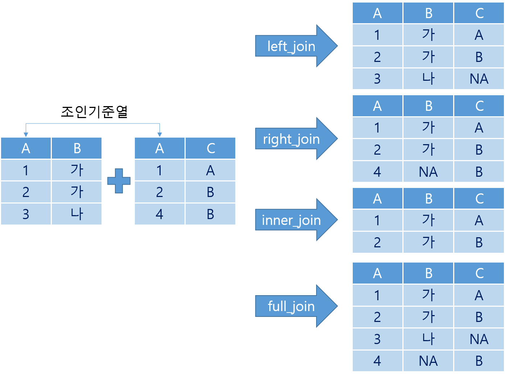
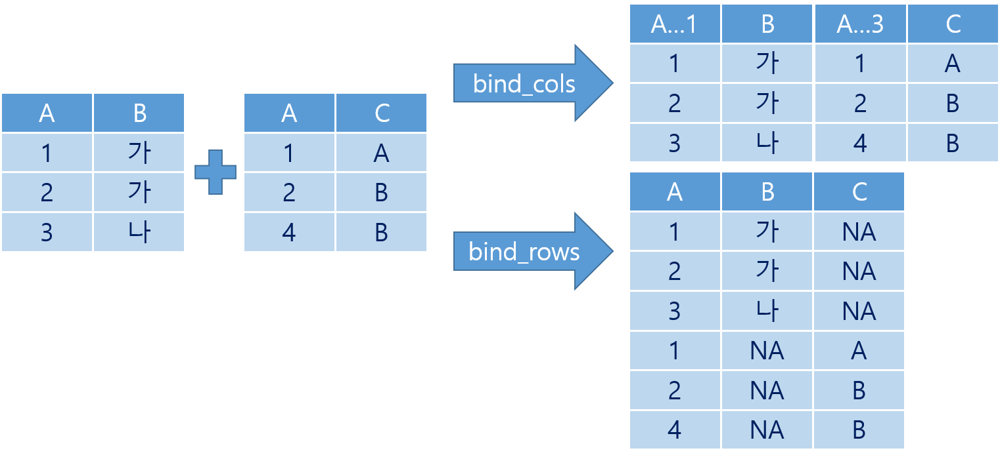

---
output:
  html_document:
    css: D:/analysis/R/tistory/plotly/style.css
---

```{r setup, include=FALSE}
knitr::opts_chunk$set(echo = TRUE, message = FALSE, warning = FALSE, dpi = 90)
library(showtext)
showtext_auto()
library(tidyverse)
library(readxl)
library(patchwork)
library(plotly)
```

```{r include = FALSE, message = FALSE, warning = FALSE}
## 데이터 전처리를 위한 패키지 설치 및 로딩
if(!require(readr)) {
  install.packages('readr')
  library(readr)
}

if(!require(lubridate)) {
  install.packages('lubridate')
  library(lubridate)
}

if(!require(tidyverse)) {
  install.packages('tidyverse')
  library(tidyverse)
}

                      
## covid19 데이터 로딩(온라인에서 바로 로딩할 경우)
df_covid19 <- read_csv(file = "https://covid.ourworldindata.org/data/owid-covid-data.csv",
                            col_types = cols(Date = col_date(format = "%Y-%m-%d")
                                             )
                            )
## 2. 전체 데이터셋 중 최근 100일간의 데이터를 필터링한 df_covid19_100 생성
df_covid19_100 <- df_covid19 |> 
  ## 한국 데이터와 각 대륙별 데이터만을 필터링
  filter(iso_code %in% c('KOR', 'OWID_ASI', 'OWID_EUR', 'OWID_OCE', 'OWID_NAM', 'OWID_SAM', 'OWID_AFR')) |>
  ## 읽은 데이터의 마지막 데이터에서 100일전 데이터까지 필터링
  filter(date >= max(date) - 100) |>
  ## 국가명을 한글로 변환
  mutate(location = case_when(
    location == 'South Korea' ~ '한국', 
    location == 'Asia' ~ '아시아', 
    location == 'Europe' ~ '유럽', 
    location == 'Oceania' ~ '오세아니아', 
    location == 'North America' ~ '북미', 
    location == 'South America' ~ '남미', 
    location == 'Africa' ~ '아프리카')) |>
  ## 국가 이름의 순서를 설정 
  mutate(location = fct_relevel(location, '한국', '아시아', '유럽', '북미', '남미', '아프리카', '오세아니아')) |>
  ## 날짜로 정렬
  arrange(date)


## 3. df_covid19_100을 한국과 각 대륙별열로 배치한 넓은 형태의 데이터프레임으로 변환
df_covid19_100_wide <- df_covid19_100 |>
  ## 날짜, 국가명, 확진자와, 백신접종완료자 데이터만 선택
  select(date, location, new_cases, people_fully_vaccinated_per_hundred) |>
  ## 열 이름을 적절히 변경
  rename('date' = 'date', '확진자' = 'new_cases', '백신접종완료자' = 'people_fully_vaccinated_per_hundred') |>
  ## 넓은 형태의 데이터로 변환
  pivot_wider(id_cols = date, names_from = location, 
              values_from = c('확진자', '백신접종완료자')) |>
  ## 날짜로 정렬
  arrange(date)

## 4. covid19 데이터를 국가별로 요약한 df_covid19_stat 생성
df_covid19_stat <- df_covid19 |> 
  group_by(iso_code, continent, location) |>
  summarise(인구수 = max(population, na.rm = T), 
            인당GDP = max(gdp_per_capita, na.rm = T),
            전체확진자수 = sum(new_cases, na.rm = T),
            전체사망자수 = sum(new_deaths, na.rm = T), 
            십만명당중환자실 = last(icu_patients_per_million),
            재생산지수 = last(reproduction_rate),
            봉쇄지수 = max(stringency_index), 
            전체검사자수 = max(total_tests, na.rm = T), 
            신규검사자수 = sum(new_tests, na.rm = T),
            전체백신접종자수 = max(total_vaccinations, na.rm = T),
            백신접종자완료자수 = max(people_fully_vaccinated, na.rm = T),
            부스터접종자수 = max(total_boosters, na.rm = T),
            인구백명당백신접종완료률 = max(people_fully_vaccinated_per_hundred, na.rm = T),
            인구백명당부스터접종자수 = max(total_boosters_per_hundred, na.rm = T)
            ) |> 
    ungroup() |>
    mutate(십만명당사망자수 = round(전체사망자수 / 인구수 *100000, 5),
           백신접종완료률 = 백신접종자완료자수 / 인구수)

## 여백 설정을 위한 리스트 설정
margins <- list(t = 50, b = 25, l = 25, r = 25)

  library(readxl)

df_취업률 <- read_excel('D:/analysis/R/tistory/plotly/2020년 학과별 고등교육기관 취업통계.xlsx', 
                     ## '학과별' 시트의 데이터를 불러오는데,
                     sheet = '학과별',
                     ## 앞의 13행을 제외하고
                     skip = 13, 
                     ## 첫번째 행은 열 이름으로 설정
                     col_names = TRUE, 
                     ## 열의 타입을 설정, 처음 9개는 문자형으로 다음 79개는 수치형으로 설정
                     col_types = c(rep('text', 9), rep('numeric', 79)))

## df_취업률에서 첫번째부터 9번째까지의 열과 '계'로 끝나는 열을 선택하여 다시 df_취업률에 저장
df_취업률 <- df_취업률 |> 
  select(1:9, ends_with('계'), '입대자')
names(df_취업률)[10:12] <- c('졸업자수', '취업률', '취업자수')

## 랜덤 샘플을 위한 시드 설정
set.seed(123)

## df_취업률에서 졸업자가 500명 이하인 학과 2000개 샘플링
df_취업률_2000 <- df_취업률 |> 
  filter(졸업자수 < 500) |> 
  sample_n(2000)

## 열 이름을 적절히 설정
names(df_취업률_2000)[10:12] <- c('졸업자수', '취업률', '취업자수')

```

## 데이터 결합

서로 다른 데이터프레임에 저장된 데이터를 합쳐서 하나의 데이터프레임으로 만들어 사용하는 것을 데이터 결합(Merge)이라고 한다. R에서 데이터를 결합하는 방법은 데이터 조인과 데이터 바인딩으로 구분된다.

#### 데이터 조인

데이터 조인은 서로 다른 데이터프레임에서 같은 값을 가진 열의 데이터를 사용하여 두개의 데이터프레임을 하나로 묶어주는 방법이다. 조인의 기준을 어디에 두느냐에 따라 왼쪽 조인(`left_join()`), 오른쪽 조인(`right_join()`), 내부 조인(`inner_join()`), 전체 조인(`full_Join()`)으로 구분된다.

-   왼쪽 조인 : 조인의 기준을 왼쪽 데이터프레임에 두고 왼쪽 데이터 프레임에 대응되는 오른쪽 데이터프레임의 값을 가져온다. 만약 왼쪽 데이터프레임에 대응되는 오른쪽 데이터프레임의 값이 없다면 NA값을 넣어준다.
-   오른쪽 조인 : 조인의 기준을 오른쪽 데이터프레임에 두고 오른쪽 데이터 프레임에 대응되는 왼쪽 데이터프레임의 값을 가져온다. 만약 오른쪽 데이터프레임에 대응되는 왼쪽 데이터프레임의 값이 없다면 NA값을 넣어준다.
-   내부 조인 : 두개의 데이터프레임의 결합 기준이 되는 데이터가 일치하는 데이터만 조인된다. 앞의 왼쪽 조인, 오른쪽 조인에서 NA값을 제거하는 방법이다.
-   전체 조인 : 왼쪽 조인과 오른쪽 조인을 모두 사용하는 방법으로 왼쪽 조인으로 발생되는 NA와 오른쪽 조인으로 발생되는 NA를 모두 생성하는 방법이다.



::: {.comment}
left_join(x, y, by, copy = FALSE, suffix = c(".x", ".y"), ..., keep = FALSE)\

right_join(x, y, by, copy = FALSE, suffix = c(".x", ".y"), ..., keep = FALSE)\

inner_join(x, y, by, copy = FALSE, suffix = c(".x", ".y"), ..., keep = FALSE)\

full_join(x, y, by, copy = FALSE, suffix = c(".x", ".y"), ..., keep = FALSE)\
  - x : 왼쪽 데이터프레임\
  - y : 오른쪽 데이터프레임\
  - by : 조인의 기준이 될 열\
:::
\

```{r}
## 조인을 위한 데이터프레임 생성
df_join1 <- data.frame(A = c(1, 2, 3), B = c('가', '가', '나'))

df_join2 <- data.frame(A = c(1, 2, 4), C = c('A', 'B', 'B'))

## df_join1을 기준으로 한 조인
left_join(df_join1, df_join2, by = 'A')

## df_join2을 기준으로 한 조인
right_join(df_join1, df_join2, by = 'A')

## 양쪽 데이터 모두 해당하는 조인
inner_join(df_join1, df_join2, by = 'A')

## 전체 데이터에 대한 조인
full_join(df_join1, df_join2, by = 'A')
```

#### 데이터 바인딩

데이터 조인과 달리 데이터 바인딩은 특별한 조건없이 데이터를 행 방향(아래쪽)이나 열 방향(오른쪽)에 붙이는 방법이다. 행 방향으로 데이터를 붙이는 것은 `bind_rows()`를 사용하고 열 방향으로 데이터를 붙이는 것은 `bind_cols()`를 사용한다. `bind_cols()`는 두개의 데이터프레임의 행의 개수가 같아야하고 각 데이터프레임의 행 순서대로 붙는다. `bind_rows()`는 두개의 데이터프레임의 열의 개수가 같아야하고 붙는 순서는 각 데이터프레임의 열의 순서대로 붙는다. 그리고 `bind_rows()`에서 하나 주의할 점이 각각의 열의 순서에 따른 데이터 타입이 같아야 한다는 점이다.



::: {.comment}
bind_cols(..., .id = NULL)

bind_rows(..., .name_repair = c("unique", "universal", "check_unique", "minimal"))\
  - ... : 바인딩 할 데이터프레임\
  - .id : 데이터프레임 id\

:::
\

```{r}
## 데이터 바인딩을 위한 데이터프레임 생성
df_bind1 <- data.frame(A = c(1, 2, 3), B = c('가', '가', '나'))

df_bind2 <- data.frame(A = c(1, 2, 4), C = c('A', 'B', 'B'))

## 열 방향 데이터 바인딩
bind_cols(df_bind1, df_bind2)

## 행 방향 데이터 바인딩
bind_rows(df_bind1, df_bind2)
```
