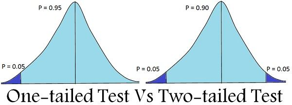

---
output:
  html_document: 
    css: D:/analysis/R/tistory/plotly/style.css
---

```{r setup, include=FALSE}
knitr::opts_chunk$set(echo = TRUE, message = FALSE, warning = FALSE)
library(showtext)
showtext_auto()
library(tidyverse)
library(readxl)
theme_set(theme_get() + theme(text = element_text(size = 24)))
update_geom_defaults("text", list(size = 6))
```

본 포스트는 [https://medium.com/\@hablo/a-beginner-guide-to-t-test-and-anova-analysis-of-variance-in-r-programming-d65944a97ce1](https://medium.com/@hablo/a-beginner-guide-to-t-test-and-anova-analysis-of-variance-in-r-programming-d65944a97ce1){.uri} 를 참조하여 작성되었음.

## t-test

t-test는 검증하려는 표본이 서로 다른 모집단에서 추출된 독립 표본 집단의 경우와 하나의 모집단에서 반복적으로 추출된 대응표본집단의 경우 두가지로 나뉘는데, t-test는 거의 정규분포를 따르고 두 집단간의 분산이 동일하며 모집단에서 30개 이하의 샘플을 추출하는 경우에 사용된다.

서로 다른 모집단에서 추출된 독립 표본 집단의 경우에는 두 집단간의 평균의 차이가 통계적으로 유의미하게 차이가 있는지를 검증한다. 아래의 그림은 전체 학생 모집단에서 여학생의 샘플과 남학생의 샘플의 평균이 서로 통계적으로 유의미하게 차이가 있는지를 표현한 그림이다.

{.uri}](1.png)

반면 하나의 모집단에서 추출된 샘플이 특정 이벤트를 시행하기 전과 후를 비교하기 위해서도 t-test가 사용된다. 여기서 중요한 것은 대응표본이어야 한다는 것이다. 아래의 그림에서도 보이듯이 특정 이벤트 전과 후의 샘플들은 서로 같은 객체들로 인해 이전과 이후의 값들로 짝지어질 것이다. 예를 들어 특정 수업을 들은 이후의 학업 성취도를 평가한다고 했을때 검증의 대상이 되는 학생들이 특정 수업을 듣기 전의 학업성취도와 그 학생들이 특정 수업을 들은 후의 학업성취도가 비교해야 할 것이다. 이런 경우 t-test를 사용할 수 있다.

{.uri}](2.png)

### 독립 표본 집단의 t-test

독립 표본 집단은 타 집단의 결과에 전혀 영향을 미치지 않는 서로 독립적인 집단을 의미한다. 이 두 집단의 평균값이 통계적으로 차이가 있는지를 판단하기 위해 t-test를 사용한다.

예를 들어, 어떤 사람이 매일 아침 아이들과 함께 3km을 달린다. 그는 아들이 빨리 뛰는 것이 통계적으로 의미가 있는지 알고 싶었다. 이를 검증하기 위해 다음 표와 같이 일주일 동안의 달리기 시간을 기록했다.

| 아들의 달리기 시간(분) | 딸의 달리기 시간(분) |
|:----------------------:|:--------------------:|
|           20           |          30          |
|           22           |          26          |
|           16           |          24          |
|           21           |          19          |
|           15           |          17          |
|           17           |          19          |
|           16           |          21          |

```{r}
Kids <- c(rep('son', 7), rep('daughter', 7))
Minute <- c(20, 22, 16, 21, 15, 17, 16, 30, 26, 24, 19, 17, 19, 21)
RunData <- data.frame(Kids, Minute)

##knitr::kable(RunData)
```

t-test는 대립가설을 단측 검정(One Tailed Test)과 양측 검정(Two Tailed Test)중에 선택해야 한다. 단측 검정은 대립가설을 작은 방향 또는 큰 방향으로 설정하여 검정하기 때문에 한 쪽 그룹의 평균이 다른쪽 평균보다 작거나 크다는 것이 통계적으로 유의한지를 검정한다. 그러나 양측 검정은 작은 방향과 큰 방향을 지정하지 않기 때문에 양쪽 그룹간의 평균이 같지 않다는 것에 대한 검정이다.  



위의 데이터에서 독립변수의 역할을 하는 것은 Kids열에 기록된 'Son'과 'Daughter'이다. R에서는 변수의 순서를 특별히 지정하지 않는 한 알파벳 순서로 기록된다. 그래서 'Son' 보다는 'Daughter'가 먼저 처리된다. 따라서 두 집단의 평균값이 차이가 없다는 것이 귀무가설($H_0$)이고, 대립가설($H_a$)을 단측 검정으로 한다면 'Daughter'가 'Son'보다 평균값이 크다(혹은 작다)로 설정된다. 여기서는 단측 검정으로 '크다'로 대립가설을 설정한다. ($\mu_{(Daughter)}$ \> $\mu_{(Son)}$) 결국 아들이 좀 더 빠르게 뛴다는 것이다. 

$H0 : \mu_{(Daughter)} = \mu_{(Son)}$ $Ha : \mu_{(Daughter)} > \mu_{(Son)}$

두 집단간의 평균값의 차이가 유의미하다는 것을 검증하기 위한 t-test를 위해서는 앞서 언급한 세 가지 가정, 즉 데이터가 정규성을 만족해야하고, 등분산성을 가져야하고 소규모 샘플(n < 30)이어야 한다. 

우선 샘플수는 위에서 보이는 대로 7개씩이니 소규모 샘플 가정을 만족한다고 볼 수 있다. 

다음으로 정규성을 만족해야하는데 이는 `shapiro.test()`를 사용하여 검정할 수 있다. `shapiro.test()`는 정규성을 검정해야하는 수치 벡터를 매개변수로 전달한다. `shapiro.test()`는 귀무가설을 수치 벡터가 정규성을 가진다로 설정하기 때문에 유의 확률, p 값이 0.05보다 크면 귀무가설을 기각할 수 없어 정규성을 가지는 것으로 본다.  

```{r}
shapiro.test(RunData[RunData$Kids=='daughter',2])

shapiro.test(RunData[RunData$Kids=='son',2])

```

다음으로 두 그 집단간의 등분산성을 체크해야한다. 등분산성은 `var.test()`로 검증할 수 있다. `var.test()`의 귀무 가설은 두 집단간의 분산의 차이가 없다는 것이다. 따라서 p 값이 0.05보다 크면 두 집단의 등분산성이 있다는 것이고 0.05보다 크면 이분산성이 있다는 것이다.

```{r}
var.test(Minute ~ Kids, data = RunData)

## 위의 코드는 아래의 코드와 동일하다
##var.test(RunData[RunData$Kids=='daughter',2], RunData[RunData$Kids=='son',2])

```

이제 t-test를 시행한다. t-test는 `t.test()`를 사용한다. 위의 결과를 보면 p 값이 0.24로 0.05보다 크기 때문에 등분산성이 있다고 볼 수 있다. 따라서 `t.test()`의 실행시에 등분산성 매개변수인 'var.equal'을 'TRUE'로 설정한다.

```{r}
t.test(Minute ~ Kids, data = RunData, alternative = 'greater', var.equal = TRUE)

```

`t.test()`의 결과에서 보면 t-통계량은 2.0337이고 p-값은 0.032로 나타나는데 95% 신뢰구간에서 0.05보다 작게 나타난다. 그래서 $H_0$는 기각되고 $H_a$가 채택되어 딸이 아들보다 평균 러닝타임이 더 크다는 것을 뒷받침하는 충분한 근거가 된다. 결국 같은 3km를 뛰지만 아들의 달리기 시간이 딸보다 작다는 것이기 때문에 아들이 좀 더 빨리 뛴다는 것이다. 

### 대응 표본 집단의 t-test(Paired t-test)

대응 표본 집단의 t-검정은 하나의 모집단에서 특정 이벤트가 실행된 이전과 이후에 대한 두 개의 종속(쌍을 이루는) 데이터가 있고 이벤트 이전과 이후의 데이터의 차이가 유의하게 다른지 확인하려는 경우 적용된다.

예를 들자면 앞에서 예로 들었던 아들과 딸의 3km 달리기 이후의 심박수가 다음과 같다고 가정해보겠다.

| 구분 | 달리기 전 심박수 | 달리기 후 심박수 |
|:----:|:----------------:|:----------------:|
| 아들 |        72        |        90        |
|  딸  |        81        |        96        |

위의 데이터는 다음과 같이 만들어준다. 

```{r}
at <- c(rep('before', 2), rep('after', 2))
bpm <- c(72, 81, 90, 96)
heartrate <- data.frame(at, bpm)
heartrate

```

이 t-test에서 귀무가설은 달리기 이후의 bpm은 평균의 차이가 없다는 것이고 대립가설은 평균의 차이가 있다는 것이다. 

$H0 : \mu_{(before)} = \mu_{(after)}$ $Ha : \mu_{(before)} \neq \mu_{(after)}$

```{r}
t.test(bpm ~ at, data = heartrate, paired = TRUE)

```

위의 결과에서 보면 p-값이 0.05772(0.05보다 큼)이기 때문에 어린이 심박수가 3km 달리기 전후에 크게(통계적으로) 다르다는 것을 뒷받침할 충분한 증거가 되지 않기 때문에 $H0$를 기각할 수 없다.

따라서 3km 달리기 전후의 평균 차이가 16.5임을 보여주기 때문에 달리기 후에 심박수가 높다는 것을 보여주긴 하지만 이 차이가 유의미하지는 않다. 
