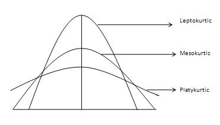

---
output:
  html_document: 
    css: D:/analysis/R/tistory/plotly/style.css
---

```{r setup, include=FALSE}
knitr::opts_chunk$set(echo = TRUE, message = FALSE, warning = FALSE)
library(showtext)
showtext_auto()
library(tidyverse)
library(readxl)
theme_set(theme_get() + theme(text = element_text(size = 24)))
update_geom_defaults("text", list(size = 6))
```

데이터를 평가할 때 데이터 내 값의 분포를 설명하기 위해 가장 기본적으로 사용되는 통계치가 왜도와 첨도이다. 왜도 및 첨도는 이상치가 있는지를 검토하거나 데이터의 정규 분포 패턴을 확인하는데 유용하게 사용되는 통계치이다. 

일반적으로 첨도는 데이터가 가장 밀집되어 있는 구간의 범위가 얼마나 넓게 퍼져있는지를 측정하는 통계치이다. 

이번 포스트에서는 첨도에 대해 알아본다. 첨도를 설명하기 위해 사용하는 데이터는 '평균과 중간값 등 통계치의 시각화 in R'(https://2stndard.tistory.com/132) 포스트에서 사용했던 학업 중단자 데이터를 사용하도록 하겠다. 

```{r eval=FALSE}
df_dropout <- read_excel('데이터저장폴더/유초 주요-04 시도별 행정구역별 교육통계 현황_방통제외(1999-2022)_20220824y.xlsx', 
           sheet = '2021-2022',
           skip = 11, 
           col_names = FALSE, 
           col_types = c(rep('text', 4), rep('numeric', 166)))

df_dropout <- df_dropout |> 
  select(1, 2, 3, 4, 22, seq(from = 127, to = 142, by = 3)) |>
  rename(c('연도' = ...1, '시도' = ...2, '시군' = ...3, '학교급' = ...4, '전체학생수' = ...22, '학업중단자' = ...127, '유예' = ...130, '면제' = ...133, '자퇴' = ...136, '퇴학' = ...139, '제적' = ...142))

```

```{r echo=FALSE}
df_dropout <- read_excel('D:/R/data/유초 주요-04 시도별 행정구역별 교육통계 현황_방통제외(1999-2022)_20220824y.xlsx', 
           sheet = '2021-2022',
           skip = 11, 
           col_names = FALSE, 
           col_types = c(rep('text', 4), rep('numeric', 166)))

df_dropout <- df_dropout |> 
  select(1, 2, 3, 4, 22, seq(from = 127, to = 142, by = 3)) |>
  rename(c('연도' = ...1, '시도' = ...2, '시군' = ...3, '학교급' = ...4, '전체학생수' = ...22, '학업중단자' = ...127, '유예' = ...130, '면제' = ...133, '자퇴' = ...136, '퇴학' = ...139, '제적' = ...142))

```

## 첨도

첨도(Kurtosis)의 데이터 분포 형태의 꼬리성(Tailedness)을 측정하기 위해 사용된다. 이는 결국 데이터 분포의 피크값이 같이 설명된다. 첨도가 클수록 데이터의 피크 포인트가 뾰족하고 양쪽 끝의 꼬리와의 차이가 심하고 첨도가 작을 수록 데이터 분포 피크 포인트가 뭉툭하고 양쪽 꼬리와의 차이가 크게 나지 않는다. 

### 첨도의 종류

양의 방향(오른쪽)으로 치우치거나 음의 방향(왼쪽)으로 치우친 데이터들의 평균과 중앙값은 다음의 그림과 같은 관계를 가진다. 



-   Mesokurtic : 정규분포 형태의 데이터 분포(그리스어로 Meso는 '중간'을 의미)
-   Leptokurtic : 두꺼운 꼬리를 가지고 날카로운 피크점을 가지는 데이터 분포(그리스어로 Lepto는 '가느다란', '날씬한'을 의미)
-   Platykurtic : 낮고 긴 꼬리를 가지고 뭉툭한 피크점을 가지는 데이터 분포(그리스어로 Platy는 '넓은', '뚱뚱한'을 의미)

### 첨도의 수치적 표현 : e1071::kurtosis()

전체적인 분포가 보인다면 얼마나 치우친 데이터인지를 확인해야 할 것이다. 이를 위해서는 `e1071`패키지에서 제공하는 `kurtosis()`를 사용한다.   

`kurtosis()`의 결과는 수치로 표현되다. 첨도는 표준화된 데이터의 4제곱의 평균이다. 1보다 작은 표준화된 값(즉, 데이터의 피크가 평균에서 1 표준 편차 이내)은 첨도에 거의 영향을 주지 않는데 1보다 작은 수를 네제곱 하면 거의 0에 가까워지기 때문이다. 반면 첨도에 영향을 주는 데이터는 이상치라고 하는 피크 영역 외부의 값이다. 즉 첨도는 이상치에 매우 민감한 값이다. 결국 표준화된 관측치가 평균의 1 표준편차 이내에 있는 값들은 네제곱하여 0으로 수렴하도록 만들어버리고 피크에서 멀어진 값들은 네제곱함으로써 멀리 있는 값이 존재하면 존재할 수록 첨도 값이 점점 커지게 된다.

앞서 분류한 첨도의 세가지 종류에 따른 첨도값의 범위는 일반적으로 다음과 같이 정의한다. 

-   Mesokurtic : 정규분포에 근사한 데이터 분포로 첨도가 3에 근접함.
-   Leptokurtic : 양의 첨도를 가지며 첨도가 3을 넘어가는 경우임.
-   Platykurtic : 음의 첨도를 가지며 첨도가 3보다 작은 경우임. 

데이터의 형태에 따른 첨도를 살펴보기 위해 'df_dropout'을 다음과 같이 전처리하고 중도탈락자의 원인별로 데이터 분포의 첨도를 알아보겠다.

```{r}
kurt <- df_dropout |>
  filter(시군 != '소계', 학교급 == '고등학교') |>
  summarise(across(.col = is.numeric, .fns = e1071::kurtosis)) |>
  pivot_longer(1:7) |>
  mutate(labs = paste0(name, ':', as.character(round(value, 2)))) |>
  pull(labs)

names(kurt) <- colnames(df_dropout[5:11])

df_dropout |>
  pivot_longer(5:11, names_to = '구분', values_to = '학생수') |>
  filter(시군 != '소계', 학교급 == '고등학교') |>
  ggplot(aes(x = 학생수)) +
  geom_density() +
  facet_wrap(.~구분, scales = 'free', labeller = labeller(구분 = kurt))

```

위의 그래프를 보면 첨도가 최소 3.9에서 최대 82.15까지 산출된다.  


