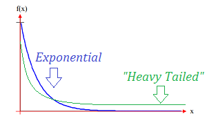
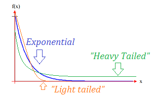

---
output:
  html_document: 
    css: D:/analysis/R/tistory/plotly/style.css
---

```{r setup, include=FALSE}
knitr::opts_chunk$set(echo = TRUE, message = FALSE, warning = FALSE)
library(showtext)
showtext_auto()
library(tidyverse)
library(readxl)
theme_set(theme_get() + theme(text = element_text(size = 24)))
update_geom_defaults("text", list(size = 6))
```

데이터를 평가할 때 데이터 내 값의 분포를 설명하기 위해 가장 기본적으로 사용되는 통계치가 왜도와 첨도이다. 왜도 및 첨도는 이상치가 있는지를 검토하거나 데이터의 정규 분포 패턴을 확인하는데 유용하게 사용되는 통계치입니다. 

일반적으로 왜도는 평균을 중심으로 대칭성(symmetry)을 나타내는 통계치이고 첨도는 꼬리의 두께 또는 두꺼움(heaviness of Tails)을 나타내는 통계치이다.

이번 포스트에서는 왜도에 대해 알아본다. 왜도를 설명하기 위해 사용하는 데이터는 '평균과 중간값 등 통계치의 시각화 in R'(https://2stndard.tistory.com/132) 포스트에서 사용했던 학업 중단자 데이터를 사용하도록 하겠다. 

```{r eval=FALSE}
df_dropout <- read_excel('데이터저장폴더/유초 주요-04 시도별 행정구역별 교육통계 현황_방통제외(1999-2022)_20220824y.xlsx', 
           sheet = '2021-2022',
           skip = 11, 
           col_names = FALSE, 
           col_types = c(rep('text', 4), rep('numeric', 166)))

df_dropout <- df_dropout |> 
  select(1, 2, 3, 4, 22, seq(from = 127, to = 142, by = 3)) |>
  rename(c('연도' = ...1, '시도' = ...2, '시군' = ...3, '학교급' = ...4, '전체학생수' = ...22, '학업중단자' = ...127, '유예' = ...130, '면제' = ...133, '자퇴' = ...136, '퇴학' = ...139, '제적' = ...142))

```

```{r echo=FALSE}
df_dropout <- read_excel('D:/R/data/유초 주요-04 시도별 행정구역별 교육통계 현황_방통제외(1999-2022)_20220824y.xlsx', 
           sheet = '2021-2022',
           skip = 11, 
           col_names = FALSE, 
           col_types = c(rep('text', 4), rep('numeric', 166)))

df_dropout <- df_dropout |> 
  select(1, 2, 3, 4, 22, seq(from = 127, to = 142, by = 3)) |>
  rename(c('연도' = ...1, '시도' = ...2, '시군' = ...3, '학교급' = ...4, '전체학생수' = ...22, '학업중단자' = ...127, '유예' = ...130, '면제' = ...133, '자퇴' = ...136, '퇴학' = ...139, '제적' = ...142))

```

## 왜도

왜도(Skewness)는 데이터의 비대칭성의 정도를 표현하는 통계치이다.  데이터의 전반적 분포들이 평균에서 얼마나 떨어져 있는지와 양의 방향 또는 음의 방향으로 움직이는 경향가 측정되는 통계치로, 양수 및 음수 왜곡(방향)은 선 그래프의 어느 한 방향으로 점 집합이 중심(평균)에서 얼마나 멀리 떨어져 있는지가 표현된다.

### 왜도와 평균, 중간값의 관계

양의 방향(오른쪽)으로 치우치거나 음의 방향(왼쪽)으로 치우친 데이터들의 평균과 중앙값은 다음의 그림과 같은 관계를 가진다. 


일반적으로 평균이 중앙값보다 크다면 데이터는 양의 방향으로 치우친 데이터이다. 양의 치우침이 있는 데이터는 데이터의 수가 가장 많은 Peak 점이 중앙값(Median)보다 작고 중앙값은 평균보다 작다. 결국 중앙값을 기준으로 최빈값(Mode)가 왼쪽, 평균이 오른쪽에 위치한다. 그리고 오른쪽으로 더 길게 치우쳐진 꼬리를 가지게 된다.

```{r}
mean_학업중단자 <- df_dropout |>
  filter(학업중단자 < 100, 학업중단자 > 0) |>
  pull(학업중단자) |>
  mean()

median_학업중단자 <- df_dropout |>
  filter(학업중단자 < 100, 학업중단자 > 0) |>
  pull(학업중단자) |>
  median()

df_dropout |>
  filter(학업중단자 < 100, 학업중단자 > 0) |>
  ggplot(aes(x = 학업중단자)) + 
  geom_density(fill="dodgerblue", alpha=0.5) +
  geom_vline(aes(xintercept = mean_학업중단자, color = '평균')) +
  geom_vline(aes(xintercept = median_학업중단자, color = '중앙')) + 
  scale_color_manual(name = '', values = c('평균' = 'red', '중앙' = 'blue')) +
  theme(legend.position = 'bottom')
  
```

그러나 평균이 중앙값보다 작다면 데이터는 음의 방향으로 치우친 데이터이다. 음의 치우침이 있는 데이터는 데이터의 수가 가장 많은 Peak 점이 중앙값(Median)보다 크고 중앙값은 평균보다 크다. 결국 중앙값을 기준으로 최빈값(Mode)가 가장 오른쪽, 평균이 가장 왼쪽에 위치한다. 그리고 왼쪽으로 더 길게 치우쳐진 꼬리를 가지게 된다.

```{r}
set.seed(123)

##  베타 확률분포 함수를 이용하여 왼쪽으로 치우친(left skewed) 데이터 10000개를 생성
samples <- rbeta(10000,5,1)

## 시뮬레이션을 위한 데이터 프레임을 생성
sim.data <- data.frame(samples)

mean_sim <- mean(samples)

median_sim <- median(samples)

sim.data |>
  ggplot(aes(x = samples)) + 
  geom_density(fill="dodgerblue", alpha=0.5) +
  geom_vline(aes(xintercept = mean_sim, color = '평균')) +
  geom_vline(aes(xintercept = median_sim, color = '중앙')) + 
  scale_color_manual(name = '', values = c('평균' = 'red', '중앙' = 'blue')) +
  theme(legend.position = 'bottom')
  
```

위의 그래프를 보면 X축의 양의 방향으로 값이 큰 데이터로 인해 그래프가 전반적으로 오른쪽으로 길게 나타난다. 이러한 그래프의 형태가 양으로 치우친 또는 오른쪽으로 치우친 그래프이다. 

### 왜도의 수치적 표현 : psych::skew()

전체적인 분포가 보인다면 얼마나 치우친 데이터인지를 확인해야 할 것이다. 이를 위해서는 `psych`패키지에서 제공하는 `skew()`를 사용한다. `skew()`의 결과는 부호와 절대값의 두 가지 관점에서 해석해야 한다.  

`skew()`의 결과는 수치로 표현되다. 왜도 값이 음수이면 데이터가 음의 방향, 왼쪽으로 치우친 것이고 왜도 값이 양수이면 데이터가 양의 방향, 오른쪽으로 치우친 것이다.  

왜도의 절대값은 데이터가 얼마나 왜곡되었는지를 나타낸다. 왜도 값이 0이면 데이터가 완벽하게 대칭을 이룬다. 그러나 실세계의 데이터에서는 왜도가 0인 데이터는 거의 볼 수 없다. Bulmer(Bulmer, MG 1979. Principles of Statistics. Dover) 는 다음과 같이 왜도 값을 해석하고 있다.

-   왜도가 -1보다 작거나 +1보다 크면 분포가 심하게 치우친 것임.
-   왜도가 -1과 -.5 사이 또는 +.5와 +1 사이이면 분포가 적당히 치우친 것임.
-   왜도가 -.5와 +.5 사이이면 분포가 거의 대칭임.


```{r}
set.seed(123)

##  베타 확률분포 함수를 이용하여 왼쪽으로 치우친(left skewed) 데이터 10000개를 생성
samples1 <- round(rbeta(10000,2,8), 2)

samples2 <- round(rbeta(10000,3,7), 2)

samples3 <- round(rbeta(10000,4,6), 2)

samples4 <- round(rbeta(10000,5,5), 2)

## 시뮬레이션을 위한 데이터 프레임을 생성
sim.data <- data.frame(samples1, samples2, samples3, samples4) |>
  pivot_longer(1:4, names_to = 'div', values_to = 'values')

label <- sim.data |> 
  group_by(div) |>
  summarise(x = density(values)$x[which.max(density(values)$y)], 
            y = max(density(values)$y), 
            skew = round(psych::skew(values), 2))


sim.data |>
  ggplot(aes(x = values)) + 
  geom_density(aes(fill = div, color = div), alpha=0.5) + 
  geom_text(data = label, 
            aes(x = x, y = y, 
                label = paste0('왜도 = ', skew)), vjust = -0.5)
```

위의 결과에서도 보이듯이 왜도값 양의 수이고 클수록 오른쪽 치우침이 심하다. 만약 왜도 값이 음의 수이면 다음과 같이 나타난다. 

```{r}
set.seed(123)

##  베타 확률분포 함수를 이용하여 왼쪽으로 치우친(left skewed) 데이터 10000개를 생성
samples1 <- round(rbeta(10000,8,2), 2)

samples2 <- round(rbeta(10000,7,3), 2)

samples3 <- round(rbeta(10000,6,4), 2)

samples4 <- round(rbeta(10000,5,5), 2)

## 시뮬레이션을 위한 데이터 프레임을 생성
sim.data <- data.frame(samples1, samples2, samples3, samples4) |>
  pivot_longer(1:4, names_to = 'div', values_to = 'values')

label <- sim.data |> 
  group_by(div) |>
  summarise(x = density(values)$x[which.max(density(values)$y)], 
            y = max(density(values)$y), 
            skew = round(psych::skew(values), 2))

sim.data |>
  ggplot(aes(x = values)) + 
  geom_density(aes(fill = div, color = div), alpha=0.5) + 
  geom_text(data = label, 
            aes(x = x, y = y, 
                label = paste0('왜도 = ', skew)), vjust = -0.5)
```

### 무거운 꼬리 분포(Heavy Tailed Distribution)와 가벼운 꼬리 분포(Light Tailed Distribution)

한쪽으로 치우친 데이터 분포는 치우쳐진 꼬리의 두께에 따라 무거운 꼬리 분포와 가벼운 꼬리 분포로 구분할 수 있다. 무거운 꼬리 분포와 가벼운 꼬리 분포의 구분은 지수 분포와 비교해서 지수 분포의 꼬리보다 Y값이 크게 꼬리가 있으면 무거운 꼬리분포하 하고 지수 분포와 비교해서 Y값이 작은 꼬리가 있다면 가벼운 꼬리분포라고 한다. 

무거운 꼬리분포는 다음과 같다. 



반면 가벼운 꼬리분포는 다음과 같다. 




